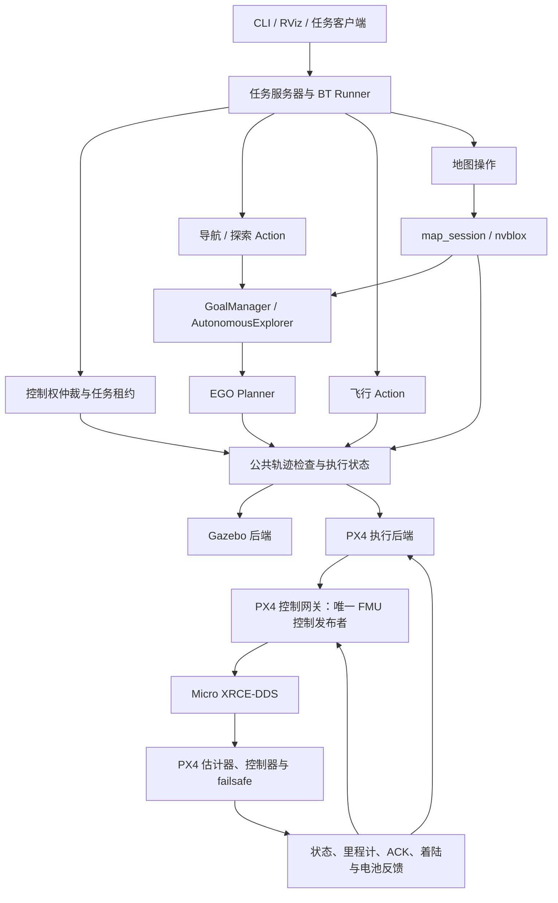
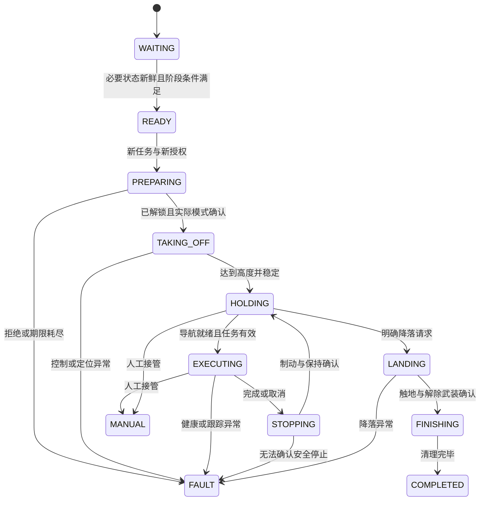

# BehaviorTree 与 PX4 协同开发计划

日期：2026-10-07。状态：开发中；最小任务 Action/暂停协议与 FlightSession mock 已交付，W0 真实飞行任务后端已实现；最小 BT XML/Runner 已接入 W0；逐步骤编排、EGO 实际任务后端与复杂场景仍待开发。

2026-10-08 开发补充：新增 `uav_bt` 最小 XML/异步 Action Runner 与 UUID/实例绑定的 BT
进展租约，复用 W0 飞行后端；运行入口为 `./scripts/sim.sh px4-flight --bt`。
这是 S2 的首批真实 PX4 接入，逐步骤 PX4 飞行 BT 与完整阶段验收仍待完成，
不代表 S2 或 S3/S4 全部验收通过。验证证据见 [BT/PX4 记录](validation/simulation/2026-10-08-bt-px4/REPORT.md)。

2026-10-08 导航补充：EGO 已在原 Executor 内提供真实 `NavigateToPose3D` Action，
含 UUID 取消、任务反馈、地图/时间校验、旧入口互斥与停稳确认。普通客户端的两航点和
运动中取消验证见 [导航 Action 记录](validation/simulation/2026-10-08-navigation-action/REPORT.md)，
接口与复现命令见 [运行说明](NAVIGATION_ACTION.md)。

2026-10-08 任务补充：algorithm MissionServer 与 ExecuteWaypoints BT 已接入，父任务覆盖
两航点和暂停期的会话预约/进展租约，支持确认停稳后暂停、检查点和新子 UUID 恢复。
请求幂等、旧世代与旧轨迹拒绝、暂停中取消及 Runner 停滞处置已有契约/实景回归。
见 [任务说明](ALGORITHM_MISSIONS.md) 与
[任务验证记录](validation/simulation/2026-10-08-algorithm-mission/REPORT.md)。
S2 算法闭环首批已实现，更多地图/clock 故障与逐步骤 PX4 BT、后续坐标/感知门槛仍待推进。

2026-10-07 版本核验补充：本机 QGC AppImage 为 v5.1.5；用户提供的 DM-FC01 固件已下载并解析，内嵌构建身份为 `v1.16.0-7-g78a512995e`，完整 hash 为 `78a512995e73dad88051707b5bee3df07eed4d78`，board_id=7140。文件 SHA-256、来源和证据见 [版本核验记录](validation/simulation/2026-10-07-artifact-versions/REPORT.md)。这些是文件元数据；厂商源码对应关系及飞控当前运行构建未核验，主机 SITL 基线已独立选定 v1.16.2，构建与运行证据见下文。

本机 SITL 版本选择（2026-10-07）：按用户要求采用 PX4 1.16 系列最新稳定发布 **v1.16.2**，固定 commit `54f0455ffcd755534539a7cf33a09a20bf71d29d`；官方 release 与远端 tag 已核验。使用精确 commit 构建，后续升级显式更新版本锁。源码/SITL 子模块、独立构建及 Agent v2.4.3 / px4_msgs v1.16.2 对应已验证；未解锁 x500 基础链路见 [构建与验证记录](validation/simulation/2026-10-07-px4-sitl-build/REPORT.md)。只读状态聚合与任务接口/mock 协议已开发，见 [S1 协议验证](validation/simulation/2026-10-07-s1-mission-protocol/REPORT.md)；W0 真实任务与飞行控制验证见 [飞行报告](validation/simulation/2026-10-07-px4-flight/REPORT.md)；BT/EGO 集成继续开发。详见 [SITL 版本冻结记录](validation/simulation/2026-10-07-px4-sitl-version/REPORT.md)。

当前执行范围（2026-10-07 用户调整）：暂不使用 Jetson，仿真和导航全部在本机开发/验收；Jetson 软件移植、ARM 样例与跨机联调属于后续可选阶段，不阻塞本机 S0–S8。

本文以当前源码为基线。目标是在现有 EGO + nvblox 三维导航上建立可取消、可追踪、可切换执行后端的任务系统，先完成 Gazebo 算法仿真，再完成 PX4 SITL，最后进行受控实机验证。

仿真实施细节见 [UAV 全链路仿真开发计划](SIMULATION_DEVELOPMENT_PLAN.md)，其中 S0–S8 是本文仿真工作包的细化，工期不重复相加。

## 1. 目标、范围与最终交付

完成后应支持：

1. 单目标与多航点三维导航。
2. 有界自主探索、停止、地图保存和网格导出。
3. 加载兼容地图后导航。
4. PX4 下的控制权申请、Offboard 准备、解锁、起飞、轨迹执行、制动悬停、降落与释放。
5. 用户取消、RViz 目标替换、遥控接管、通信失联、定位或地图异常的确定性处理。
6. 同一任务接口分别调用 Gazebo 和 PX4 执行后端；后端能力不满足时拒绝任务。
7. 任务结果、树节点状态、控制权、地图会话与轨迹身份可联合追溯。

首版限制为单机、静态障碍、低速飞行。动态障碍预测、多机任务、全图覆盖保证和通用自主重定位不纳入首版。PX4 原生 RTL 与基于地图规划的返程分别建模，不相互替代。

交付包含源码、接口定义、任务 XML、参数、launch、回归测试、故障注入脚本、rosbag/ULog 与验收报告。计划完成不等于上述能力已完成。

## 2. 当前基线与差距

| 已有内容 | 当前边界 | 需要开发 |
| --- | --- | --- |
| `uav_ego_nvblox.launch.py` | Gazebo 真值定位与速度模型，不包含 PX4 | 新增任务启动和独立 SITL 启动入口 |
| `GoalManager` | 最终目标、局部观察、重试、移动接续；已提供 Navigate Action/UUID/反馈/停稳取消 | 有界探索、更多故障回归及全局结构化事件 |
| `AutonomousExplorer` | 自主选点、扫描、预算与故障锁止 | 有界探索 Action，区分正常完成与故障退出 |
| `uav_ego_adapter` | 快照规划、B-spline、安全种子与独立检查 | 保留算法；按需增加结构化错误分类 |
| `MapSnapshot/TimedTrajectory/PlannerStatus/TrajectoryRequest` | 已有 epoch、版本、局部 token 与父轨迹 ID | 补任务接口，不把局部 token 当最终任务 UUID |
| Gazebo `Executor` | 50 Hz 稳态定时器，向 Gazebo 发布机体系 `Twist` | 分离公共执行逻辑与后端，补真实制动与悬停 |
| `/uav/navigation/state` | 全局字符串；Navigate Action 另有 TaskStatus 反馈 | 父 ExecuteMission 已有结构化反馈；保留字符串供人工观察 |
| `/uav/cancel` | 旧目标使用 Trigger；Action 占用期间拒绝，改用 UUID 取消 | 扩大任务/故障验收矩阵 |
| `px4_comm_bridge` | ENU/NED 速度桥、反馈驱动状态机、ACK、应急动作 | 显式控制会话、飞行 Action、轨迹执行后端、着陆反馈 |
| 现有 PX4 状态机 | `auto_arm=false` 默认，MANUAL/FAULT/LANDED 锁定 | 将自动解锁与任务授权分离；保留显式恢复语义 |
| PX4 数据桥 | 读回 PX4 数据，部分默认 topic 为 `/px4/*` | 与固定固件的实际 DDS topic、QoS、版本逐项核验 |
| BehaviorTree.CPP | 本机 `/opt/ros/jazzy` 已安装 4.9.0 | 新增项目任务包；锁定库版本及 ROS 包装方式 |

当前源码虽包含上游 GXF behavior_tree 相关文件，但项目主导航没有使用它们进行 BT.CPP 任务编排。

代码依据：

- [导航启动](../src/uav_bringup/launch/uav_ego_nvblox.launch.py)
- [目标管理](../src/uav_nav_sim/uav_nav_sim/navigation.py)、[自主探索](../src/uav_nav_sim/uav_nav_sim/autonomous.py)
- [Gazebo 执行器](../src/uav_nav_sim/uav_nav_sim/executor.py)
- [接口契约](../src/uav_nav_interfaces/README.md)
- [PX4 桥与实际限制](../src/px4_comm_bridge/README.md)
- [项目评估](UAV_PROJECT_ASSESSMENT.md)

### 2.1 已确认的实机配置（用户提供，2026-10-07）

| 项目 | 已知信息 | 仍需核实的边界 |
| --- | --- | --- |
| 遥控器 | RadioMaster Pocket，ELRS，无外置高频头 | EdgeTX 与 ELRS 固件版本、开关到通道映射 |
| 接收机 | 贝壳 ELRS 2.4G 接收机 | 完整型号、固件、飞控侧输出协议及连接端口；ELRS 空口不等于已确认 CRSF 串口输出 |
| 飞控固件 | `damiao_dm-fc01_V1.16.px4` | 文件元数据为 v1.16.0-7-g78a512995e、board_id=7140、board_revision=1；现场板卡/运行构建及厂商源码改动待核实 |
| 遥控链路 | QGroundControl 能看到摇杆和开关变化 | 尚未据此确认模式切换、解锁、RC 丢失和空中接管行为 |
| 伴飞计算机 | Jetson Orin Nano 8GB | JetPack/L4T、操作系统、ROS、Isaac ROS/CUDA 兼容组合、功耗模式及持续运行性能待验证 |
| 伴飞通信 | 计划使用 TELEM 串口，端口尚未分配 | TELEM1/2/其他、波特率、伴飞设备路径暂不指定；不影响状态模型和仿真开发 |
| 环境 | 室内 | 首版不默认使用 GPS/原生 RTL；接管模式能力依赖实际估计器状态 |
| 相机 | OAK-D Pro W | 实际 IMU/标定、安装外参、VIO 软件路线、PX4 外部定位融合状态待验证 |
| 操作偏好 | 解锁、接管、任务取消通过遥控通道；映射未分配 | 本轮先设计逻辑事件，暂不指定开关和 CH 号 |

以上是用户报告的配置，不等于硬件联调验收。固件文件名不能替代实际运行版本；P0 记录 QGC/飞控报告的版本、构建信息和固件文件校验值。

### 2.2 遥控通道方案与新增工作

建议首版遥控器负责解锁，BT 申请自动控制权并执行已授权任务；保留 `auto_arm=false`。这需要改造当前桥：允许已人工解锁状态下显式准备/进入 Offboard，不能直接复用目前仅由 auto_arm 驱动的启动路径。

建议分开四项功能，具体 CH 号在读取当前映射后固定：

| 功能 | 建议操作 | 执行方及语义 |
| --- | --- | --- |
| 解锁/上锁 | 独立开关或按钮 | PX4 直接处理，按实际固件地面/空中保护规则验收；不作为任务取消 |
| 人工接管 | 飞行模式开关 | 直接切换 PX4 至已验证人工模式；伴飞收到实际模式反馈后撤销 BT 会话，不能依赖 ROS 才能接管 |
| 自动任务允许 | 独立开关 | 允许 BT 请求控制；没有就绪状态和有效任务时不自动起飞；关闭即撤销任务授权 |
| 任务取消 | 独立按钮或开关边沿 | RC 适配器调用当前 UUID 的取消，定位与控制有效时制动悬停；不解除武装 |

上游 PX4 1.16 提供 `RC_MAP_ARM_SW`、`RC_MAP_FLTMODE`、`RC_MAP_OFFB_SW` 等映射；模式开关路线先选一种并验证冲突，不能把“任务允许”自动视作飞控已经进入 Offboard。厂商固件以实际参数为准。[PX4 1.16 参数参考](https://docs.px4.io/v1.16/en/advanced_config/parameter_reference)

人工接管模式由估计器能力与操作者习惯决定；室内 Position 模式需要有效的位置估计，不能只凭 OAK-D 已连接就认定可用。任务取消依赖伴飞系统，必须保留独立的飞控模式接管路径。

新增 RC 适配工作放入 P1 的控制权协议设计、P4 的固件接口核验和 P5 的飞行验收：

1. 读取实际可用的 RC/开关消息，核实自定义 DDS 配置是否导出所需通道；QGC 能读到不等于 ROS 2 可读到。
2. 配置通道索引、极性、阈值、迟滞、去抖、源/接收时间和失联状态；通道失效不能解释为有效取消边沿或自动授权。
3. 取消采用边沿锁存并绑定当前任务 UUID；按钮保持不重复发送，旧边沿不作用于新任务。
4. 开机/桥重启时开关已处于自动允许位置也不自动恢复任务；要求重新授权和新任务请求。
5. 验证遥控关机、接收机断线、DDS 中断、BT 卡住、伴飞重启时的控制权与失效保护。
6. 将 RC 丢失与 Offboard 丢失分开配置、分别注入，避免异常组合下仍无限续租。

OAK-D Pro W 路线建议以现有 cuVSLAM/VIO 入口做候选，先验证实际标定与定位质量，再冻结主定位方案。通过 `/fmu/in/vehicle_visual_odometry` 等实际固件支持的外部定位接口接入前，需验证坐标、时间、协方差、外参和 EKF 融合；深度建图不能替代飞控定位。[PX4 1.16 外部定位说明](https://docs.px4.io/v1.16/en/ros/external_position_estimation)

## 3. 架构与职责



职责约束：

- BT 决定任务先后、条件分支和有界恢复，不直接产生高频 setpoint。
- 任务后端拥有最终目标、局部规划、取消、结果提交的原子状态。
- 执行器拥有轨迹接受、替换、接续、制动和完成判断。
- 控制网关是 FMU 控制消息的唯一项目发布者；旧速度桥与新后端不同时发布。
- PX4 执行位置/速度、姿态及电机控制，并执行其配置的飞控失效保护。
- 地图服务拥有地图操作事务与 epoch；BT 只请求操作和等待结果。
- 既有未知空间禁飞、机身体积、曲线复检和动力学检查继续有效。

## 4. 代码组织与改造边界

以下新增包名为计划名称，实施时按依赖检查后固定：

```text
src/uav_nav_interfaces/       扩展任务、控制权、健康和飞行接口
src/uav_nav_core/             分阶段提取公共逻辑，不能依赖 Gazebo 或 px4_msgs
src/uav_nav_sim/              保留 Gazebo 后端和现有脚本兼容入口
src/uav_mission/              Python 任务后端、Action 生命周期、仲裁和地图适配
src/uav_bt/                   C++ BT Runner、节点、XML、任务参数
src/uav_px4_executor/         C++ 轨迹采样、PX4 参考生成、制动与跟踪
src/px4_comm_bridge/          通信、转换、唯一控制网关与飞控模式状态机
src/uav_bringup/              algorithm / SITL / hardware 启动组合
scripts/                     构建、任务控制、故障注入和验收脚本
docs/validation/             可复现实验配置与结果
```

第一步在现有执行器内增加 Action 适配，所有任务变更仍在其所有者线程中完成；不要先进行大范围移动。通过兼容回归后再提取公共逻辑。独立网关必须使用带任务 UUID 的内部命令/事件协议，不能通过全局字符串拼接 Action 结果。

BT 首版使用已安装的 `behaviortree_cpp` 和 `rclcpp_action`。BehaviorTree.ROS2 可在版本兼容与取消行为验证后引入，不能把外部包装器视作已完成服务端制动和取消确认。

## 5. 任务与控制接口

### 5.1 Action 清单

| 建议 Action | 请求 | 反馈 | 完成语义 |
| --- | --- | --- | --- |
| `ExecuteMission` | 任务类型、参数、后端、任务期限 | 树节点、阶段、当前子任务、故障 | 子任务和清理全部结束后才提交结果 |
| `NavigateToPose3D` | map 目标、容差、稳定时长、期限、控制会话 | 位置、距终点距离、局部阶段、分段数 | 当前 UUID 对应最终目标到达且速度稳定 |
| `ExploreVolume` | 最大时长、地图增长目标、选配空间边界、控制会话 | 地图增长、到点数、扫描数、进展 | 达到指定停止目标并停稳；故障和停滞为失败 |
| `PrepareOffboard` | 控制会话、进入模式请求、授权凭据 | 预发送、解锁、模式确认阶段 | 必要状态反馈新鲜，实际 armed/Offboard 符合请求 |
| `Takeoff` | 参考坐标系、高度、运动限制、控制会话 | 高度、速度、状态 | 通过起飞通路检查，达到高度并稳定 |
| `StopAndHold` | 被停止任务 UUID、控制会话、期限 | 制动阶段、速度、保持误差 | 旧任务撤销且实际稳定保持 |
| `Land` | 降落策略、控制会话、期限 | 模式、下降、触地、解锁状态 | 着陆反馈成立，并按策略确认解除武装 |

`ExploreVolume` 名称不代表保证全体积覆盖；首版只支持明确的时间或观测增长终止条件。任务定义必须声明达到哪种条件算正常完成。

### 5.2 结构化状态和服务

- `TaskStatus`：任务 UUID、协调器实例 ID、事件序号、阶段、结果码、原因、控制会话、地图 session、ROS 时间。
- `ControlStatus`：所有者、租约 ID、租约世代、期限、实际飞行模式、允许操作及接管原因。
- `NavigationHealth`：地图/里程计/TF/估计器/执行器/通信各自的有效性和接收年龄，避免一个 Bool 隐藏故障。
- `AcquireControl/ReleaseControl/ResetFault`：显式申请、释放、恢复。恢复要求新鲜状态和操作者的新授权，不通过重新发目标隐式恢复。
- `MapOperation`：地图服务适配器提供 operation ID、状态与最终结果；底层保存、加载和导出继续复用现有服务。
- `PauseMission/ResumeMission`：请求包含 mission_uuid、coordinator_instance、request_id，响应包含接受/拒绝、原因和当前阶段；重复请求幂等，旧 UUID 拒绝。命令接受不代表已经停稳，完成由 TaskStatus 确认。

最小 ExecuteMission、MissionServer 和暂停协议与首批 Navigate/BT 同期交付。暂停采用 RUNNING→PAUSING→PAUSED→RESUMING，撤销当前 Navigate 子 Action、保存航点/最终目标/会话检查点，父 ExecuteMission 保持活动；恢复从当前位置创建新子 UUID 和曲线。总任务单调时间期限包含暂停与清理，暂停期间不消耗子导航运动预算。首版不支持进程重启后自动恢复任务，检查点仅供诊断。起飞及原生降落首版拒绝暂停。

字段由接口评审冻结。涉及 Action 生成时更新 `CMakeLists.txt/package.xml`，根据字段补充 `unique_identifier_msgs`、`action_msgs` 等依赖，并重建所有消费者。

### 5.3 任务身份与竞态处理

```text
ExecuteMission UUID
  └─ 控制租约 ID + 世代
      └─ Navigate / Explore / Flight 子 Action UUID
          └─ 局部 goal_stamp
              └─ trajectory_id / parent_trajectory_id
                  └─ map_id / epoch / map_version
```

1. 最终 Action UUID 和局部时间 token 分别管理。
2. 状态/反馈/结果必须匹配任务 UUID、实例和世代，拒绝重启前及旧任务事件。
3. 新目标采用明确的 REJECT 或 REPLACE 策略；首版默认 BUSY 拒绝，显式替换走取消确认流程。
4. 旧取消请求只作用于旧 UUID；不能取消新任务。
5. 每个 Action 终态只提交一次。到达与取消同时发生时，由所有者事件顺序确定结果并记录。
6. `LOCAL_GOAL_REACHED`、`HANDOVER`、`SAFE_SEED_FALLBACK`、`TRAJECTORY_PUBLISHED` 都不等于最终任务成功。
7. 迟到规划结果和待接续轨迹在取消、替换、会话变化时失效。
8. BT 客户端超时后先请求取消，等待停止确认；取消超时进入故障，禁止马上派发下一任务。

### 5.4 结果与重试

统一错误类别建议：`INVALID_GOAL`、`NOT_READY`、`BUSY`、`NO_PATH`、`EXPLORATION_LIMIT`、`MAP_STALE`、`ODOMETRY_STALE`、`TF_INVALID`、`SESSION_CHANGED`、`TRACKING_ERROR`、`OFFBOARD_REJECTED`、`CONTROL_LOST`、`CANCEL_TIMEOUT`、`BACKEND_UNAVAILABLE`、`MAP_OPERATION_FAILED`。

- 最终到达：ROS Action SUCCEEDED，BT SUCCESS。
- 目标阻塞、健康故障、期限耗尽：ABORTED，BT FAILURE，并输出错误类别。
- 操作者取消：CANCELED；任务服务器保留取消语义，不把它降格为可重试规划失败。
- 下层局部重试继续由 GoalManager 管理；BT 首版默认不重试整个目标。
- 后续只对已列明的可恢复错误允许最多一次恢复，恢复前后必须重新验证控制权和健康状态。
- 探索达到用户指定时长可成功；因地图不增长、内部预算或定位异常退出不能伪装为达到目标。

## 6. 控制权与取消设计

### 6.1 控制状态

采用 `IDLE / RESERVED / ACTIVE / STOPPING / HOLDING / MANUAL / FAULT`。RESERVED 仅表示任务占有，ACTIVE 允许授权任务运动；STOPPING/HOLDING 只允许有效停止/保持授权对应的受限参考，不能派发新导航。

正常切换顺序：撤销旧任务 → 旧轨迹与 token 失效 → 制动/停止确认 → 更新租约世代 → 接受新任务。接管由飞控实际模式变化触发时，立即撤销自动输出，不能等待旧任务先完成制动。

仲裁优先级：飞控实际控制权和 failsafe > 人工接管 > 安全停止 > 任务请求。BT、RViz、旧命令行和自主探索统一经过仲裁，不能保留可绕过的新旧运动入口。

### 6.2 三种停止分别实现

| 场景 | 自动层行为 | 结束确认 |
| --- | --- | --- |
| 正常取消/换目标 | 在控制权和定位有效时执行安全制动，进入持续悬停 | 新鲜位置/速度持续满足稳定条件 |
| 人工接管/非预期退出 Offboard | 立即撤销自动任务和输出，不再抢占模式 | ControlStatus 为 MANUAL/CONTROL_LOST；自身请求的原生降落另走交接确认 |
| 执行器故障/失联 | 能保证参考时进行有界处置；否则停止自动控制流并交由飞控 failsafe | 记录失败，不虚构停止或着陆成功 |

执行任务租约必须验证 BT 的有效进展，不能由一个与卡住的树无关的常驻线程无限续租。PAUSED 仍由暂停管理状态 tick 并验证健康/期限。任务后端另有参考新鲜度检查；桥检查当前 owner 授权、后端健康及状态新鲜度。

BT 的 `halt()` 只发起异步撤销；Runner/任务服务器继续处理取消结果与清理，禁止立即销毁客户端或释放控制权。进程崩溃由下层租约失效处理。

### 6.3 任务终止与 FlightSession 生命周期

FlightSession 跨任务 Action 存活，HoldController 共享唯一网关。取消时依次撤销旧轨迹→有界制动→实际停稳→原子交接 HOLD_CONTROLLER 并更新控制世代→网关确认新授权/参考→提交 CANCELED→根树停止 tick。交接失败为 ABORTED/CANCEL_TIMEOUT，不伪造安全取消。子 Navigate 正常结束仍由父任务持有会话；根任务结束但需空中保持才交接。停止/保持授权不能重新解锁、导航或复用旧 token。

保持授权由状态健康、参考新鲜度和不可滑动延长的最终期限约束，不依赖已结束树的 tick。仿真首版候选任务租约 0.5 s、终止后保持 30 s、暂停 60 s，按仿真 S4 标定冻结；硬件另行验证。到期在定位有效和已验证区域内请求原生降落，否则执行冻结飞控故障策略并报告真实结果。BT 卡住触发有界处置；会话/网关崩溃由 Offboard 丢失机制处理。人工接管/failsafe 撤销全部自动授权，不能由保持线程抢回。

起飞取消仅在定位与停止余量满足时转保持，否则请求已验证降落；已解锁未离地时仅凭新鲜 landed 确认允许按策略解除武装。原生降落命令提交后（含等待 AUTO_LAND 确认阶段），首版 Land 与父 ExecuteMission 均拒绝取消，返回 CANCEL_REJECTED_LANDING 并继续观察着陆；提交与取消按同一所有者事件顺序裁决。中止降落是另一项显式授权能力，首版不实现。完整操作矩阵与验证条件见 [仿真计划](SIMULATION_DEVELOPMENT_PLAN.md)。

## 7. 完整任务树设计

### 7.1 Runner 与树的生命周期

```text
接收 ExecuteMission
 → 校验任务 schema 与后端能力
 → 创建独立 Blackboard 和实例
 → 执行任务树
 → 成功/失败/取消都进入清理协调
 → 确认运动与地图操作状态
 → 提交一次最终结果，停止 tick
```

根节点返回 SUCCESS 后不能继续周期执行并重发起飞或目标。清理过程独立于树的正常成功路径，取消或 guard 失败也会执行；对人工接管只撤销自动控制，不再降落或重新申请 Offboard。

根树停止 tick 不终止已交接的 FlightSession；保持服务遵守独立的健康与最终期限。尚未确认交接不能完成空中任务的清理。原生降落阶段拒绝取消不调用 halt，防止释放仍需观察的着陆 Action。

### 7.2 XML 方案

以下 XML 为待实现设计，内含自定义节点，当前不能直接运行。先开发最小导航树，再扩展飞行树。`MissionGuard` 是计划中的单子节点装饰器，检查任务取消、控制世代和阶段相关健康条件；它允许准备/地图操作阶段的预期状态，失败时触发统一清理。不能简单把“已 armed/Offboard”作为准备前的全局前置条件。

最小 Gazebo 导航树 `navigate.xml`：

```xml
<root BTCPP_format="4" main_tree_to_execute="Navigate">
  <BehaviorTree ID="Navigate">
    <MissionGuard mission_id="{mission_id}">
      <Sequence>
        <WaitNavigationReady timeout_s="{ready_timeout_s}"/>
        <ReserveControl session="{control_session}"/>
        <NavigateToPose3D goal="{goal}"
                          session="{control_session}"
                          error_code="{error_code}"/>
        <StopAndWait session="{control_session}"/>
        <ReleaseControl session="{control_session}"/>
      </Sequence>
    </MissionGuard>
  </BehaviorTree>
</root>
```

PX4 多航点任务 `flight_waypoints.xml`：

```xml
<root BTCPP_format="4" main_tree_to_execute="FlightWaypoints">
  <BehaviorTree ID="FlightWaypoints">
    <MissionGuard mission_id="{mission_id}">
      <Sequence>
        <CheckBackendCapabilities required="flight,hold,land"/>
        <WaitFlightReady timeout_s="{ready_timeout_s}"/>
        <ReserveControl session="{control_session}"/>
        <PrepareOffboard session="{control_session}"
                         authorization="{flight_authorization}"/>
        <Takeoff height_m="{takeoff_height_m}" session="{control_session}"/>
        <WaitNavigationReady timeout_s="{ready_timeout_s}"/>
        <ExecuteWaypoints waypoints="{waypoints}"
                          session="{control_session}"
                          error_code="{error_code}"/>
        <StopAndWait session="{control_session}"/>
        <Land policy="{landing_policy}" session="{control_session}"/>
        <ReleaseControl session="{control_session}"/>
      </Sequence>
    </MissionGuard>
  </BehaviorTree>
</root>
```

`ExecuteWaypoints` 首版为顺序执行的异步节点，内部逐个调用 Navigate Action、报告航点索引，halt 时取消当前航点；不默认跳过失败航点，也不自动循环。后续可改为已验证的列表循环子树。

探索保存任务 `explore_save.xml`：

```xml
<root BTCPP_format="4" main_tree_to_execute="ExploreSave">
  <BehaviorTree ID="ExploreSave">
    <MissionGuard mission_id="{mission_id}">
      <Sequence>
        <CheckMappingMode/>
        <WaitNavigationReady timeout_s="{ready_timeout_s}"/>
        <ReserveControl session="{control_session}"/>
        <EnsureFlightIfRequired session="{control_session}"
                                authorization="{flight_authorization}"
                                height_m="{takeoff_height_m}"/>
        <ExploreVolume duration_s="{explore_duration_s}"
                       session="{control_session}"
                       error_code="{error_code}"/>
        <StopAndWait session="{control_session}"/>
        <FinishFlightIfRequired session="{control_session}"/>
        <SaveMap directory="{map_directory}" operation_id="{map_operation_id}"/>
        <WaitMapOperation operation_id="{map_operation_id}"/>
        <ReleaseControl session="{control_session}"/>
      </Sequence>
    </MissionGuard>
  </BehaviorTree>
</root>
```

`EnsureFlightIfRequired/FinishFlightIfRequired` 是后端能力适配：Gazebo 速度模型不具备真实解锁/起降，明确跳过飞行步骤；PX4 执行准备、起飞与降落。在算法仿真里跳过不能作为起降验证。

离线地图任务为：检查 localization 模式 → 预留任务控制 → LoadMap → 等待新 session 有效快照和定位 → 按后端准备起飞 → ExecuteWaypoints → 停稳/降落 → 释放。首版模式启动时固定；BT 不在飞行中自行重启 launch 切换模式。

### 7.3 失败和取消树的配合

正常任务 XML 不加入“失败后降落并返回 SUCCESS”的 Fallback。Runner 保存原始结果，清理只附加处置结果。建议清理决策：

```text
人工已接管？ 是 → 撤销自动会话，结束
否则，当前控制和定位有效？
  是 → 有界制动悬停 → 按任务策略继续保持或降落
  否 → 交给已验证的 PX4 失效保护
记录原始失败和处置结果 → 结束
```

没有有效定位时不执行盲目位置悬停；室内没有验证全局定位与返航路径时，不默认请求原生 RTL。

### 7.4 Blackboard 与节点规则

Blackboard 保存任务参数、控制会话、航点索引、错误码、操作 ID 和小型健康摘要；不复制 ESDF、大型轨迹或相机图像。各任务实例独立，禁止共享旧任务的 REACHED 状态。

节点必须非阻塞：onStart 只派发一次，onRunning 检查缓存与期限，onHalted 发起自己的取消。Condition 只读缓存。建议 tick 10 Hz，控制输出先采用 50 Hz 目标频率并实测；现有桥默认 20 Hz 是另一配置，迁移时明确设置。

## 8. PX4 配合的实施细节

### 8.1 固件与通信先冻结

记录 PX4 commit/版本、机型与参数、`px4_msgs` commit、XRCE Client/Agent、DDS topics、ROS 2 与仿真版本。版本不一致时明确选择匹配消息或已验证的消息转换机制。

核对输入/输出 topic 是否在固件 DDS 配置中发布；状态、ACK、里程计、着陆与电池逐项验证 QoS、频率、源时间和接收时间。当前 `/px4/vehicle_odometry` 默认值不能假定等于固件实际 `/fmu/out/*`。

通信参考：[PX4 ROS 2 用户指南](https://docs.px4.io/main/en/ros2/user_guide)，本项目入口见 [串口通信指南](PX4_MICRO_XRCE_DDS_SERIAL_SETUP.md)。最终验收使用固定固件对应文档。

### 8.2 定位、时间与坐标

- 先选定唯一主定位路线，例如 FAST-LIO 或 VIO；第二来源只在经过验证的融合方案中使用。
- 建立 `map → odom → base_link` 及 PX4 local NED 对齐，记录原点、航向偏置与重置行为。
- ENU/NED 轴交换不解决原点与航向对齐；机体系 FLU/FRD 单独处理。
- 对位置、速度、姿态、协方差和时间戳分别验证，处理 PX4 本地估计器 reset 与外部定位重定位。
- 若 PX4 依赖外部定位，开发并验证外部里程计输入、EKF 融合、延时和质量检查；ROS 中有里程计不代表飞控已经融合。
- 导航曲线按 ROS 时间采样；SITL 时钟统一配置。通信/取消/租约期限用单调时间；仿真暂停与时钟回跳制定测试策略，不能继续重放旧参考。
- map 到控制坐标转换变化时停止并重规划；首版拒绝沿用未经重新验证的旧轨迹。

参考：[PX4 坐标约定与兼容性](https://docs.px4.io/main/en/ros2/user_guide)。外部定位参数和具体输入消息在选定固件后冻结。

现有 PX4 里程计转换直接复制位置/速度并标记 map，未填姿态，不能直接接入要求 odom/base_link 的导航执行器。公共执行层迁移必须修复 pose_frame/velocity_frame、四元数/协方差与时间转换，将 odom 起点/速度转换到 map，并验证非零平移/航向的 map→odom；禁止仅改 frame_id。定位 reset/对齐变化使旧轨迹失效。

SITL 固定使用 Gazebo 单向 `/clock`，参与轨迹/TF/传感器节点 use_sim_time=true；PX4 1.16 对应配置 UXRCE_DDS_SYNCT=false。真实硬件采用系统时间与经验证 XRCE 同步，不照搬 SITL 关闭同步参数。活动任务中暂停/clock 停滞或回跳触发 CLOCK_FAULT，恢复不重放旧曲线、不自动重入 Offboard；具体期限及跨机规则见 [仿真计划第 6 节](SIMULATION_DEVELOPMENT_PLAN.md#6-版本通信坐标与时间)。依据：[固定版本时间同步说明](https://docs.px4.io/v1.16/en/ros2/user_guide#ros-gazebo-and-px4-time-synchronization)。

### 8.3 轨迹执行后端

1. 复用 TimedTrajectory 的样条定义，验证 map session、goal token、父轨迹及开始时间。
2. 保留完整曲线复检和移动接续的边界连续性检查。
3. 第一版采用速度参考，与现有桥契约匹配；用实际飞控位置计算跟踪误差，重新标定增益和运动限制。
4. 后续位置+速度/加速度前馈作为单独版本和验收项，不能一次性改完后混合归因。
5. 未使用 setpoint 字段明确设 NaN；OffboardControlMode 与实际字段语义匹配。
6. 输出世界参考至 PX4 本地坐标，禁止转发 Gazebo 机体系 `/cmd_vel`。Gazebo 用于姿态回正的 angular.x/y 不转成飞控速度命令。
7. 轨迹结束前生成可执行制动和保持参考；禁止把“清除轨迹后发布一次零速度”作为真实停止实现。
8. 移动接续先在停止式导航稳定后启用；继承轨迹和替换轨迹分别进行 SITL 验收。

PX4 控制字段参考：[Offboard 模式](https://docs.px4.io/main/en/flight_modes/offboard)。

### 8.4 Offboard 与飞行状态机

将当前“新速度 + auto_arm 触发飞行”改为显式 PrepareOffboard/授权流程。`auto_arm=false` 保持默认，不通过普通导航目标授予解锁权限。

预发送安全参考与心跳 → 请求解锁/模式 → 用新鲜 VehicleStatus 确认；次序按已选固件与机型在 SITL 验证后冻结。当前代码次序为 PRESTREAM → ARM → OFFBOARD，是基线，不预设为所有机型的通用结论。

PX4 要求持续超过约 2 Hz 的 Offboard 存活信号，并在进入前预发送。控制网关使用独立循环，实测最大间隔及抖动；其存活判断还必须受任务租约和执行器健康约束。通信中断行为依据固定固件验证 `COM_OF_LOSS_T`、Offboard 丢失动作及 RC/定位状态组合。[官方要求](https://docs.px4.io/main/en/flight_modes/offboard)

起飞：检查地面状态、定位和安全起飞体积，生成受限爬升参考，确认高度与速度稳定。现有 `sim.sh init` 通过 Gazebo set_pose 扫描，不可用作 PX4 起飞；必须在传感器安装、地面观测或其他已验证方案中解决近距未知体积。

降落：首版使用已验证的 PX4 原生降落策略并明确交出 setpoint 控制，增加着陆检测反馈。降落后任务仍需区分“触地”“已解除武装”。失败时保持真实状态，不按超时假设已落地。

网关保存预期模式切换目标、命令序号和期限；实际 AUTO_LAND 确认后停止 Offboard 流，继续观测降落。ACK 不等于进入目标模式；非预期模式变化与自身请求的降落分开处理。降落状态失联不重新申请 Offboard，也不假设已经触地。

当前桥的 `land/rtl/disarm` 选项逐项评审；常规空中故障不采用立即 disarm。落地后解除武装与空中失效处置分别实现。

### 8.5 真实动力学下的安全包线

采用低速起步，测量跟踪误差、制动距离、定位误差和通信延时。安全净空预算至少覆盖机身体积、跟踪误差、定位不确定性和反应/制动距离，不能直接照搬 Gazebo 的半径及误差阈值。

SITL 建模的实际加速度/jerk 必须与规划上限匹配。地图失效时不能继续依赖该地图证明新制动路径安全；根据之前验证的停止余量和飞控能力采取有界策略，记录降级条件。

## 9. 地图操作与任务协作

- `SaveMap` 保存 `static_map.nvblx + manifest.json`；PLY 仅作为可视化导出。
- 保存/加载/导出前取得地图操作锁，并确认无观察旋转、无活动/待接续轨迹且状态新鲜。
- 当前 `HOLD` 可包含观察旋转；新增 StopAndWait 必须验证实际速度稳定。
- 操作会推进 epoch 并失效快照；MissionGuard 识别本任务发起的预期变化，导航启动前等待新 session 有效。
- Service 超时不代表服务端操作撤销；MapOperation 适配器追踪 operation ID，防止盲目重试或并行启动。
- 对保存保持已有目录不覆盖规则。底层操作结束但响应丢失时核对产物和事务状态。
- 首版 PX4 探索任务先降落再保存；在空中悬停保存作为后续独立能力验证。
- localization 首版只做已对齐静态地图复用；保存的 Gazebo identity 地图不能直接当作实机已定位地图。

仿真 S5 将地图包迁移到 schema=2，记录定位来源、标定/配置 hash、坐标与对齐会话证据；schema=1 仅保留 algorithm identity 兼容。新会话加载后重新验证定位对齐，不能复用历史对齐即宣布可导航。将现有字面 HOLD 门控升级为新鲜结构化静止证明；PX4 首版保存还需 landed=true、armed=false、无活动/排队轨迹。地面加载不依赖最终导航就绪，加载后等待对齐及新有效快照。

## 10. 分阶段工作包、交付与验收门槛

估算为一名熟悉项目的开发者的有效工作日，假设现有仿真、编译环境及传感器基本可用；硬件等待和定位重大问题另计。日期以验收门槛推进，不以排期到期自动进入下一阶段。

| 阶段 | 工作与交付 | 依赖 | 估算 | 必须通过的验收 |
| --- | --- | --- | --- | --- |
| P0 基线与设计冻结 | 现状记录、基线结果、接口草案、版本清单、机型与定位选择 | 无 | 2–3 日 | 当前导航/取消/地图回归通过，未改算法有结果记录 |
| P1 任务协议与所有权 | Navigate Action、TaskStatus、UUID 事件、取消/替换、仲裁 | P0 | 4–6 日 | 普通 Action 客户端验证终态唯一、旧事件隔离、迟到取消安全 |
| P2 最小 BT 闭环 | Runner、异步节点、navigate.xml、任务结果与清理 | P1 | 3–5 日 | Gazebo 单目标、失败、取消、Runner 退出；不重复派发 |
| P3 完整仿真任务 | 航点、探索保存、加载导航、地图事务、CLI/RViz 统一入口 | P2 | 4–6 日 | 三类任务及接管/预算/操作超时通过，无结果误判 |
| P4 公共执行层与 PX4 底座 | 公共逻辑提取、独立动力学 SITL、通信、状态/坐标验证 | P3，协议核验可提前只读开展 | 5–8 日 | Gazebo 回归保持，PX4 无算法任务也能验证控制会话和状态确认 |
| P5 PX4 飞行与轨迹 | Prepare/Takeoff/Hold/Land、速度轨迹跟踪、制动和租约保护 | P4 | 7–10 日 | 无障碍起降/航点/取消/人工接管/失联，实测包线达标 |
| P6 BT + PX4 + 地图 | 三维感知避障、未知目标、有界探索、受控移动接续 | P5 | 5–8 日 | 树到电机完整闭环，故障注入、性能和独立净空检查通过 |
| P7 真实定位与实机 | 传感器标定、外部定位融合、台架、低速受控飞行与报告 | P6，真实定位可提前单独验证 | 8–12 日 | 固定硬件配置下的起降、导航、取消与接管逐项通过 |

合计约 38–58 个有效工作日。P0–P3 为首个可用 BT 交付，约 13–20 日；P4–P6 为 PX4 SITL 交付，另约 17–26 日。P7 估算以硬件和定位可用为前提。

以上 P0–P7 为原始功能分解粗估，未覆盖后续细化的完整 VIO/Jetson/自动回归工作量，不能继续用作全链路仿真承诺。完整仿真以 [S0–S8 修订计划](SIMULATION_DEVELOPMENT_PLAN.md#11-分阶段工作包与验收门槛) 为执行排期，条件估算 38–61 个有效工作日；两套估算重叠，不能相加。最小 MissionServer/暂停前移至 P1/P2 对应工作，FlightSession/保持交接同 P1 设计、P5 动力学验收。当前 S0 验证本机 VIO/nvblox 组件样例，S7 做本机集成负载；Jetson 构建/组件样例与跨机联调均延期，硬件与实机另估。

里程碑：

- M1：已有导航成为可靠 ROS Action。
- M2：Gazebo 中完整任务树可运行、取消和追溯。
- M3：PX4 SITL 起降、跟踪、制动与接管稳定。
- M4：BT + EGO + nvblox + PX4 SITL 集成验收。
- M5：固定实机配置的受控飞行验收。

## 11. 测试矩阵与量化证据

### 11.1 软件测试

| 类别 | 必测场景 |
| --- | --- |
| 身份与终态 | 旧 REACHED、旧取消、重复请求、结果/取消竞争、后端重启、时钟回跳 |
| BT 节点 | onStart 单次发送、RUNNING、失败映射、halt、通信超时、根结束停 tick |
| 控制权 | 两客户端竞争、RViz 替换、探索与导航互斥、租约过期、人工接管锁定 |
| 轨迹 | 错 token、错父轨迹、错 epoch、迟到接续、边界不连续、剩余路径失效 |
| 地图 | 未就绪、查询迟到、save/load epoch、服务响应丢失、目的目录已存在 |
| 飞控状态 | ACK accepted 但状态未变、ACK 拒绝、旧 ACK、状态过期、模式丢失 |
| 清理 | 制动失败、取消确认丢失、地图操作未完成、BT 崩溃、Runner 卡住 |

### 11.2 集成与故障注入

每个后端执行相同任务契约测试；真实飞行能力仅由 PX4 测试证明。测试中主动注入：规划器停进程、地图停止发布、里程计停止或 reset、Agent 断开、控制网关退出、BT 退出、延迟结果、手动切模式和低电量场景。

需要独立动力学 SITL 入口，不能在当前 VelocityControl 模型上加 PX4 名称便当作 SITL。真值只用于验收误差/净空，后期真实定位测试的控制输入不使用真值。

### 11.3 验收指标

P0 记录基线，P4 按机型冻结数值。首版软件不变量直接判定通过/失败：

- 每个任务最多一个终态；旧任务事件误完成和迟到取消误伤次数为 0。
- 一个控制会话只有一个有效运动所有者和一个 FMU 控制发布路径。
- 取消确认前不运行新任务；锁定故障后不自动恢复。
- 地图或定位失效后不继续发出未经验证的新轨迹。
- 根任务完成后不重复发起飞行；清理成功不覆盖原始失败。

飞行指标包括：任务成功率与重复次数、位置误差 P95/最大值、制动时间/距离、悬停漂移、独立真值净空、控制输出最大间隔、取消确认时延、接管停止输出时延、地图查询年龄、CPU/GPU 与 DDS 延时。

建议 SITL 各正常任务至少重复 10 次，每个关键故障注入至少 3 次；任何失败保留记录，不只统计成功样本。净空按机体几何扣除，不能只报中心距离。阈值写入测试配置，超过即失败，不能验收后调整阈值掩盖问题。

产物记录：代码 commit、vendor patch 状态、固件与参数、世界/机型、定位后端、任务 XML/hash、种子、起始地图、任务 UUID、rosbag、ULog 和 JSON 结果。有限时长地图增长不表述为全图覆盖。

## 12. 构建、运行与提交安排

现有基线测试命令：

```bash
PYTEST_DISABLE_PLUGIN_AUTOLOAD=1 ROS_DOMAIN_ID=180 \
  ./scripts/with_venv.sh python -m pytest -q \
  scripts/test_sim_control.py src/uav_nav_sim/test

PYTEST_DISABLE_PLUGIN_AUTOLOAD=1 PYTHONPATH=src/px4_comm_bridge \
  ./scripts/with_venv.sh python -m pytest -q src/px4_comm_bridge/test
```

新增包完成后的构建示例，当前不能直接执行：

```bash
./scripts/with_venv.sh colcon build \
  --build-base build_uav --install-base install_uav \
  --symlink-install \
  --packages-up-to uav_bt uav_mission uav_px4_executor \
  --cmake-args -DBUILD_TESTING=ON
```

同步维护 `build_algorithm_sim.sh`，并新增独立 BT/PX4 构建入口，避免日常 BT 修改触发不必要的 CUDA 全量重建。运行模式建议为 algorithm / px4_sitl / hardware，彼此互斥；沿用统一 ROS 域、Gazebo 分区和进程管理。

按可审查的功能拆分提交：

1. 接口与协议定义。
2. 任务所有权及 Action 后端。
3. BT Runner 与最小导航树。
4. 多航点、探索与地图任务。
5. 公共执行层与 Gazebo 兼容。
6. PX4 通信状态及控制会话。
7. PX4 飞行与轨迹后端。
8. SITL 启动、故障注入及验收记录。
9. 实机定位与受控验证。

每个提交通过相应检查再推进。供应商补丁遵循 `scripts/vendor_patches.py`，不要将应用补丁后的脏子模块误提交；新增项目逻辑优先放自有包。配置和执行逻辑变化后重启相应运行进程验证，不能将静态测试当作运行中已生效。

## 13. 开始实施时的第一批任务

1. 固定现有 lab 与 expanded 场景的导航、取消和地图基线。
2. 冻结 NavigateToPose3D、TaskStatus、控制会话和错误码。
3. 在现有执行器所有者中实现 Action 接受/取消/结果，补 UUID 竞态测试。
4. 用普通 Action 客户端完成目标、替换、取消与故障验证。
5. 开发最小 BT Runner 与 navigate.xml，完成 M1/M2 的第一部分。

用户已提供 Pocket ELRS、贝壳 ELRS 2.4G、`damiao_dm-fc01_V1.16.px4`、Jetson Orin Nano 8GB、OAK-D Pro W 和室内环境。端口与通道映射明确未分配，按用户要求延后，先在本机推进状态、任务协议和定位路线，Jetson 软件兼容性延期。接入真实硬件前再冻结端口/通道、实际固件构建和飞控定位融合状态，不提前写死未验证的控制参数。

## 14. Jetson Orin Nano 8GB 与 OAK-D Pro W 专项计划（可选、延期）

以下 Jetson 移植与部署要求仅在后续恢复该阶段时执行。当前全部仿真、VIO、建图、规划、任务及测试运行于本机；OAK-D 实机台架验证仍属于后续硬件工作。

### 14.1 部署分工与版本兼容

开发工作站运行 Gazebo/PX4 SITL、RViz、测试工具与大型日志分析；Jetson 目标运行相机驱动、VIO、nvblox、EGO、BT、状态聚合和 PX4 网关，飞行时不默认同时运行 Gazebo 或 RViz。优先在工作站 SITL 验证逻辑，再用 Jetson 接入工作站仿真验证真实算力与通信延时。

Jetson 部署首先形成一张实际验证的版本矩阵：JetPack/L4T、Ubuntu、ROS 2、Python、DepthAI、Isaac ROS、NITROS/GXF、CUDA、cuVSLAM 和 nvblox。仓库当前工作站脚本中的 CUDA 13.2、GPU 架构 89 和 x86_64 vendor 二进制不能直接照搬到 Jetson。编译时使用目标 GPU 架构，检查 aarch64 二进制及运行依赖；选择与 Jetson 软件栈匹配的 Isaac ROS 版本或容器，记录 vendor patch 的重放情况。

不在未验证兼容性时承诺当前工作站 ROS Jazzy 环境可原样迁移。若目标 ROS 版本不同，重新生成接口、构建 BT 与桥，并验证跨机 DDS；版本差异涉及源码/API 改造时单独计入 P4 工作量。[NVIDIA Jetson CUDA 安装说明](https://docs.nvidia.com/jetson/orin-nano-devkit/user-guide/setup_cuda.html)

### 14.2 感知与定位路线

首选候选链路为：

```text
OAK-D Pro W 校正双目 + 原始 IMU → cuVSLAM VIO-only → 连续 odom
OAK-D Pro W 深度 + 对应标定与采样时刻位姿 → nvblox → MapSnapshot
连续 VIO → 外部定位适配 → PX4 EKF → 飞控实际状态与控制反馈
```

复用 `oakd_vio.launch.py` 和 `isaac_visual_slam_oakd_vio_only.yaml`，但先核对实际设备标定、广角畸变处理、校正图与 CameraInfo 一致性、左右同步、IMU 时间和相机到机体外参。不能因为型号属于 OAK-D 就沿用其他相机的 TF 或视野参数。

将 Gazebo 固定相机的观察收益/定向扫描视野模型替换为实际安装与标定模型；飞行姿态影响可见范围，未知区域仍不可飞。深度质量与有效观测规则按室内材质、照明和实际工作距离验证；不能把无深度数据当作自由空间。

飞控融合验证依次进行：静止噪声 → 手持平移/旋转 → 坐标与延时核验 → EKF 外部定位融合与创新检查 → reset/遮挡恢复 → 受控飞行。cuVSLAM 不可用或性能不足时才评估替代 VIO；不默认并行运行多个主定位后端。

### 14.3 8GB 资源预算与性能门槛

以下是待实测的初始配置方向，不是已经达到的性能：

- 控制网关/轨迹循环独立于地图和推理回调，目标 50 Hz；BT 10 Hz；状态聚合建议 20 Hz。优先测量最大间隔，不能只报平均频率。
- 相机与 VIO 从约 20–30 Hz 图像配置起步，IMU 频率按实际设备及 VIO 要求设置；建图可独立限频，不能通过随意丢弃定位所需同步数据解决过载。
- 限制局部地图查询范围、快照保留数量、ROS 队列及可视化频率；旧快照只在活动消费者需要时保留，禁止积压完整 ESDF 消息。
- 为系统和突发分配预留内存，持续记录可用内存、共享 CPU/GPU 内存占用、温度、降频、CPU/GPU 使用率和磁盘写入。交换分区不能当作实时内存预算。
- 依次开启 VIO、建图、规划、BT、日志，做至少 30 分钟集成压力试验；在实测热稳定后冻结地图范围、分辨率与频率。
- 过载先削减可视化、网格导出和非关键日志，其次按已验证配置降低建图负载；定位/执行截止时间持续超限则拒绝新任务或进入安全处置，不静默降低安全检查。

新增 `jetson` 启动 profile 与性能记录脚本移到后续可选 Jetson 阶段。版本移植和压力测试属于原计划细化，若需升级系统或替换算法则重新评估排期。

## 15. 飞机状态模型与状态管理开发

### 15.1 实际状态、任务状态和控制权分别记录

新增计划组件 `AircraftStateAggregator`。它只聚合观测、判断能力和发布状态，不直接发送飞行命令。BT/Action 请求和飞控事实分开：发送 Land 只代表请求降落，不代表已经落地。

建议 `AircraftState` 采用多个独立维度，不能将所有组合塞进一个枚举：

| 维度 | 建议值 | 判定依据 |
| --- | --- | --- |
| 链路 | UNKNOWN / CONNECTED / STALE / LOST | 必要消息的源与接收时间、Agent/桥健康 |
| 解锁 | UNKNOWN / DISARMED / ARMED | 新鲜 VehicleStatus；ACK 仅用于命令诊断 |
| 空地 | UNKNOWN / ON_GROUND / TRANSITION / IN_AIR | 着陆检测及运动一致性；解除武装不等于触地 |
| 实际模式 | UNKNOWN / OFFBOARD / PILOT / AUTO_LAND / AUTO_OTHER | PX4 实际 nav_state 和已选机型映射，保留原始值 |
| 控制权 | NONE / RESERVED / AUTONOMOUS / STOPPING / PILOT / FAILSAFE | 仲裁租约与实际模式；飞控状态优先 |
| 定位能力 | INVALID / ATTITUDE_ONLY / ALTITUDE / LOCAL_POSITION | 实际估计有效性、时效、质量、reset 和融合状态 |
| 导航健康 | NOT_READY / READY / DEGRADED / FAULT | 地图、TF、规划与执行后端，附各项原因 |
| 飞控异常 | UNKNOWN / NOMINAL / FAILSAFE | 新鲜 failsafe 等反馈；与伴飞故障分别记录 |
| 电量 | UNKNOWN / NORMAL / LOW / CRITICAL | 新鲜 BatteryStatus、飞控告警与验证的任务余量规则 |

每个维度附有效标志、源时间、单调接收年龄。断链后已缓存的 ARMED/landed 只能作为最后已知值，不继续作为当前事实；必要字段缺失时状态 UNKNOWN，相关操作能力为 false。

### 15.2 观测消息与厂商固件核验

| 输入 | 使用内容 | 首版用途 |
| --- | --- | --- |
| VehicleStatus | arming_state、nav_state、failsafe、pre-flight 检查等实际可用字段 | 解锁、模式、预检和接管确认 |
| VehicleLandDetected | landed、maybe_landed、ground_contact | 空地判定与降落完成 |
| VehicleLocalPosition | 位置/速度有效性、reset 计数等 | 飞控定位能力、保持与坐标变化检查 |
| VehicleOdometry | 位姿、速度、坐标与 reset 信息 | 跟踪反馈和坐标适配 |
| EstimatorStatus / EstimatorStatusFlags | 外部定位融合意图/状态、故障、创新及漂移相关信息 | 联合定位质量判断；融合标志本身不等于定位健康 |
| BatteryStatus | 剩余量、告警、连接有效性等 | 禁止起飞/新任务及低电量处置 |
| 实际可用的 RC 输入 | 有效性、逻辑开关事件 | 授权、接管与取消，通道实现后补 |
| VIO、MapSnapshot、TF、执行器诊断 | 时效、质量、会话和跟踪状态 | 伴飞导航健康与就绪条件 |

字段以固定厂商固件及匹配消息定义为准，DDS 未导出的必需状态必须补齐或明确限制相关能力，不用默认值伪造。官方参考：[着陆检测](https://docs.px4.io/v1.16/en/msg_docs/VehicleLandDetected)、[本地位置有效性](https://docs.px4.io/v1.16/en/msg_docs/VehicleLocalPosition)。

### 15.3 任务执行阶段与转移

以下是任务会话的执行阶段，飞机事实仍由上表独立表达。MANUAL 终态表示本任务因人工/模式接管结束，不能据此推断飞机在地面；FAULT 也不替代飞控实际模式。



图为正常地面起飞任务的主路径；实现必须对所有活动阶段处理取消、接管、失联和 failsafe，不仅限于图中示例箭头。启动时已经在空中或已 Offboard 不自动加入控制，先观测并等待显式控制转移；首版可直接拒绝空中接管新任务。

### 15.4 就绪条件与状态转移规则

- `can_prepare_offboard`：必要飞控状态与姿态/定位新鲜、无阻止自动控制的 failsafe、控制租约有效、后端健康且授权成立。
- `can_takeoff`：上述条件加地面确认、起飞所需预检与电量、起飞体积已知安全、实际解锁和控制模式满足请求。
- `can_navigate`：实际空中/控制状态符合任务、局部位置及速度有效、VIO/飞控对齐有效、地图新鲜且 session 正确、完整路径检查通过。
- `can_hold`：控制权仍属于自动层、实际模式适用、保持所需定位有效；取消后继续维持执行后端，不随 Action 客户端销毁。
- `can_save_map`：活动运动与观察任务已撤销、实际停稳；实机首版还要求地面/解除武装与地图服务条件满足。
- `can_release_control`：明确已交给人工/原生飞控模式，或地面解除武装；禁止把空中悬停会话直接释放为无人持续控制。

位置/速度稳定采用持续时间与迟滞，阈值用 SITL/实机测量冻结；控制丢失与关键定位失效及时锁止，不用长去抖拖延。模式切换和地图操作期间仅允许阶段契约中列出的暂态；到期仍未确认即失败。

### 15.5 故障与任务结果的分离

| 情况 | 任务结果 | 飞机状态与处置 |
| --- | --- | --- |
| 最终目标到达 | 成功 | 可继续 HOLDING；是否降落由上层任务决定 |
| 正常取消 | 取消 | STOPPING → HOLDING，保持控制会话直到明确后续处置 |
| 无路径/探索预算结束 | 失败或按探索目标定义正常完成 | 能保持时停稳；不自动解释成应降落 |
| 地图过期但定位有效 | 导航失败 | 在已验证停止余量内制动保持，不继续探索 |
| VIO 失效/坐标 reset | 导航失败并锁止 | 根据飞控仍有效的估计能力与验证策略处置；不承诺位置悬停 |
| 遥控接管/退出 Offboard | 接管结束 | PILOT 或实际飞控模式，停止自动输出，不自动恢复 |
| 低电量 | 拒绝新任务或中断任务 | 留足制动/降落余量；飞控 failsafe 优先 |
| DDS/伴飞失联 | 失败/未知结束待追溯 | 当前状态转 UNKNOWN/LOST，由飞控保护；不得报告已降落 |
| 解锁状态与空地判定矛盾 | 故障 | 保留原始观测与诊断，不以 disarmed 覆盖 IN_AIR |

### 15.6 先开展、不依赖端口和通道的工作

1. 定义 AircraftState、阶段、能力标志与原因码，建立状态聚合的纯逻辑测试。
2. 使用 mock PX4/rosbag 回放验证地面、起飞、飞行、取消、触地、接管、失联、时钟变化和定位 reset。
3. 开发逻辑事件接口 `ARM_REQUEST / AUTO_ENABLE / TAKEOVER / CANCEL`；仿真注入事件，硬件 profile 默认拒绝未映射授权，不能自动退化为模拟通道。
4. 将状态摘要接入 BT 条件节点和任务反馈，UI 同时显示实际飞机状态与任务阶段。
5. 在本机完成仿真软件版本审计、模拟传感器/VIO 与资源压力测试；Jetson 版本审计、真实相机采集与目标资源测试延期。
6. SITL 中验证已人工解锁后的显式 Offboard 进入路径；端口与通道分配时只接入适配配置，不重写任务语义。

当前未连接或读取真实飞控，因此此文没有认定飞机已经 READY、ARMED、LANDED 或定位有效。真实飞机状态必须来自后续新鲜遥测。
