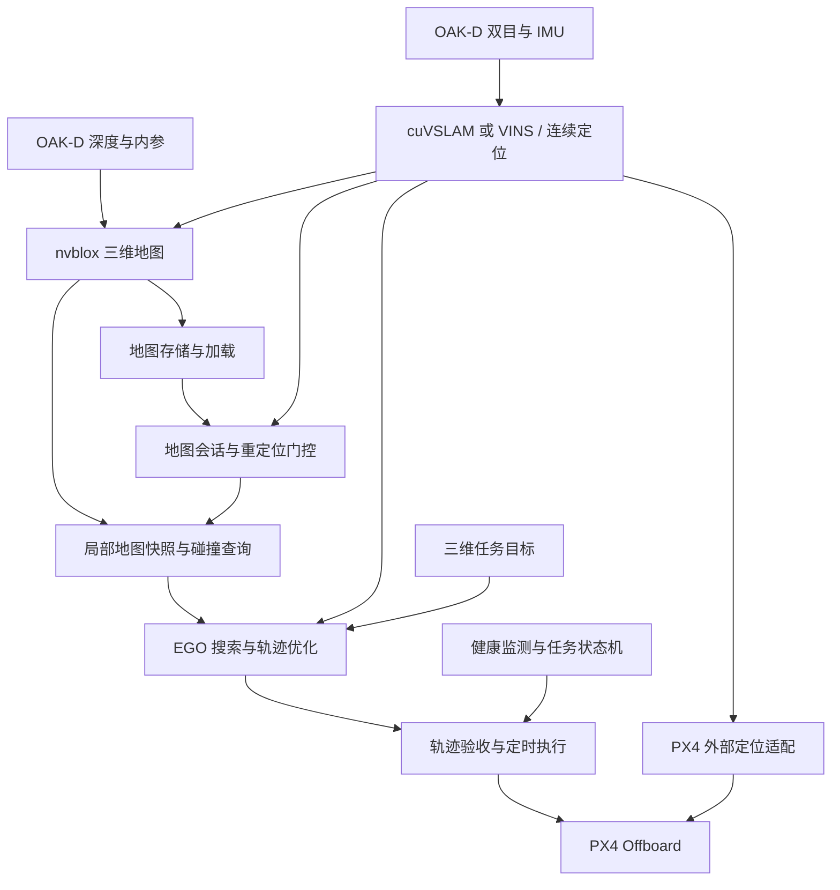

# EGO + nvblox 无人机自主导航开发手册

本文确定本项目后续路线：**nvblox 统一三维重建与地图存储，EGO 负责三维局部轨迹规划，PX4 负责飞行控制**。

状态：开发设计，2026-09-24。文中标注“拟新增”的包、消息和 launch 尚未实现；示例参数是起始设计值，不是已验证飞行参数。本文描述目标设计，不代表 EGO 已安装或自主导航链路已完成。现状与已知失败见 [项目评估](UAV_PROJECT_ASSESSMENT.md)。

## 1. 目标与边界

首版目标：单机在受控室内静态环境中，从当前位置飞向指定三维目标，绕开已观测障碍；无可行路径时停止任务并执行经过验证的制动/保持策略。地图可保存，并在完成重新定位后用于下一次任务。

首版采用 OAK-D + cuVSLAM 主线，同时保留 VINS-Fusion 为可选定位后端；MID360 / FAST-LIO 保留为后续定位与障碍输入。所有后端须满足同一里程计契约，切换时重置地图/轨迹会话。暂不同时做多传感器融合、集群、高速飞行和动态障碍预测。

四个不能混淆的能力：

| 能力 | 责任模块 | 不代表什么 |
| --- | --- | --- |
| 连续定位 | cuVSLAM 或 VINS、可选三维 EKF | 有里程计不代表已与旧地图对齐 |
| 三维重建与距离查询 | nvblox | 有 mesh 不代表可通行区域和未知区域已正确处理 |
| 无碰撞轨迹规划 | EGO + 地图适配层 | 有轨迹不代表 PX4 能按约束跟踪 |
| 轨迹执行 | executor + PX4 | 发出 setpoint 不代表飞控已进入 Offboard |

EGO 是 ESDF-free 规划方法，接入 nvblox 的首要目的为统一地图，不是强制把 ESDF 梯度注入 EGO 优化器。保留原优化方法，先替换地图查询依赖。[论文](https://arxiv.org/abs/2008.08835)

### 1.1 已确认的工程决策

- 统一三维地图路线为 EGO + nvblox，不再保留项目自有二维栅格/APF 作为运行方案。
- cuVSLAM 为主定位候选，VINS-Fusion 保留为可选后端；保留选项不等于两者并行融合或自动故障切换。
- 完整保留工作区已有 Isaac 系列源码、工具、测试和示例；按需构建、按需启动。
- EGO 自带三维地图只用于隔离测试和对照，不是已删除的项目二维栅格。最终飞行验收使用 nvblox 地图后端。
- 统一地图是统一数据来源，不要求所有模块共享一个进程，也不要求所有模块读取整张全局地图。

### 1.2 nvblox 的职责与交付物

**nvblox 把深度观测与对应时刻的位姿融合为三维环境模型，供规划与地图复用使用。**

| 职责 | 输入或操作 | 交付物及消费者 |
| --- | --- | --- |
| 三维重建 | 深度、匹配内参、传感器位姿 | 体素化表面表示（TSDF），作为后续距离计算和重建的基础 |
| 距离计算 | 已融合的环境模型 | 三维 ESDF，由地图适配层批量读取 |
| 几何可视化 | 重建表面 | mesh/点云等检查数据，供 RViz 和离线质量评估使用 |
| 地图存取 | 保存/加载静态地图 | 地图文件，由地图管理器连同定位资产和标定信息管理 |

职责边界：

- 位姿由定位后端提供；nvblox 不估计本项目的无人机位姿。
- 地图适配层解释未知、地图边界、距离有效性和机体膨胀；不能把原始距离直接当作可飞判据。
- EGO 使用地图查询生成轨迹；nvblox 不承担任务决策、轨迹规划或飞行控制。
- 地图加载只恢复地图数据；地图管理器还须协调重定位、现场确认和地图会话切换。
- 距离来自已重建障碍，不保证未知区域安全；地图质量依赖定位、时序、深度和标定质量。

最小可验收输出为：有明确坐标和版本的地图、可验证的局部三维距离查询、未知状态处理，以及能复现的保存/加载结果。看到 mesh 或接收到 ESDF 消息都不能单独证明地图已可用于飞行。

## 2. 当前代码如何复用

| 当前资源 | 处理方式 |
| --- | --- |
| `src/oakd_perception` | 保留驱动、内参、深度和 IMU；补充时序、单位与丢帧验收 |
| `src/uav_bringup/launch/oakd_vio.launch.py` | 作为定位接入基础；现有默认配置面向 VIO 验证，不等于建图深度已开启 |
| `src/isaac_ros_nvblox` | 保留 vendor，新增无人机三维配置和地图适配层 |
| `src/nav_mapping` | 仅保留点云转换与合并；原二维栅格、APF 及其兼容层已移除 |
| `src/VINS-Fusion-ros2` | 保留源码、配置及可选启动；接入统一定位契约 |
| `src/px4_comm_bridge` | 复用通信基础，修正坐标和状态机问题，扩展轨迹跟踪接口 |
| `src/nav_guard`、`src/nav_safety` | 复用监测基础；重做运动阈值、超时和任务状态联动 |
| `src/uav_bringup/gazebo` | 复用障碍场地；简化速度模型仅用于可视化，PX4 SITL 需单独接入 |
| `patches/vendor` | EGO 的最小上游改动也走版本固定和补丁流程 |

本地读取确认的版本基线：

- nvblox 顶层提交：`6362295e581ef243773c8a348ac46711e4a1fca4`。
- Isaac ROS Visual SLAM：`04bf49a2daf7710d2ba2390d1772435a1baeb48d`。
- 两者仍需记录本地补丁和嵌套子模块提交，单个顶层 SHA 不能完整复现环境。
- EGO 候选为官方 `ego-planner-swarm` 的 `ros2_version`，不是 EGO-Planner-v2；该分支说明使用 Humble 示例并提到 DDS 延迟，不能推定 Jazzy 已通过测试。[分支说明](https://github.com/ZJU-FAST-Lab/ego-planner-swarm/tree/ros2_version)
- PX4 固件版本尚未锁定；须与 `px4_msgs` 消息定义、DDS 配置一起验证并记录。不要随意升级其中一项。

先在隔离目录验证 EGO 构建，筛选实际需要的规划包；确认包名不冲突后再进入主工作区。固定 EGO commit、记录补丁，不跟踪浮动分支做验收。新增发布依赖前检查各仓库 LICENSE。

Isaac 系列源码完整保留，构建按需选择；范围见 [Isaac 内容说明](ISAAC_ROS_COMPONENTS.md)。

### 2.1 Isaac 系列在本路线中的分工

| 仓库 | 本项目中的作用 | 运行选择 |
| --- | --- | --- |
| `isaac_ros_visual_slam` | 双目/惯性视觉定位 | 选择 cuVSLAM 后端时启用；VINS 模式不重复发布控制用定位 |
| `isaac_ros_nvblox` | 统一三维重建、距离查询与地图存取 | 最终地图主线 |
| `isaac_ros_image_pipeline` | 按需图像矫正、缩放、立体与深度处理 | OAK-D 已提供匹配输出时避免重复处理；具体节点按输入要求选择 |
| `isaac_ros_nitros` | NITROS/GXF、数据类型及支持节点间的高效数据传输 | 随实际 Isaac 节点依赖启用，不假设任意节点间都能零拷贝 |
| `isaac_ros_common` | 公共工具、构建支持与接口 | 按依赖使用 |

上游 `nvblox_nav2`、示例、测试保留源码，但不接入 EGO 无人机控制链路。项目自有二维栅格的删除不意味着裁剪这些上游功能，也不意味着必须构建所有上游示例。

Isaac Sim 是独立仿真软件，不是以上 ROS 包的替代品。现有独立 UI 脚本只提供入口；无人机传感器模型、时钟、PX4 通信与动力学联调仍需开发验证。

### 2.2 当前可用入口与待开发接口

| 当前入口/内容 | 实际状态 |
| --- | --- |
| `oakd_visual_slam_rviz.launch.py` / `oakd_vio.launch.py` | 已有 cuVSLAM 硬件验证入口 |
| `nav_stack.launch.py` 的 `enable_vins`、`odometry_source` | 已有 VINS/LIO 相关开关；关闭 VINS 不会自动启动 cuVSLAM |
| `nav_mapping` 点云转换、合并 | 保留；不进行二维投影或三维地图积分 |
| `uav_ego_nvblox.launch.py`、MapQuery、定时轨迹与 executor | 拟开发，不能按现有命令运行 |

项目二维栅格构建器、二维地图融合、APF、`nav_local` 兼容层及原二维链路集成测试已删除。后续测试围绕三维地图接口与轨迹执行重新建立，不恢复旧节点以满足过时测试。

## 3. 最终架构



nvblox 是最终地图数据源；CPU 查询缓存是地图的派生视图，不做第二次传感器积分。EGO 自带地图仅在早期基线测试中保留，切换后禁用其深度/点云积分回调。

拟新增目录职责：

| 包/文件 | 内容 |
| --- | --- |
| `src/ego_planner_vendor/` | 固定版本的上游规划代码，排除不需要的模拟器/控制器 |
| `src/uav_nav_interfaces/` | 地图快照元数据、定时轨迹、任务状态接口 |
| `src/uav_map_adapter/` | nvblox 批量读取、缓存、有效性和碰撞查询 |
| `src/uav_ego_adapter/` | EGO 地图接口适配、目标输入、轨迹转换 |
| `src/uav_trajectory_executor/` | 按时间采样、连续切换、控制仲裁与执行监测 |
| `src/uav_map_manager/` | 地图包、加载、会话标识、重定位门控 |
| `src/uav_bringup/launch/uav_ego_nvblox.launch.py` | 最终编排入口，默认不自动解锁 |
| `src/uav_bringup/config/uav_ego_nvblox.yaml` | 项目参数集合，区分上游参数和适配器参数 |

## 4. 坐标、时间和定位契约

### 4.1 坐标所有权

约定 `map -> odom -> base_link -> camera optical frames`：

- `odom` 为当前会话连续局部世界系；飞行执行轨迹使用此系。
- `map` 为可持久化地图系；地图重定位可能修正 `map -> odom`。
- `base_link` 使用 FLU；相机光学系使用右、下、前。
- 首版无重定位时可让 map 与 odom 对齐，但只允许一个明确的 TF 发布者。
- cuVSLAM 与 EKF 不能同时发布同一条 `odom -> base_link`。
- 加入地图管理后，既有双 EKF 的 `map -> odom` 发布权必须重新配置，不能与重定位模块冲突。

为降低 ESDF 服务适配复杂度，首版规划坐标使用 nvblox 地图系 `map`；每次规划冻结地图快照及 `map -> odom` 变换。候选轨迹转成 odom 后交给执行器。变换修正超出约定容差时，旧地图版本和候选轨迹失效，重新检查剩余轨迹/制动路径，不把跳变直接传给控制器。

PX4 本地 NED 与项目 odom 可能有不同原点和航向。先估计/建立刚体对齐，再做坐标约定转换。不能仅交换 X/Y 就声称完成对齐。

### 4.2 定位输入验收

先独立验证：时间连续、位置/姿态轴向、速度所在坐标系、外参、协方差、重定位与 reset 行为。不要把由同一 VIO 推导出的多个输入当作独立传感器重复融合。

规划定位与 PX4 外部定位必须一致。外部定位输入应包含有效性、时间对齐及 reset 处理；控制器不能同时依赖一个原点，而规划器依赖另一个原点。

当前 `converters.py` 中 `vehicle_odometry_to_ros()` 直接复制位置/速度并标记 map，未完整处理 PX4 frame 枚举、姿态和协方差；这项必须先修正或明确禁用，不能作为已合格状态输入。

#### 可选定位后端的统一接口（拟开发）

最终入口拟提供 `localization_backend:=cuvslam|vins|external`，这是新设计参数，当前 launch 尚不支持。FAST-LIO 首期可经 external 接入；每次任务只选择一个控制用定位来源。

适配层拟输出 `/uav/localization/odometry`（`nav_msgs/Odometry`）和独立定位状态，统一机体参考点、坐标、采样时间、速度语义、协方差有效性及 reset/session 标识。只做 topic remap 不足以完成统一：尤其要检查 VINS 输出的 IMU 参考点与机体中心之间的刚体变换。

VINS 源码、OAK-D 标定配置与原启动入口保留。cuVSLAM 与 VINS 可离线对比，但不能未经设计同时发布相同 TF 或同时给 PX4 注入同源视觉观测。

后端切换只允许在任务停止状态：停止接受旧轨迹，确认新后端初始化和坐标对齐，递增会话 epoch，重建或重新对齐地图，再恢复任务。若只有里程计没有地图重定位能力，新会话必须重新建图或通过独立锚点对齐；不得直接继续使用旧地图。

### 4.3 时间约定

- ROS 消息使用统一 ROS 时间；SITL 全链路一致配置 `/clock`，不得混用系统时间。
- 控制周期监测同时使用单调时钟，防止 ROS 时间暂停/回跳掩盖进程失活。
- 图像匹配对应时刻 TF，不能用最新 TF 代替历史 TF。
- 记录图像采集、里程计、地图积分、缓存完成、规划完成和实际执行时间。
- PX4 时间戳与采样时间按锁定固件的接口约定处理，不能简单把飞控启动计时当成 Unix 时间。

## 5. nvblox 地图接入

### 5.1 三维配置与输入

最小配置意图如下；须合并到新配置，不能替代完整相机/TF 配置：

```yaml
nvblox_node:
  ros__parameters:
    global_frame: map
    esdf_mode: "3d"
```

本地 `node_params.hpp` 中 `esdf_mode` 默认为 `2d`、未观测输出默认值为 `-1000`。构建前后都应核对固定版本参数；上游文档可能随版本改变。[官方参数](https://nvidia-isaac-ros.github.io/repositories_and_packages/isaac_ros_nvblox/isaac_ros_nvblox/api/parameters.html)

启动时明确打开 OAK-D 深度发布，校验深度 encoding、单位、分辨率、无效像素、与深度匹配的 CameraInfo，以及深度光学坐标系。不能未经确认直接使用左右目内参代替深度内参。

首版只接 OAK-D 深度；MID360 接入前另做时间同步、去畸变、外参和 nvblox 雷达输入支持验证。

#### 建图数据的验收边界

TSDF 表示重建表面附近的截断距离，ESDF 用于空间障碍距离查询，mesh 用于观察重建几何。三者的有效范围和消费者不同；适配层不应从可视化 mesh 或表面点云反推完整自由空间。

针对同一平面、立柱和悬空障碍，分别验证表面位置、距离数值、未知区与地图边界。若深度继续更新但位姿过期，应拒绝错误配对的积分并报告健康异常，不能让“地图仍在刷新”掩盖定位失效。

如果定位发生回环修正，已经按旧位姿融合的体素不会仅通过修改 TF 自动修复。需要根据修正性质选择暂停积分、重新对齐整个地图、重建或回放重积分；超出刚体整体对齐范围的历史漂移不能靠一条 `map -> odom` 变换消除。

### 5.2 本地已存在的服务

默认节点名为 `nvblox_node` 时：

| 服务 | 类型 | 用途 |
| --- | --- | --- |
| `/nvblox_node/get_esdf_and_gradient` | `nvblox_msgs/srv/EsdfAndGradients` | 批量读取局部三维距离网格 |
| `/nvblox_node/save_map` | `nvblox_msgs/srv/FilePath` | 保存静态 mapper 地图 |
| `/nvblox_node/load_map` | `nvblox_msgs/srv/FilePath` | 加载地图 |

接口源文件：

- [EsdfAndGradients.srv](../src/isaac_ros_nvblox/nvblox_msgs/srv/EsdfAndGradients.srv)
- [ESDF 转换实现](../src/isaac_ros_nvblox/nvblox_ros/src/lib/conversions/esdf_and_gradients_conversions.cu)
- [节点与地图存取实现](../src/isaac_ros_nvblox/nvblox_ros/src/lib/nvblox_node.cpp)

**当前转换实现实际输出三维有符号距离数组，不是每体素四通道的 distance+gradient。** 读取 `layout`、维度、stride、data_offset、`origin_m` 和 `voxel_size_m`；为本版本编写适配测试，禁止根据服务名字猜布局。体素中心为 `origin + (index + 0.5) * voxel_size`。

响应 header 的时间是最近积分深度的时间，不等于每个体素最后观测时间。对持续更新区域中长期未观测体素，如需逐体素时效判断，需扩展时间/观测元数据；不能用全局 header 掩盖局部陈旧数据。

节点运行后可手动检查，以下命令不是启动建图的命令：

```bash
./scripts/with_venv.sh ros2 interface show nvblox_msgs/srv/EsdfAndGradients
./scripts/with_venv.sh ros2 service call \
  /nvblox_node/get_esdf_and_gradient nvblox_msgs/srv/EsdfAndGradients \
  '{frame_id: map, use_aabb: true, aabb_min_m: {x: -2.0, y: -2.0, z: 0.0}, aabb_size_m: {x: 4.0, y: 4.0, z: 3.0}, update_esdf: true, visualize_esdf: false}'
```

查询请求的清除球/清除盒字段保持空。不要为了使起点“可飞”而自动清掉机体周围真实障碍。

### 5.3 地图语义

内部状态至少为 `UNKNOWN / FREE / OCCUPIED / OUT_OF_MAP`，并单独标识 `STALE`。

- 未观测哨兵、无效数据、地图外区域不能判为 FREE。
- ESDF 有效性和符号需通过几何夹具验证；有效距离不能自动证明当前飞行时间窗内仍被观测。
- 首版 UNKNOWN、地图外和过期区域禁止进入；这可能使狭窄/遮挡区域无法规划，应报告失败。
- 起飞体积须先确认可观测且无障碍；不得全局将 UNKNOWN 改成 FREE 来解决启动失败。
- 已知自由状态与“膨胀后可飞”分开表示。后者要求距离大于机体包络及误差余量。
- 若现有 ESDF 响应不足以支持必要的自由空间语义，扩展 observed/TSDF weight/occupancy 数据导出；不可自行补猜。

采用保守球形包络时：`r_effective = r_body + e_localization + e_tracking + e_map`。所有项来自实测或明确上界；不能在 nvblox 适配和 EGO 原膨胀层重复叠加同一机体半径。

制动空间另外考虑：`d_stop >= v * latency_total + v² / (2 * a_brake) + margin`。此式仅为设计估计；实际 jerk 限制、姿态和推力能力可能需要更长距离，以 SITL/实测制动包络验收。

### 5.4 缓存设计

首版采用后台 AABB 批量服务查询 + CPU 双缓冲/不可变快照。规划线程不逐点访问 ROS 服务。

建议快照字段：`map_id`、`epoch`、`version`、`frame_id`、来源时间、完成时间、origin、resolution、shape、距离、有效性、冻结的 frame 变换。

查询原则：

1. 每个规划任务持有同一快照；新地图在任务间原子切换。
2. 过期或越界立即返回不可用状态，不默认为无障碍。
3. 新轨迹下发前用最新可用快照复检，并持续监测执行中的剩余轨迹。
4. 地图加载、定位 reset、关键参数变化递增 epoch；旧 epoch 轨迹不再接受。
5. ESDF 截断/最大有效距离必须覆盖所需安全阈值，否则明确视为信息不足。

10×10×4 m、0.1 m 分辨率约 40 万体素；距离 float32 + 有效标志 uint8 原始约 2 MB，双缓冲约 4 MB，尚不含消息/复制/元数据。5 Hz 批量更新仅距离和标志已约 10 MB/s。必须测量 GPU 同步、DDS 序列化和 CPU 拷贝成本；该估算不等于性能承诺。

## 6. EGO 地图与轨迹适配

### 6.1 保留与修改范围

固定上游版本后，盘点搜索器、优化器、FSM、碰撞检测中所有地图调用点；将其统一转到 `MapQuery`，不能只改一个 `getOccupancy()`。

建议的项目内部接口（不是上游已有 API）：

```cpp
struct MapQuery {
  // All calls operate on one immutable snapshot.
  CellState state(const Eigen::Vector3d& p) const;
  bool inflatedCollision(const Eigen::Vector3d& p) const;
  bool segmentCollision(const Eigen::Vector3d& a,
                        const Eigen::Vector3d& b) const;
  double resolution() const;
  MapVersion version() const;
};
```

保留 EGO 搜索和 B 样条优化；禁用原建图输入、原飞控/模拟器控制输出、无目标自动巡航。未知状态不能透过整数/布尔转换意外成为 free。

线段检查采用体素遍历或有保守距离界的检查；轨迹复检还要覆盖曲线内部，不能只检查控制点或稀疏采样点。约束 XYZ 速度、加速度、jerk、飞行高度和任务边界。yaw 策略需考虑 OAK-D 前向视场，不能在未观测侧后方任意横飞。

### 6.2 轨迹数据契约

拟新增 `/uav/trajectory`，建议消息至少包含：

| 字段 | 语义 |
| --- | --- |
| header、frame_id | 执行坐标 odom；消息生成时间 |
| trajectory_id、map_id、epoch、map_version | 跟踪轨迹与地图来源 |
| start_time、valid_until | 绝对执行起点和有效期限 |
| representation、knots、coefficients | 明确样条次数、单位、节点向量和维度 |
| yaw reference | yaw/yaw rate 或独立时间函数 |
| constraints | 本轨迹承诺的动态边界 |
| terminal behavior | 已验证终端停止/保持条件 |

也可采用固定格式的定时轨迹点序列，但必须规定插值方式和验证插值后的碰撞/动态约束。`nav_msgs/Path` 仅供可视化，不能承担定时控制契约。

新轨迹从预测接管时刻的状态开始，与旧轨迹位置、速度连续，并检查加速度连续性。过早、过晚、乱序、重复和跨 epoch 的轨迹有明确拒绝规则；不得把发布时间误当作轨迹起点。

## 7. PX4 执行和故障处理

当前 `fill_trajectory_setpoint()` 只填速度，位置/加速度为 NaN；`fill_offboard_control_mode()` 也仅启用速度。新增执行器不能直接复用它来声称实现了位置轨迹跟踪。

首版目标为位置控制参考加速度/速度前馈，按固定 PX4 版本支持的组合设置字段和 OffboardControlMode。不要因为发送了加速度前馈就无条件切换到加速度控制模式。未使用字段显式 NaN，禁止残留上一帧数据。[PX4 Offboard 语义](https://docs.px4.io/main/en/flight_modes/offboard)

开发顺序：

1. 修正 `auto_arm` 与 `sm_auto_arm` 两套开关，使用单一显式授权；默认不自动解锁。
2. 修正现有状态机测试失败，增加真实确认消息、拒绝、超时和人工接管测试。
3. 做 ENU/NED、FLU/FRD、原点/航向对齐、yaw wrap 和时间戳测试。
4. 按绝对时间采样轨迹，而不是每个 timer 回调推进固定一步。
5. 保证同一 PX4 输入只有一个控制发布者；避免旧桥与新执行器并行控制。
6. 接入健康门控与制动轨迹，最后接规划器实时输出。

Offboard 心跳与规划频率独立。PX4 文档要求连续存活信号并在进入模式前预发送；具体进入条件、超时和失效动作按锁定固件配置验证。保持心跳不应掩盖地图/定位失效。

拟定任务状态：`IDLE -> READY -> TAKEOFF -> HOLD -> EXECUTE -> BRAKE -> HOLD/LAND`，另有 `FAULT` 和 `MANUAL`。只有状态确认后进入后续动作。

| 情况 | 预期处理 |
| --- | --- |
| 无目标/目标取消 | 不前向巡航；有可靠定位时执行验证过的保持/制动 |
| 地图过期/规划失败 | 禁止新前进轨迹；仅使用仍有效、已验证的制动余量 |
| 定位丢失或跳变 | 使轨迹失效；不能假定位置保持仍可用，按飞控能力和场地执行已验证失效策略 |
| 障碍侵入剩余轨迹 | 重规划或制动；不能等待旧轨迹结束 |
| 人工接管 | 停止自动重新抢占模式；恢复需显式操作 |
| 控制进程退出/链路中断 | 由 PX4 配置的 Offboard 失联机制接管，SITL 注入验证 |

不要把“立即发布零速度”当成已证明的制动策略，也不要在室内定位失效时盲目默认返航。

## 8. 地图持久化与跨任务复用

### 8.1 地图包格式

拟定布局：

```text
maps/<map_id>/
  manifest.yaml
  static_map.nvblx
  localization/       # 可选：定位地图/锚点/描述子及其版本
  calibration/        # 相机内外参、传感器配置
  preview/            # 可选 mesh/图像，仅用于查看
  validation/         # 地图质量与复用测试结果
```

manifest 至少包含 schema、map_id、创建时间、坐标系、voxel_size、上游 commits/补丁哈希、标定哈希、定位资产类型、有效边界、校验和与兼容版本。map_id 跨任务保持，epoch 属于加载/定位会话，version 属于本次地图更新。

当前 save_map 保存静态 mapper，不能假设它包含定位地图、动态层、任务状态或完整缓存。实际序列化层内容须做保存/重载对照，派生 ESDF 必要时重新计算。

### 8.2 保存与加载步骤

保存：暂停任务和地图写入竞争，等待积分完成，保存临时地图文件，检查 success 和校验和，最后原子发布 manifest。失败不得覆盖上一份完整地图。

服务检查命令（先创建目标目录；路径是节点进程所在文件系统的绝对路径）：

```bash
./scripts/with_venv.sh ros2 service call \
  /nvblox_node/save_map nvblox_msgs/srv/FilePath \
  '{file_path: /absolute/path/maps/room_a/static_map.nvblx}'
```

加载必须在非 EXECUTE 状态执行：验证版本与标定，加载地图，获取当前定位到旧 map 的变换，验证对齐误差，重建缓存并递增 epoch，确认现场环境后才允许任务。

**nvblox load_map 不提供重新定位。** 当前 VIO-only 配置也不能被假定能自动恢复旧地图坐标。需要实现并验证 cuVSLAM 地图重定位，或使用可测量锚点/其他地图匹配方法。首版可以在受控固定起点验证复用，但不得将其标记为任意位置重定位。

旧地图自由空间不应永久视为现场自由空间。定义在线确认范围；新观测障碍优先于旧 free，清除旧障碍必须有可靠新观测。地图标定/体素大小改变时拒绝静默复用。

## 9. 分阶段开发与退出标准

| 阶段 | 交付 | 必须通过后再进入下一阶段 |
| --- | --- | --- |
| M0 版本与接口基线 | 版本锁、EGO Jazzy 构建结果、PX4/SITL 配套版本、修复状态机与坐标问题 | 单元测试通过；无默认自动解锁、无重复控制发布者 |
| M1 定位与三维地图 | 新 nvblox 配置、深度/位姿对齐、三维距离查询 | 墙/立柱/悬空障碍/未知区夹具正确；静止不重影，运动延迟有记录 |
| M2 地图适配 | MapQuery、局部缓存、epoch/version、边界/时效处理 | 解析布局、负坐标、未知、越界、版本切换和连续碰撞检查测试通过 |
| M3 EGO 离线闭环 | 原生地图对照、nvblox 查询后端、定时轨迹输出 | 同一场景完成绕障；每条轨迹通过独立几何与动态约束检查 |
| M4 PX4 SITL | 真实飞控模型、executor、人工接管和故障注入 | 起飞/悬停/三维目标/制动/降落闭环；地图与定位故障不继续执行前进轨迹 |
| M5 地图复用 | 地图包与定位对齐流程 | 重启后正确加载；错误地图、错误标定和对齐失败均阻止任务 |
| M6 受控实机验收 | 低速静态障碍绕行记录 | 在预先确定边界内重复完成任务，并记录全部失败/干预 |

M3 前可运行 EGO 原地图作为基线；最终验收必须使用 nvblox 唯一地图后端。SITL 真值定位只用于隔离规划/执行问题，之后必须用实际感知定位链路重复测试。

每个阶段建议单独提交：先接口与测试，再实现，再启动配置和文档，不一次混合定位、地图和飞控改造。

## 10. 性能预算与参数起点

以下是受控低速实验的设计起点，需用本机数据调整，不是上游保证：

| 项目 | 初始目标 |
| --- | --- |
| 深度输入 | 20–25 Hz，与设备稳定能力一致 |
| 定位 | 25–50 Hz，记录有效采样而非重复发布频率 |
| 地图快照 | 5–10 Hz；控制执行不等待地图服务 |
| 局部重规划 | 5–10 Hz，并支持障碍/目标变化触发 |
| 轨迹执行与心跳 | 50 Hz 起步，测量最大调度间隔 |
| 体素 | 0.1 m 起步；细杆/窄门需更细分辨率或扩大余量 |
| 受控初期水平速度 | 0.3–0.5 m/s，仅在制动/感知余量验证后使用 |
| 地图快照超时 | 0.3 s 初始门限，最终由时延测量与制动距离共同确定 |

记录 p50/p95/p99 及最大值：图像至地图延迟、批量服务耗时、缓存转换耗时、规划耗时、执行抖动、GPU/CPU/内存负载。超出预算时先减少局部窗口/可视化负载或降低速度，不能仅放宽超时继续飞行。

避免将 25 Hz VIO 通过 50 Hz EKF 输出理解为获得了 50 Hz 新视觉信息。NVIDIA 与 EGO 的 DDS/RMW 选择统一做端到端测试，不直接照抄上游修改全局 `.bashrc`。

## 11. 验收用例与记录

### 11.1 单元和离线测试

- ESDF 解析：不同 shape、stride、offset、负 origin、未知哨兵、NaN、失败响应、尺寸不匹配。
- 几何：平面、球、立柱、薄板、悬空障碍；检查正负距离、体素中心和有效范围。
- 碰撞：线段穿过单体素障碍、样条控制点无碰撞但曲线碰撞、地图外段、双重膨胀。
- 并发：规划期间新缓存到达、旧版本乱序响应、加载地图、定位 reset；旧 epoch 不得继续下发。
- 坐标：ENU/NED 基向量、FLU/FRD、旋转原点、yaw 跨 ±π、速度坐标系、时钟回跳。
- 定位后端：cuVSLAM/VINS 机体参考点一致性、TF 单发布者、初始化失败、切换时旧轨迹失效。
- 重建：位姿过期时拒绝积分，回环修正后地图一致性，表面重影与距离查询偏差。
- 执行：接管连续性、延迟/丢失轨迹、终点制动、重复轨迹和人工接管。

### 11.2 SITL 场景

空场到点、单柱左右绕行、墙面绕行、不同高度门框、顶部/底部障碍、死胡同、狭窄不可通行通道、目标在障碍内、未知目标、地图冻结、定位跳变、进程退出和人工接管。

碰撞判据使用仿真真实几何/机体包络，不仅使用规划器自己的地图；否则同一个地图错误可能同时欺骗规划和验收。

### 11.3 验收门槛如何制定

测试前固定场景、种子、起终点、机体包络、速度/加速度约束和通过条件。建议每类静态正常场景至少重复 20 次，记录完成率、最小间距、跟踪误差、制动距离、人工干预与全部失败；零次碰撞是必要条件，但有限样本不构成安全证明。

跟踪误差上限不得大于分配给 `e_tracking` 的预算；地图与定位误差同理。p99 延迟及观测到的最坏延迟都要落入制动空间假设。无路场景以正确停止为成功，不以强行到达为成功。

保存 ROS bag、PX4 ULog、参数快照、版本锁、地图包和结果 JSON。逐条关联 trajectory_id 与 map_version，支持回放复现。测试报告区分真值定位、实际 VIO、简化模拟器、PX4 SITL 和实机。

## 12. 开发任务清单

- [ ] 固定 EGO ROS 2 commit，完成 Jazzy、DDS 和消息依赖兼容性验证。
- [ ] 固定 PX4 / px4_msgs，解决坐标、时间和自动解锁参数问题。
- [ ] 实现 cuVSLAM/VINS 统一定位接口与停止状态下的后端切换。
- [ ] 核对 Isaac 源码完整保留、主线按需构建，避免本地补丁重新屏蔽上游包。
- [ ] 新增三维建图 launch，验证实际深度与历史位姿匹配。
- [ ] 实现 ESDF 解析和 UNKNOWN/FREE/OCCUPIED 语义测试。
- [ ] 实现 MapQuery 快照和 EGO 全调用点适配。
- [ ] 实现定时轨迹消息、独立复检和 PX4 executor。
- [ ] 实现制动余量、失效门控及单控制发布者仲裁。
- [ ] 接入 PX4 SITL，复用现有障碍场地。
- [ ] 实现地图包、加载后的坐标恢复与现场确认。
- [ ] 按 M0–M6 保存可复现验收报告。

## 13. 参考资料

- [EGO 原论文](https://arxiv.org/abs/2008.08835)：ESDF-free 方法原理。
- [EGO ROS 2 候选分支](https://github.com/ZJU-FAST-Lab/ego-planner-swarm/tree/ros2_version)：以固定 commit 为准。
- [EGO 原地图接口参考](https://github.com/ZJU-FAST-Lab/ego-planner-swarm/blob/master/src/planner/plan_env/include/plan_env/grid_map.h)：用于理解接口；ROS 2 分支需重新盘点。
- [nvblox 参数文档](https://nvidia-isaac-ros.github.io/repositories_and_packages/isaac_ros_nvblox/isaac_ros_nvblox/api/parameters.html)：以本地固定源码核对参数类型。
- [PX4 Offboard](https://docs.px4.io/main/en/flight_modes/offboard)：实施时切换到锁定固件版本文档。
- [现有安装说明](INSTALLATION.md)、[硬件定位验证](OAKD_VISUAL_SLAM_RVIZ.md)、[当前项目评估](UAV_PROJECT_ASSESSMENT.md)。

## 14. 本次修订记录（2026-09-24）

明确 nvblox 的三维重建、距离计算、可视化和地图存取职责；补充 Isaac 各仓库运行分工与完整保留边界；同步项目自有二维链路已删除的现状；保留 VINS 可选性并定义拟开发的统一定位接口。新增定位切换、回环修正和地图一致性的验收要求。

本次修改仅涉及开发手册，检查本地链接与 Markdown 结构；未安装新包、未修改运行代码，也未将设计参数视为已经实现或测试通过。

## 达妙 USB IMU 可选融合入口

已加入 `damiao_imu` 驱动与 `damiao_visual_odometry.launch.py`，使用达妙角速度和视觉位姿进行三维 EKF 融合，输出 `/uav/localization/odometry`。OAK-D/cuVSLAM 默认继续使用相机原生 IMU；也可关闭 OAK-D 启动并接入经过坐标系适配的 VINS 里程计。此入口不自动接通 EGO/nvblox 或飞控。

具体安装、USB 协议、单位确认、外参、TF 所有权及验证步骤见 [达妙 USB IMU 接入手册](DAMIAO_IMU_USB.md)。`robot_localization` 输出供下游导航使用，不作为视觉前端的原始 IMU 输入。直接使用达妙驱动 VIO 仍需要完成硬件时间对齐与相机—IMU 标定。
