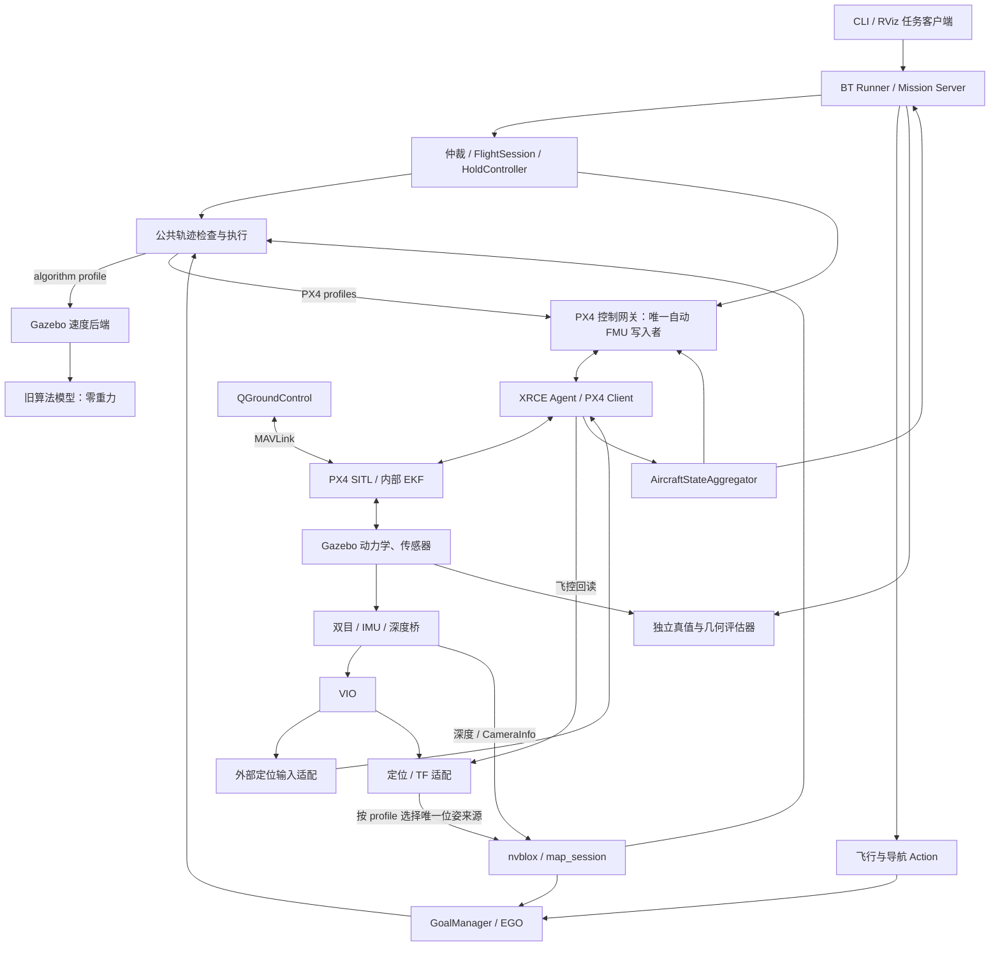

# UAV 全链路仿真开发计划

日期：2026-10-07。状态：S0 基础链路与 S1 首批接口/mock 已交付；S0 感知样例及实际任务/控制接入继续开发；已交付离线依赖审计、验收 schema、主机回归运行器，以及本机 PX4/Agent/消息包独立构建与未解锁 x500 冒烟链路；W0 已知区域的真实起飞/航点/悬停/返航/原生降落后端已实现；最小 BT XML/Runner 已接入 W0；感知、EGO 任务适配与完整 BT 编排仍待推进。详见 [S0 开发与验证记录](validation/simulation/2026-10-07-s0/REPORT.md)。

执行顺序更新：继续使用 PX4 官方 SITL＋Gazebo Harmonic＋QGC，先重新验证逐步骤 BT
和停止/失联语义，再完成真实 VIO 悬停，最后接入导航与避障。逐阶段门槛见
[三阶段集成路线](PX4_INTEGRATION_ROADMAP.md)，不能以合成外部视觉或影子规划代替飞行验收。

2026-10-08 真实传感器补充：新增独立针孔双目／IMU参考模型与有纹理场景，
实际 cuVSLAM 已通过未解锁静止跟踪的采样率、同步、重力与漂移检查。
尚非 Pro W 标定模型；原始 Odometry 的滑窗协方差禁止直接作为 EKF 观测置信度。
源标准化、运动/reset、真实 VIO 融合和 BT 悬停仍待验证，S6 尚未完成。见
[传感器跟踪证据](validation/simulation/2026-10-08-vio-sensors/REPORT.md)。

2026-10-08 VIO 遥测补充：新增独立 PX4 1.16.2 构建，保留原 W0 二进制/版本锁，
只扩展 selector 与四类 EV aid DDS 遥测。未解锁合成外部视觉已通过实际 EKF 融合、
连续准入和停更拒绝审计；GNSS/磁/光流辅助关闭，气压高度辅助保留。
该结果不代表双目/IMU VIO 或室内飞行通过 S6，详见
[VIO 遥测验证](validation/simulation/2026-10-08-vio-telemetry/REPORT.md)。

2026-10-08 开发补充：新增 `uav_bt` 最小 XML/异步 Action Runner 与 UUID/实例绑定的 BT
进展租约，复用 W0 飞行后端；运行入口为 `./scripts/sim.sh px4-flight --bt`。
这是 S2 的首批真实 PX4 接入，独立逐步骤飞行 Actions 与完整阶段验收仍待完成，
不代表 S2 或 S3/S4 全部验收通过。验证证据见 [BT/PX4 记录](validation/simulation/2026-10-08-bt-px4/REPORT.md)。

2026-10-08 导航补充：EGO 已在原 Executor 内提供真实 `NavigateToPose3D` Action，
含 UUID 取消、任务反馈、地图/时间校验、旧入口互斥与停稳确认。普通客户端的两航点和
运动中取消验证见 [导航 Action 记录](validation/simulation/2026-10-08-navigation-action/REPORT.md)，
接口与复现命令见 [运行说明](NAVIGATION_ACTION.md)。

2026-10-08 任务补充：algorithm MissionServer 与 ExecuteWaypoints BT 已接入，父任务覆盖
两航点和暂停期的会话预约/进展租约，支持确认停稳后暂停、检查点和新子 UUID 恢复。
请求幂等、旧世代与旧轨迹拒绝、暂停中取消及 Runner 停滞处置已有契约/实景回归。
见 [任务说明](ALGORITHM_MISSIONS.md) 与
[任务验证记录](validation/simulation/2026-10-08-algorithm-mission/REPORT.md)。
S2 算法闭环首批已实现，更多地图/clock 故障与逐步骤 PX4 BT、后续坐标/感知门槛仍待推进。

同日故障补充：RUNNING/PAUSED 的地图 epoch、健康失效、源时间戳冻结/回退和里程计
接收停更已有父任务契约回归；真实 Gazebo 时钟暂停与暂停中保存地图均终止旧任务，
随后新根两航点回归通过。持续观测缺失的停止未确认锁止也有契约覆盖。见
[故障回归记录](validation/simulation/2026-10-08-algorithm-faults/REPORT.md)。
这些用例不覆盖全部故障矩阵；ROS 时钟回跳的整栈现场处置、非 identity 定位和逐步骤 PX4 BT 仍待实现/验收。

2026-10-08 步骤控制补充：PX4 Runner 已生成显式的起飞/航点/悬停/返航/降落 BT 叶节点，
通过父任务绑定的 AdvanceFlightStep 服务逐次授权，步骤完成停稳后等待下一步。
现有唯一飞行网关保留物理执行、取消、保持和原生降落；独立逐步骤 ROS Actions 仍未实现。
新增 `--ui` 显示本轮 PX4 Gazebo/QGC。接口与证据见 [逐步骤 BT](PX4_STEP_BT.md)。

2026-10-07 版本核验补充：本机 QGC AppImage 为 v5.1.5；用户提供的 DM-FC01 固件已下载并解析，内嵌构建身份为 `v1.16.0-7-g78a512995e`，完整 hash 为 `78a512995e73dad88051707b5bee3df07eed4d78`，board_id=7140。文件 SHA-256、来源和证据见 [版本核验记录](validation/simulation/2026-10-07-artifact-versions/REPORT.md)。这些是文件元数据；厂商源码对应关系及飞控当前运行构建未核验，主机 SITL 基线已独立选定 v1.16.2，构建与运行证据见下文。

2026-10-08 定位门控补充：PX4 网关增加 VehicleOdometry 接收/发布/采样三重年龄检查，
覆盖位置、速度、航向与里程计重置计数；重置撤销参考并锁存，最终保持期间独立撤权。
实现与测试入口见 [定位输入门控](PX4_LOCALIZATION_GATES.md)。这只是 S3 首批门控，
地图规划、动态对齐与 EGO/PX4 接线尚未完成。

2026-10-08 规划上下文补充：新增 LocalizedOdometry/LocalizationAlignment/PlanningContext/
ContextTrajectory，提供显式 SE(3) 里程计适配、会话/世代绑定与迟到结果拒绝。EGO 支持
map 规划模式并保留默认 identity 模式；独立影子链路仅发布已复检轨迹，不写飞控。
范围与证据见 [规划上下文](PLANNING_CONTEXT.md)，S3/S5 与 PX4 感知执行仍未整体验收。

VIO 悬停首批实现（2026-10-08）：新增 `VioStatus`、cuVSLAM 源适配和
`FlightServer` 可选 VIO 门控；同时检查原始源、标定/会话、EKF selector、状态标志
与实际 EV aid source。`--require-vio` 缺少证据时拒绝预检，不启动 BT 飞行。
默认 PX4 DDS 尚未导出全部门控遥测，真实双目/IMU→VIO→融合→悬停仍未验收；
单纯定点悬停优先完成最小 VIO 闭环，不以 nvblox/EGO 为前提。见 [实现范围](VIO_HOVER.md)。

相机型号确认（2026-10-08）：实机为 **OAK-D Pro W**。新增
`./scripts/sim.sh px4-depth` 未解锁传感器链路验收入口，使用 PX4 上游
OakD-Lite 参考模型；它只用于 Gazebo→ROS 深度与 CameraInfo 审计，不代表
Pro W 视场、双目/IMU 标定或 nvblox/VIO 已完成。参考模式与 W0 飞行模式互斥。

本机 SITL 版本选择（2026-10-07）：按用户要求采用 PX4 1.16 系列最新稳定发布 **v1.16.2**，固定 commit `54f0455ffcd755534539a7cf33a09a20bf71d29d`；官方 release 与远端 tag 已核验。使用精确 commit 构建，后续升级显式更新版本锁。源码/SITL 子模块与构建已验证；Agent v2.4.3 及 px4_msgs v1.16.2 接口对应已验证。未解锁 x500 的 DDS/clock/QGC 冒烟通过，见 [构建与基础链路记录](validation/simulation/2026-10-07-px4-sitl-build/REPORT.md)。S1 首批只读 AircraftState 聚合与源/时钟丢失验证已完成，见 [S1 首批记录](validation/simulation/2026-10-07-s1-aircraft-state/REPORT.md)；最小任务接口、暂停/恢复与 FlightSession mock 已验证，见 [S1 协议记录](validation/simulation/2026-10-07-s1-mission-protocol/REPORT.md)；W0 真实状态/授权/坐标与任务后端已验证，见 [飞行验证](validation/simulation/2026-10-07-px4-flight/REPORT.md)；S2 BT、EGO 接入及 S3/S4 全部正式门槛仍待补齐。详见 [SITL 版本冻结记录](validation/simulation/2026-10-07-px4-sitl-version/REPORT.md)。

当前执行范围（2026-10-07 用户调整）：暂不使用 Jetson，Gazebo、PX4 SITL、感知、导航、BT 与测试全部在本机执行。S0/S6 不再依赖 ARM 样例，S7 改为本机集成负载与稳定性验收；Jetson/跨机联调移到本机主线交付后的可选阶段。既有 Jetson 未验证结果保留为历史证据，不再阻塞本机开发。见 [本机范围调整与回归记录](validation/simulation/2026-10-07-local-s0/REPORT.md)。

修订：补齐坐标迁移、时钟 profile、任务到保持会话交接、暂停协议、分阶段取消、起飞区域、地图格式迁移与可判定验收。本文约定是后续开发要求，不代表现有代码已修复。

本计划细化 [BT 与 PX4 协同开发计划](BT_PX4_DEVELOPMENT_PLAN.md)，覆盖当前算法仿真、飞机状态、BT 任务、PX4 动力学、室内视觉定位、本机负载与故障验收；另保留后续可选 Jetson 联调。当前可用命令见 [SIMULATION_CONTROL.md](SIMULATION_CONTROL.md)，不要将本文的计划入口当作已有功能。

## 1. 目标与已确认条件

目标闭环：

```text
任务客户端 → BT → 导航/飞行 Action → EGO/轨迹执行器
→ ROS 2 / Micro XRCE-DDS → PX4 SITL → Gazebo 动力学
→ 模拟双目/IMU/深度 → VIO/nvblox → 导航与飞控状态反馈
```

已确认目标硬件：Jetson Orin Nano 8GB、OAK-D Pro W、RadioMaster Pocket 内置 ELRS、贝壳 ELRS 2.4G 接收机，室内运行；厂商固件文件为 `damiao_dm-fc01_V1.16.px4`。QGC 已能观察真实遥控输入，但伴飞 TELEM 端口和遥控通道映射尚未分配，按用户要求暂缓。

仿真阶段使用 UDP 通信与逻辑遥控事件，不依赖真实 TELEM 或 CH 号。硬件运行配置不得自动使用模拟授权。首版单机、静态障碍、低速；不承诺全图覆盖、动态障碍安全或仿真直接等价实机。

交付任务至少包含：单点、多航点、暂停/继续、取消悬停、基于地图规划的返程、降落、有界探索保存和加载地图导航。返程位置由任务明确指定并带坐标会话，不等同于 PX4 原生 RTL。

## 2. 当前基础与必须保留的边界

| 当前内容 | 可复用部分 | 仿真升级工作 |
| --- | --- | --- |
| `uav_ego_lab/expanded.sdf` | 障碍布局、场景资产、目标测试 | 新增有重力的动力学场景，不覆盖零重力基线 |
| `uav_quad_mid360/model.sdf` | 传感器/几何组织参考 | 当前 VelocityControl 不作为真实飞行动力学，另建 PX4 模型 |
| `uav_ego_nvblox.launch.py` | nvblox、地图、EGO、执行组合 | 新入口按后端选择组件，禁止双重执行和重复 TF |
| GoalManager/AutonomousExplorer | 分段观察、探索、重试、接续；Navigate Action 与 UUID 取消已接入 | 探索 Action、更多故障回归和后续坐标/定位适配 |
| `MapSnapshot/TimedTrajectory` | 地图会话、样条、token、父轨迹契约 | 从 identity map/odom 仿真契约扩展至经过验证的坐标适配 |
| `px4_comm_bridge` | 速度参考转换、状态/ACK、模式状态机框架 | 修复里程计转换，显式授权/模式进入、状态聚合、制动、飞行 Action |
| OAK-D VIO-only 配置 | 双目/IMU 到连续里程计的候选路线 | 仿真双目和标定一致性、实际平台兼容性 |
| `sim.sh` 与验收脚本 | 环境、进程、状态、取消、地图操作 | 新模式、诊断、故障注入及统一结果输出 |

当前 lab/expanded 重力均为 `0 0 0`，使用直接速度命令；现有起点初始化通过 set_pose 改变相机位姿，不是自主起飞。两点已按当前源码核实。

项目自有 `core.py`、GoalManager、执行器之间的接口需要适配；不以 BT 框架替代 EGO/nvblox，也不在本阶段增加新的符号规划系统。既有碰撞、未知体积禁飞和轨迹完整复检继续保留。

## 3. 平台选择与验证分层

| 层级/计划 profile | 组成 | 能证明什么 | 不能证明什么 |
| --- | --- | --- | --- |
| A `algorithm` | 现有速度模型 + 真值定位 + nvblox/EGO | 算法、任务与地图回归 | 飞控起降、旋翼动力学 |
| B `px4_control` | PX4 SITL + 动力学 + 理想/受控定位 | 状态、模式、跟踪、制动、起降 | 真实 VIO 稳定性 |
| C `px4_mapping` | B + 深度建图 + EGO | 动力学下三维避障与探索 | 双目 VIO 的独立正确性 |
| D `px4_vio` | C + 模拟双目/IMU + VIO + EKF 外部定位 | 室内无 GNSS 的算法完整闭环 | 真实相机所有误差与实机可靠性 |
| E 可选 `jetson_loop`（延期） | 工作站模拟环境/PX4，Jetson 执行导航程序 | 算力、内存、网络、截止时间 | TELEM 电气层和真实 RF 链 |
| F 可选硬件联调 | 真实飞控/接收机，核验 HITL/SIH 支持 | 实际固件与遥控/串口行为 | 未实测的实际气动、感知与飞行安全 |

主线固定 PX4 v1.16.2（commit `54f0455ffcd755534539a7cf33a09a20bf71d29d`）、Gazebo Harmonic 和经过验证的 ROS/Isaac 组合；QGroundControl 监控参数、飞行状态与日志。官方 PX4 1.16 提供 `gz_x500`、`gz_x500_depth` 等模型，可用于建立基础闭环。[PX4 Gazebo 文档](https://docs.px4.io/v1.16/en/sim_gazebo_gz/)

真实板卡 `.px4` 固件不能直接作为电脑 SITL 程序运行。初期使用上游 1.16 基线；获得厂商源码后单独验证补丁和行为差异。不因上游 SITL 通过就认定厂商固件通过。

## 4. 系统架构与运行所有权



运行规则：

- 每次测试只启动一个所属 Gazebo server、一个飞机实例、一个 PX4 实例及对应 Agent 通道，命名与端口写入运行清单。
- Gazebo 与 PX4 启动由一个 supervisor 管理，若使用 standalone 则禁止 PX4 再启动 Gazebo。官方 standalone 是分离启动机制，需要本项目启动器集成。[Standalone 说明](https://docs.px4.io/v1.16/en/sim_gazebo_gz/)
- 动力学模式禁止启动旧 Gazebo 速度执行器，机体移除 VelocityControl；禁止 set_pose 与飞控同时控制飞机。
- QGC 通过 MAVLink 观察/操作，导航通过 DDS 控制；测试工具不得成为第二个持续 setpoint 发布者。
- `map→odom`、`odom→base_link` 各有唯一权威来源；真值定位、VIO、PX4 回读里程计不能同时写同一 TF。
- 硬件 profile 与模拟 profile 分开；不能靠“未找到串口便使用模拟”自动切换。

图中 algorithm 与 PX4 执行分支互斥，G0 不连接 PX4。外部定位消息通过 Agent 进入 PX4 内部 EKF；QGC 命令不经 BT。计划中的 Takeoff/Land 由飞行 Action 直接调用网关和控制会话，不要求经过 EGO 路径规划；其安全体积仍必须验证。飞控回读与 VIO 在定位适配器中按 profile 选择，禁止互相回灌。

## 5. 代码与资产交付结构

沿用 BT 总计划的包划分，新增仿真交付建议如下；均为待开发名称：

```text
simulation/px4/versions.lock.yaml          PX4、模型、Agent、QGC 版本与校验
simulation/px4/params/                    control / indoor_vio 参数差异
simulation/scenarios/                    场景、任务、种子、注入和阈值
simulation/profiles/                     时钟、定位/TF 权威与能力声明
simulation/acceptance/                   逐 profile 验收配置与适用用例
simulation/safe_regions/                 W0 已知控制/起降区域及来源
src/uav_bringup/gazebo/models/uav_px4_*    PX4 动力学及相机模型
src/uav_bringup/gazebo/worlds/*_px4.sdf    有重力的测试世界
src/uav_bringup/launch/px4_sitl.launch.py  动力学基础链路
src/uav_bringup/launch/uav_mission_sim.launch.py
src/uav_nav_interfaces/                  Action / AircraftState / 健康与任务身份
src/uav_mission/                         Task/Control/State 与暂停恢复
src/uav_bt/                              节点、任务 XML 与运行器
src/uav_px4_executor/                    轨迹采样、控制参考、制动/保持
scripts/build_px4_sim.sh                 独立构建，不混入现有 CUDA 全量流程
scripts/check_sim_environment.py         版本、topic、TF、时钟、发布者检查
scripts/run_sim_scenario.py              用例运行、结果及进程清理
scripts/inject_sim_fault.py              仅模拟环境的故障注入
scripts/measure_sim_navigation.py         本机资源与控制截止时间记录（待实现）
scripts/measure_jetson_navigation.py      可选 Jetson 阶段记录（延期）
docs/validation/simulation/              配置快照、结果与报告
```

PX4 源码放受版本锁管理的外部依赖目录或独立 checkout；不随意新增庞大二进制到主仓库。自有逻辑放自有包，vendor 改动按现有 patch 机制管理，记录 LICENSE 和提交。

## 6. 版本、通信、坐标与时间

### 6.1 版本冻结与环境审计

记录工作站操作系统、ROS、Gazebo、PX4、px4_msgs、Agent、DDS、BT.CPP、Isaac ROS/CUDA、相机依赖与所有 vendor commit。厂商固件文件的内嵌构建/hash 已核验并记录；对应源码及实际飞控运行构建仍待核实，不能将文件元数据当作现场遥测。

Jetson 另建 JetPack/L4T/Ubuntu/ROS/Isaac/CUDA/aarch64 兼容矩阵。工作站 `build_algorithm_sim.sh` 的 CUDA 13.2 和架构 89 是当前机器配置，Jetson 使用目标支持的软件栈和 GPU 架构。交叉架构不直接复制 build/install 或 x86_64 GXF 库。

S0 在本机完成基线与组件验证：记录工作站依赖版本，验证选定 VIO/nvblox 组件可加载及固定数据样例输出；接口/状态/任务骨架随 S1 实现后验证构建。S7 在同一工作站验证 Gazebo/PX4 与导航集成负载、内存及控制截止时间。Orin Nano 最小构建、ARM 组件样例和跨机测试移到后续可选 Jetson 阶段，当前标为 DEFERRED/N/A，不作为 S0、S6、S7 或 S8 前提；恢复该阶段时必须重新验证目标兼容性。

### 6.2 通信与网络

SITL 先使用 UDP Agent；官方示例为 `MicroXRCEAgent udp4 -p 8888`。Agent 版本与固件 Client 匹配并记录；本项目真实串口脚本仍保留给后续硬件阶段。[PX4 ROS 2 指南](https://docs.px4.io/v1.16/en/ros2/user_guide)

明确 XRCE UDP、MAVLink/QGC、ROS_DOMAIN_ID、GZ_PARTITION、命名空间、系统 ID 与日志目录。跨机时显式验证 Agent 主机、DDS 发现、防火墙/接口、消息大小、QoS 和时间源，不能仅凭 topic list 判断可用。

列出固件实际 DDS topic、字段和频率；至少覆盖控制输入、状态、ACK、里程计、位置有效性、着陆、电池和所需 RC 逻辑输入。缺失 topic 时补导出或限制能力，不默认已具备。

### 6.3 坐标与时钟

1. 区分 Gazebo world、ROS map/odom/FLU 和 PX4 local NED/FRD。
2. 验证轴方向、原点、航向、相机光学帧、速度参考系和重力方向；按 X/Y/Z 正向平移和绕轴旋转逐项检查。
3. map/odom 不再默认 identity。定位 reset、地图加载和 TF 校正改变时撤销旧曲线，按最新坐标重新规划。
4. 轨迹绝对时间、传感器时间、PX4 微秒时间先验证关系，明确源时间和接收时间；不只按收到消息的时刻重打时间戳。
5. 建议在 1x 仿真速度验收控制时序；快速仿真只用于已证明不依赖墙钟期限的用例。
6. ROS 仿真时间用于轨迹；租约、通信、取消期限用单调时钟。暂停 Gazebo、暂停任务和停止进程三个操作分别定义，暂停仿真不能算作任务已悬停。

### 6.4 坐标迁移工作包与权威来源

修订前 `converters.py::vehicle_odometry_to_ros` 直接复制位置/速度并标记 map，未填姿态；本批已修复 NED/FRD→ENU/FLU、child-frame twist、协方差和非法帧拒绝。现有执行器要求 odom/base_link，规划器还直接使用 odom 位置检查 map。S3 必须修复这些接口，不能只修改 frame_id。

| 数据/变换 | 首版契约 | 交付与门槛 |
| --- | --- | --- |
| PX4 回读 | 按 pose_frame/velocity_frame 分别解释；位置、姿态、速度、协方差转为明确 ROS 坐标 | 非法/未知帧、非有限值、零范数四元数拒绝；缺失协方差不能解释为零误差 |
| `/uav/localization/odometry` | pose 属于 odom，child 为 base_link；twist 按 ROS Odometry 契约属于 child | 规划使用的世界速度需显式旋转；禁止将 PX4 世界速度标成机体速度 |
| map→odom | 控制/建图基线由已记录初始对齐生成；VIO 首版由初始化对齐生成，加载地图后由对齐管理器更新 | 唯一发布者；VIO-only 不自行提供地图重定位，缺少对齐就拒绝地图导航 |
| odom→base_link | B/C：PX4 回读适配；D/E：VIO 适配 | 飞控回读在 D/E 仅供独立状态/误差检查，不重复发布 TF |
| 相机外参 | 标定管理器发布 base_link 到相机/IMU/光学帧静态链 | 原始与校正图像的 CameraInfo、外参对应，不能沿用旧相机默认值 |
| EGO/执行器 | 将 odom 起点/速度变换到地图规划帧；map 曲线按已验证对齐变换到 PX4 local | 查询采样时间对应 TF；局部坐标与 map 不直接相减；缓存带 alignment_id |

S3 增加轴向、旋转、协方差、往返转换检查，并采用非零平移和非零 yaw 的 map→odom 用例。坐标会话由 localization_session、alignment_id 和 PX4 reset 计数组成；任一变化使活动/待接续曲线失效，停止后重新对齐和规划。失去可靠定位时走降级策略，不继续用旧变换保持位置。`algorithm` 可保留 identity 基线，但必须另有非 identity 适配回归。

### 6.5 固定时钟 profile 与异常处置

| profile | ROS 源时间 | PX4/同步配置 | 期限与运行要求 |
| --- | --- | --- | --- |
| algorithm | Gazebo 单向 `/clock`；参与轨迹/TF/传感器节点 use_sim_time=true | 无 PX4 | 控制及任务监测使用单调时间；不按 ROS 时间等待取消 |
| px4_control / px4_mapping / px4_vio / jetson_loop | 同一 Gazebo `/clock`，上述 ROS 节点显式 use_sim_time=true | PX4 Gazebo bridge 驱动仿真时间；固定 1.16 配置 UXRCE_DDS_SYNCT=false | 主验收目标 1x；跨机传递同一 clock，单调时钟期限在各自进程本地计算 |
| 后续真实硬件 | 系统时间；use_sim_time=false，伴飞/记录主机校时 | 使用已验证 XRCE 时间同步，记录 timesync 状态 | 不复制 SITL 的关闭同步配置；硬件另行冻结 |

所有发布 PX4 时间戳的适配器按选定时域转换，区分 timestamp、timestamp_sample 与接收时刻；禁止假定所有微秒字段均为 Unix 时间。doctor 检查参数、clock 唯一发布者、源/接收年龄和负时间差。单调时间不跨机器相减，跨机统计使用已校时源时间或接收端本地间隔。

首版活动任务期间暂停 Gazebo、clock 回跳、clock 停滞超过冻结期限，均锁定 CLOCK_FAULT：撤销旧曲线与任务授权，不积累待发送旧参考；恢复 clock 后只执行新鲜状态下的故障处置，不自动恢复任务/Offboard。暂停期间不声称已经制动或触地；PX4 在停步期间的真实处置要到恢复后观察。故障注入用例验证此行为，正常性能用例发生暂停则判失败。持续低 RTF 按冻结容忍窗口判本次性能失败，禁止临时增大墙钟期限。

依据：[PX4 1.16 ROS/Gazebo/PX4 时间同步](https://docs.px4.io/v1.16/en/ros2/user_guide#ros-gazebo-and-px4-time-synchronization)。

## 7. 机型、场景和传感器模型

### 7.1 两步机型路线

先用官方 x500 建立控制基线，再开发接近目标飞机的机型。需要记录机体质量、惯量、旋翼位置/旋向、推力和扭矩系数、电机响应、碰撞几何及传感器外参。真实飞机参数尚未提供时，模型标注 generic，不据此宣称实际制动距离已确定。

动力学世界使用实际重力与接触；IMU、气压等飞控所需传感器按固定 PX4 模型配置。加相机后重新核对总质量和惯量，不能仅改变外观。验证静止、悬停、转向、加减速、接地及地面解锁状态。

### 7.2 场景矩阵

| 场景 ID | 内容 | 核心验收 |
| --- | --- | --- |
| W0 空旷起降区 | 平地、有纹理、无障碍 | 状态、起降、悬停与制动 |
| W1 单障碍/宽通道 | 清晰几何、充足净空 | 绕障、轨迹与碰撞检查 |
| W2 门框/上下障碍 | 不同高度门洞、横梁 | 真正三维路径与机身体积 |
| W3 lab 动力学版 | 复用现有小场景布局 | 同任务算法/动力学差异 |
| W4 expanded 动力学版 | 扩展场景与未知空间 | 分段探索、预算和返程 |
| W5 不可达/起点受阻 | 窄缝、封闭目标、地图边界 | 明确失败、有限重试、安全停止 |
| W6 感知退化场景 | 可控弱纹理、遮挡、照明变化，加数据注入 | VIO/深度失效识别及处置 |

同一场景改变物理/传感器配置后更新 scene_id；不得沿用不兼容地图包。随机种子、障碍参数和起始地图快照固定保存。

### 7.3 OAK-D Pro W 的分层建模

1. 第一层用通用 RGB-D 深度验证 nvblox 和避障，明确它是理想深度。
2. 第二层加入同步双目、CameraInfo 和机载 IMU，在真实 VIO 算法中产生里程计；验证畸变/校正、基线、外参、采样同步和 IMU 重力。
3. 第三层注入噪声、图像丢帧、IMU 偏置、深度无效区与延迟。纹理差和渲染光照不等于完整模拟主动红外或真实双目深度误差，差异必须注明。
4. 第四层用真实 OAK-D Pro W 手持/台架数据与 rosbag 验证设备标定、USB 时序、安装与退化，再进入受控飞行。

观察收益/相机视野模型使用当前安装与标定参数。旧 Gazebo 相机几何和默认盲区不能直接作为 Pro W 的真实模型。

S0 冻结 Isaac ROS Visual SLAM/cuVSLAM VIO-only 的具体版本与配置，S6 不临时更换算法归因。S5 先交付模拟传感器数据接口：左右校正图像、对应 CameraInfo、IMU、静态外参和时间戳映射；topic 名称与 QoS 以已选版本输入契约锁定。S6 检查基线、投影矩阵、左右曝光时刻、图像/IMU采样率与同步误差，提供静止重力、三轴平移/旋转、遮挡、IMU 偏置及 reset 的固定数据集。适配器明确陀螺/加速度单位、轴向、IMU 到相机变换和输出坐标会话；不支持的输入格式先修适配，禁止用理想位姿替换 VIO 输出算作通过。S0 的本机组件样例与 S6 的在线动态验收分别保存证据；ARM 样例属于延期的可选 Jetson 阶段。

## 8. 飞机状态、控制权和任务语义

复用 [飞机状态模型](BT_PX4_DEVELOPMENT_PLAN.md#15-飞机状态模型与状态管理开发)，但仿真必须逐个构造和验证状态，不能使用延时伪造完成。

实际事实包含：解锁、空地、飞控实际模式、定位能力、电量、failsafe、链路有效性。任务阶段包含：等待、准备、起飞、保持、执行、制动、降落、清理、结束。仲裁独立记录自动/人工/停止中/故障。

| 操作 | 仿真中的完整语义 |
| --- | --- |
| 开始任务 | 新 UUID、新授权、状态就绪、取得控制权，再进入动作 |
| 起飞 | 起飞通路和地面状态有效，模式/解锁确认，达到目标高度并稳定 |
| 暂停 | 保存最终目标/航点进度，撤销当前运动，制动保持；任务不提交终态 |
| 继续 | 保持状态与租约有效、新鲜授权按策略确认，复核地图/TF，从当前位置重新规划；不恢复旧曲线时间 |
| 取消 | 清理局部 token/活动及排队轨迹，安全停止后结束本任务；不默认解除武装 |
| 返程 | 将记录的起点/降落点作为新导航目标重新规划；坐标会话失效则拒绝 |
| 降落 | 首版采用 PX4 原生 AUTO_LAND；确认模式交接后停止 Offboard 输出，持续观察触地与解除武装 |
| 人工接管 | 以实际飞控模式/控制反馈撤销自动任务，停止输出，禁止自动抢回 |
| 停止仿真 | 终止受管进程；不作为取消或成功降落的证据 |

暂停最长时长、续租与低电量策略明确配置；暂停不能通过停止 BT tick 实现。取消确认前不能接受替换任务，旧 UUID 的取消不作用于新任务。

自动授权、解锁请求、接管和取消先作为逻辑事件在 mock/SITL 注入；飞控解锁与原生模式切换由唯一网关发命令。此步骤不证明 ELRS 链路，后续 RC 适配单独验收。

### 8.1 FlightSession 与保持控制交接

FlightSession 由下层会话管理器持有，跨任务 Action 存活；HoldController 使用同一 PX4 网关，不新增 FMU 发布者。分清两种授权：执行任务租约依赖 BT 有效进展；停止/保持授权只允许既定制动、保持及受限降落处置，不允许导航、重新解锁或重放目标。

正常取消顺序：撤销子目标和排队轨迹 → 保留当前世代用于有界制动 → 确认停稳 → 原子切换 owner=HOLD_CONTROLLER 并增加控制世代 → 网关确认新授权/新鲜保持参考 → 提交任务 CANCELED → 停止任务树 tick。交接不能出现两个有效 owner 或空中无主输出；交接超时提交 ABORTED/CANCEL_TIMEOUT 并记录处置，不能伪造安全取消。任务正常结束但需空中保持时走同一交接；有后续飞行动作的子 Navigate 结束只返回父任务，不终止 FlightSession。

保持续期由 HoldController 的状态检查、参考新鲜度和固定最终期限共同限制，不再要求已结束任务继续 tick。首版候选：任务进展租约 0.5 s、终止后保持最长 30 s、暂停最长 60 s；S1 固定 mock 协议，S4 通过动力学验证后冻结。每次续期不能滑动延长最终期限。只有显式新授权才能接管新任务，不能因数据恢复自动续跑旧任务。

到期/低电量时，在有效定位与已验证降落区域内申请原生降落；不具备条件时执行冻结的飞控故障策略并报告 CONTROL_LOST/FAULT，不声称已安全保持。BT 卡住时下层进入相同有界安全处置，不无限续租；会话管理器/网关崩溃则停止心跳，由已核验 Offboard 丢失配置处置。人工接管/failsafe 使全部自动授权失效，HoldController 也停止输出。

### 8.2 操作阶段与取消策略

| 当前阶段 | 暂停 | 取消/处置 | 结果确认 |
| --- | --- | --- | --- |
| 地面、未解锁 | 拒绝，无可暂停运动 | 撤销准备与目标，不发送解锁 | CANCELED，保留实际地面状态 |
| 准备、已解锁但未离地 | 拒绝 | 撤销爬升；仅新鲜 landed 成立时按策略解除武装 | 确认地面与解除武装后 CANCELED，否则失败处置 |
| 起飞爬升 | 首版拒绝暂停 | 安全停止余量及定位满足时制动保持；不足时请求已验证原生降落 | 保持交接成功或落地确认后 CANCELED；超时 ABORTED |
| 导航/规划/观察 | 允许；停稳后 PAUSED | 撤销运动，交接保持授权 | 停稳与交接成立后 CANCELED |
| 降落请求已发送、等待模式确认 | 首版拒绝暂停 | 按已提交降落处理，拒绝取消，避免迟到 AUTO_LAND 与恢复导航竞争 | 明确反馈 LANDING_COMMITTED；超时转故障，不重发导航 |
| 已进入原生降落 | 首版拒绝暂停 | Land 子 Action 拒绝取消；ExecuteMission 在此阶段也拒绝取消，继续观察降落 | UI 返回 CANCEL_REJECTED_LANDING；结果由实际降落决定，不假报 CANCELED |
| 人工接管/failsafe | 拒绝继续 | 立即撤销自动输出，不发降落或抢回模式 | 活动任务 ABORTED/CONTROL_LOST，保留真实飞控状态 |

原生降落中止另设显式授权操作，首版不实现；取消按钮不承担中止降落功能。网关记录 expected_transition（目标模式、命令序号、请求时间、期限），将自身请求的 AUTO_LAND 确认与非预期模式变化区分；ACK 仅表示命令应答，不能替代实际模式。降落提交与取消按同一所有者事件序列裁决，提交前取消可走正常停止，提交后拒绝取消，迟到 ACK 不覆盖新状态。交接确认前维持既定安全参考，确认原生模式后撤销 Offboard 流；非预期退出立即停止自动输出。降落检测失联/超时不重新申请 Offboard，也不报告已落地。

## 9. BT、Action 与执行后端开发

### 9.1 接口先行

S1 定义 NavigateToPose3D、TaskStatus、AircraftState、控制会话、ExecuteMission 最小请求/反馈/结果及 PauseMission/ResumeMission 服务，用普通 Action 客户端验证后再接 BT。S2 实现最小 MissionServer、两航点任务、暂停检查点与恢复；S4 补 PrepareOffboard、Takeoff、StopAndHold、Land，S5 补 ExploreVolume 和地图任务。ExecuteMission 与暂停协议不能推迟至 S2 之后。

保持最终任务 UUID、局部规划 token、trajectory_id、parent_trajectory_id、map session 分层对应。全局 String 状态仅供人工观察，不能直接驱动当前任务成功。

暂停协议采用 RUNNING→PAUSING→PAUSED→RESUMING→RUNNING。服务请求含 mission_uuid、coordinator_instance、request_id；返回接受/拒绝与当前阶段，接受暂停不等于已停稳。重复 request_id 返回原决策；旧 UUID 拒绝。MissionServer 保存任务定义 hash、航点索引、最终目标、剩余预算、地图/定位会话；取消当前 Navigate 子 Action 并等待稳定，父 ExecuteMission 保持活动且 BT 仍 tick 暂停管理状态。PAUSING 中取消优先于暂停；暂停超时/健康故障转终止清理。

首版只支持同进程内暂停恢复；重启后检查点仅用于诊断，不能自动续飞。总任务期限使用单调时间且包含暂停/清理预算，子导航运动预算在 PAUSED 时不消耗；继续需在剩余总预算内从当前位置发新子 UUID，生成新 token/轨迹，不复用旧曲线。PAUSED 续租由显式暂停阶段进展与健康检查产生，受 60 s 候选上限限制，不能简单停掉 BT tick。

### 9.2 首批任务树

1. 算法树：等待就绪 → 导航 A → 导航 B → 确认停止 → 结束。
2. 飞行树：状态就绪 → 控制授权/Offboard → 起飞 → 航点 A/B → 规划返程 → 停稳 → 降落 → 清理。
3. 探索树：起飞 → 有界探索 → 停稳 → 返程/降落 → 保存地图 → 结束。
4. 静态地图树：加载兼容地图 → 等待定位和地图 session → 起飞 → 导航 → 降落。

模板继承 BT 总计划。异步节点只派发一次；halt 发起取消，Runner 等待处置；失败清理完成仍保留原始失败。根任务终止即停止 tick，不能重新起飞。

### 9.3 PX4 执行后端

先停止式分段导航，再开启连续轨迹和移动接续。初版速度参考匹配当前桥；位置/速度前馈作为后续单独评审配置，不混合两种控制方式。

复用样条、动态界限、曲线复检和 token 检查；改造跟踪反馈、坐标转换、取消与制动。Gazebo 机体系 Twist 不转发至按世界系解释的 PX4 桥。实际位置、速度、姿态来自飞控/VIO 的明确坐标适配，禁止用真值掩盖误差。

制动距离需要在动力学模型中测量，覆盖检测延时、jerk、加速度和执行误差；保持需要持续的合法参考。任务 Action 结束不销毁空中保持控制。释放控制必须已经落地解除武装，或明确交给飞控模式/人工。

## 10. 室内定位与地图闭环顺序

### 10.1 先隔离控制问题

`px4_control` 使用固定、受控定位配置；可以使用模拟 GNSS 或理想外部定位建立控制基线，但日志必须标记来源。进入 `px4_vio` 验收时停用能掩盖外部定位失效的理想/GNSS辅助输入，明确 PX4 实际融合来源。

### 10.2 再接入真实 VIO 算法

模拟双目/IMU → cuVSLAM VIO-only → 外部定位适配 → PX4 EKF。验证静止、沿三个轴移动、旋转、遮挡、重置、恢复；结合外部定位融合标志、创新和实际误差判断，不仅看有无 topic。

定位输入/飞控回读/地图位姿均需一致，避免 PX4 输出再次作为外部定位输入形成循环。相机 IMU 与飞控 IMU 分别记录，时序与外参不混用。

真值只进入独立评估 namespace。控制配置通过 topic/TF 审计证明未订阅真值；若故意使用理想定位，只能标为控制基线。[PX4 1.16 外部定位说明](https://docs.px4.io/v1.16/en/ros/external_position_estimation)

### 10.3 地面未知体积与起飞

现有 set_pose 局部初始化仅用于 algorithm。动力学起飞从地面开始，必须解决相机近距盲区：评估真实相机布置、可验证地面/机身体积观测或任务明确提供的已知起飞区。仿真提供已知安全体积时记录来源与范围，不能伪装成自主感知。

不允许通过减小机身半径、将未知体素改为空闲或瞬移飞机来让起飞通过。没有安全起飞条件时正确结果是拒绝起飞。

解除 S4/S5 依赖：S3 为 W0 提供显式 `safe_regions/<scene_id>.yaml`，包含场景/机型 hash、坐标系与 alignment_id、起飞/降落位置、已知无障碍三维边界、地面支持面、机体包络、误差/制动余量与来源。S4 的基础 Flight Action 和航点参考只在该区域内运行，不要求 nvblox/MapSnapshot，也不借此调用尚未就绪的 EGO。整个运动/停止包络必须包含于区域；出界、场景不匹配或区域缺失即拒绝。该 profile 标记 known_region_control，不声称感知避障通过。

S5 的 EGO 导航继续要求有效地图；已知起飞区仅授权所声明的起降操作，不批量将 nvblox 未知体素改为空闲，也不扩展至未知航路。起飞后满足深度/地图门槛才派发 Navigate。缺少导航就绪时在已验证区域有界保持或降落，不能悬停无限等待。T01 区分“缺地图可执行 W0 基础起降”和“缺地图拒绝 EGO 导航”。

### 10.4 地图保存与加载

地图操作采用锁、operation ID、模式与新鲜停止状态；实机对应仿真首版先落地再保存。保存更新 epoch，下一任务等待新地图；加载地图还需定位对齐，仿真同场景 identity 对齐不证明真实重定位。

PLY 只作为可视化产物，导航依赖 nvblox 地图与 MapSnapshot。服务超时不等于服务端撤销，必须等待事务确认，避免重复保存/并行加载。

S5 同时迁移 `map_session.py::begin_operation` 的字面 HOLD 门控与 `core.py::validate_bundle` 的 gazebo_world_identity 限制。新增结构化静止证明：状态实例/序号、接收年龄、线/角速度、持续窗口、landed/armed、活动及排队轨迹数。PX4 首版保存必须新鲜 landed=true、armed=false 且机体稳定；algorithm 保留实际停稳条件，观察旋转不算静止。加载在地面执行，不要求定位已与待加载地图对齐，避免循环就绪依赖；加载后未对齐只能显示地图，禁止导航。

拟定 manifest schema=2：保留地图 hash/分辨率/场景/构建兼容信息，新增定位来源/配置 hash、localization_session、alignment_id、地图坐标约定、传感器标定 hash 与对齐证据引用。保存的对齐记录只作来源证据，新会话必须重新验证。加载流程为校验包→事务加载→发布新 session→取得/验证当前定位到 map 对齐→发布有效快照→允许导航。首版支持显式已知初始位姿或经验证的对齐输入，不承诺 VIO-only 自动重定位。schema=1 仅在 algorithm identity profile 兼容，其他 profile 明确拒绝；禁止仅改 manifest 字段将旧包冒充可用。新增跨重启、非 identity、错误对齐/标定/版本、响应丢失用例。

## 11. 分阶段工作包与验收门槛

估算按一名熟悉本项目的开发者有效工作日，环境与基础依赖可用；兼容移植、厂商源码缺失或定位重大问题另行评估。此表是 BT 总计划仿真部分的细化，不与原 P0–P6 工期相加。

| 阶段 | 主要交付 | 依赖 | 估算 | 阶段门槛 |
| --- | --- | --- | --- | --- |
| S0 基线/版本 | 本机版本锁、algorithm 证据、本机组件加载/样例、VIO 选型、指标 schema | 无 | 3–5 日 | 原基线可复现；本机组件样例有效；缺项如实记录 |
| S1 飞机状态/协议 | AircraftState、任务 UUID、ExecuteMission/Pause/Resume 协议、FlightSession/保持交接 mock | S0 | 4–6 日 | 旧事件隔离，UNKNOWN/失联、交接竞态、最终保持期限通过 |
| S2 BT 算法闭环 | MissionServer、Runner、Navigate Action、两航点与检查点恢复 | S1 | 4–6 日 | T03/T04/T12 算法适用部分通过，父任务保留、不重发旧曲线 |
| S3 PX4 基础平台 | x500/QGC/Agent、里程计转换、非 identity 迁移、clock profile、W0 区域 | S0/S1 | 5–8 日 | 状态可观察；坐标/时间/唯一发布者通过；未满足前不进入飞行验收 |
| S4 飞行执行后端 | 区域内起降/航点控制、制动/保持交接、原生降落与阶段取消 | S2/S3 | 5–8 日 | W0 不依赖 nvblox 可执行；T02/T05/T06 与控制故障通过，冻结包线 |
| S5 感知与地图 | RGB-D、双目/IMU 输入适配、EGO 坐标迁移联调、schema=2 地图事务 | S4 | 5–8 日 | W1–W5/T07–T11 适用项通过，地图加载对齐与地面静止门控通过 |
| S6 室内 VIO 闭环 | 固定 VIO 算法、外部定位融合、同步/标定、退化/reset | S5；S0 本机组件样例通过 | 6–10 日 | 无隐藏定位辅助，定位误差/同步与退化阈值冻结且通过 |
| S7 本机集成稳定性 | 同机 Gazebo/PX4/感知/导航集成，限频、内存、热稳定与控制截止时间 | S6 | 3–5 日 | 本机目标负载 30 min，按冻结资源预算与控制间隔通过 |
| S8 回归与交付 | 自动矩阵、故障注入、运行手册、审查项关闭证据 | S7 | 3–5 日 | 按已冻结配置判定；必需用例不跳过，无未解释失败 |

修订后约 38–61 个有效工作日，替代原 30–47 日粗估，覆盖新增迁移/协议/验收工作；本轮改为本机开发后，S0 按本机组件/传感器样例及集成负载重新估算，原估算仅作参考，不作为固定承诺。建议顺序为 S0→S1→S2，S3 可与接口设计交错推进；必须完成 S4 控制基线再进入复杂感知。可选 Jetson/跨机联调、HITL/SIH 与实机不计入当前本机仿真交付。

公共逻辑提取分两步：S2 隔离算法任务生命周期，S3 提取坐标/时间适配与轨迹检查接口，S4 接 PX4 后端，S5 联调真实地图规划；每步保留 algorithm 对照回归。指标 schema 和运行器骨架从 S0 建立，各阶段随功能加入用例，S8 不再从零编写全部验收脚本。

## 12. 自动化用例与故障注入

### 12.1 正常任务与拒绝任务

| 用例 ID | 场景/操作 | 必须检查 |
| --- | --- | --- |
| T01 | 地面启动、缺定位/地图/已知区域 | 拒绝缺少前提的动作；W0 基础控制与 EGO 导航门控分开，不自动解锁 |
| T02 | W0 起飞—保持—降落 | 实际模式、空地、稳定条件、触地和解除武装 |
| T03 | 单点、多航点、返程 | 最终到达，局部到点不误报成功 |
| T04 | 飞行中暂停/继续 | 停稳、任务保留、当前位置重规划、旧轨迹无效 |
| T05 | 飞行/规划/观察/起飞/降落阶段取消 | 按 8.2 逐行判定；原生降落拒绝取消，其余确认处置及终态，无迟到运动 |
| T06 | 人工模式接管、新授权前不恢复 | 自动流停止，BT 不抢回 |
| T07 | W1–W4 绕障/未知目标 | 真实几何净空、完整曲线检查和地图增长 |
| T08 | W5 不可达/起点未知 | 有限失败，原因明确，未知体积不飞入 |
| T09 | 探索达到时长、无增长、内部限额 | 正常终止与失败区分，停稳确认 |
| T10 | 保存—重启—加载—导航 | session、场景兼容、定位对齐、事务幂等性 |
| T11 | 连续接续开/关 | 父轨迹和连续性、迟到接续不破坏原停止路径 |
| T12 | 重启/时钟回跳/重复请求 | 旧 UUID/token 不复用，控制权重新授权 |
| T13 | 非 identity map→odom、PX4/VIO reset | 轴向/原点/姿态/速度一致，旧曲线失效；恢复须新授权/对齐 |
| T14 | 取消后根树退出、保持/暂停期限耗尽 | 保持 owner 原子交接、旧世代拒绝、到期按策略处置，无无限续租 |
| T15 | Gazebo 暂停恢复、低 RTF、clock 停滞 | 暂停不等于停稳；故障锁定、无旧参考重放，性能用例失败原因可区分 |

适用矩阵：algorithm 执行任务/地图/暂停/坐标/时钟用例，T02 与原生模式/飞控失联标 N/A；px4_control 执行区域控制、起降/取消/接管/时钟/保持用例，T07–T11 的地图能力标 N/A；px4_mapping 增加 EGO/深度/地图用例；px4_vio 增加 VIO 退化/reset 与无 GNSS 融合；本机 S7 继承 px4_vio 的关键用例并增加同机仿真/导航资源压力；jetson_loop 仅在后续可选 Jetson 阶段启用。每个 acceptance 文件列出逐用例 required/N/A 和理由，必需用例不能以 unsupported/skipped 计通过。

### 12.2 故障矩阵

| 故障 | 注入方式 | 预期结果 |
| --- | --- | --- |
| BT 退出/卡住 | 受管进程终止、tick 停滞 | 租约失效，下层执行既定处置 |
| 规划器退出/迟到结果 | 停止指定 PID、代理延迟 | 有界等待，旧结果拒绝，不盲飞 |
| 地图停止/无效/epoch 改变 | 代理门控或地图操作 | 撤销不兼容轨迹，按定位能力保持/降级 |
| VIO 丢帧/重置/漂移 | 相机/IMU 代理或外部定位输入门控 | 定位能力变化可见，安全处置，不继续旧曲线 |
| Agent/网络失联 | 停止本次 Agent、仅作用本次端口的代理丢包 | 飞控 Offboard 丢失行为符合参数，状态失效可见 |
| 控制参考停止但心跳线程存活 | 门控执行器参考 | 网关不无限发送旧参考或维持无效租约 |
| 错帧/错误时间/陈旧状态 | 消息代理输入 | 拒绝并记录，不虚构成功 |
| 电量告警/飞控 failsafe | 状态机 mock、支持时用 SITL 实际注入 | 禁止新任务或处置，飞控实际状态优先 |
| 地图操作响应丢失 | Service 适配器代理 | operation ID 可追踪，无盲目重试覆盖 |
| CPU/GPU/内存压力 | 有界负载与高数据量场景 | 可视化先降级，关键超限触发失败而非静默放宽 |

mock 验证状态逻辑，真实 PX4/SITL 注入验证飞控行为，两种证据分开。PX4 官方 failure 注入依赖具体模拟器和故障类型，不假定所有命令在 Harmonic 生效；返回 unsupported 的测试不能算通过。[故障注入限制](https://docs.px4.io/v1.16/en/debug/failure_injection)

每次注入记录目标、时间、持续长度、实际观测效果和恢复条件；恢复数据流不自动恢复任务。只清理本次测试所属进程，不使用宽泛 pkill 或影响其他会话的全局网络规则。

## 13. 验收指标、初始配置与证据

### 13.1 参数冻结规则

下面是建议的首版 SITL 候选值，不是实机参数，也不是已达到结果。S1 冻结协议与 mock 时限，S3 冻结时钟/坐标，S4 冻结控制/制动，S5 冻结地图，S6 冻结 VIO，S7 冻结本机集成资源；各阶段正式验收前必须填完其配置。S8 禁止为消除失败临时放宽阈值。调整必须说明原因、保留旧失败并重跑受影响用例。

| 指标 | 首版候选目标/规则 |
| --- | --- |
| 导航速度/加速度/jerk 上限 | 0.3 m/s、0.5 m/s²、1.0 m/s³；按机型及低速控制能力核验 |
| BT / 状态 / 控制频率 | 10 / 20 / 50 Hz 目标，分别测量最大间隔 |
| 1x 控制输出最大间隔 | 候选 <100 ms；需同时记录 ROS 时间与单调时间、仿真暂停 |
| 稳定到达/保持 | 候选位置误差 ≤0.15 m、速度 ≤0.10 m/s，连续 2 s；任务容差不替代安全余量 |
| 请求取消的响应 | 候选 0.5 s 内接受并进入停止处理；最终停稳期限按测得制动包线冻结 |
| 制动与净空 | 最大速度、最大测得延时下的停止路径检查；净空覆盖真实机体、跟踪及定位误差 |
| 地图/VIO/状态时效 | 候选源年龄与接收年龄分别：地图 ≤2 s、导航 odom ≤0.5 s、VIO ≤0.2 s、飞控关键状态 ≤0.5 s；超限即不满足能力，按故障策略处置 |
| 持续运行 | 本机集成负载至少 30 min，关键场景长时复测，内存无持续积压/耗尽 |

高度、机身半径、起飞/降落速度、电池阈值、定位协方差门槛随模型和场景评审，不在缺少真实飞机参数时给出实机安全保证。停止距离不能仅用 v²/(2a) 代替包含 jerk、延迟和跟踪误差的验证。

### 13.1.1 可执行验收配置契约

拟定 `simulation/acceptance/<profile>.yaml`，每项至少包含 metric_id、source、clock_domain、operator、threshold、unit、window、timeout、on_violation、applicable_tests、evidence_path、freeze_stage、config_hash。场景阈值随机型/定位配置继承，实际运行生成展开后的只读快照；未填阈值、无来源、N/A 无理由或证据缺失均判 INVALID_CONFIG/INCONCLUSIVE，不能 PASS。以下条目补充前表：

| 指标 | 首版候选判据/测量方法 | 超限与冻结 |
| --- | --- | --- |
| BT 任务进展/参考新鲜度 | 进展间隔 ≤0.5 s；执行参考接收年龄 ≤0.1 s，网关单调时钟检测 | 任一过期撤销运动许可，进入有界停止/故障；S4 |
| clock 活性/RTF | clock 无进展 >0.5 s 判 CLOCK_FAULT；正常性能用例 RTF 在 0.95–1.05 之外持续 5 s 判性能失败 | 注入暂停用例按预期故障判定，不要求通过正常性能指标；S3 |
| 取消完成 | 接受/拒绝 ≤0.5 s；accepted 后稳定窗口 2 s，最终期限取测得最坏停止时间加冻结余量 | 未完成交接/停稳 ABORTED，不报 CANCELED；S4 |
| 保持位置漂移 | 交接时冻结保持目标；30 s 内独立真值最大位移 ≤0.15 m、速度 ≤0.10 m/s | 模型/定位组合不满足则重评控制能力，不能报告稳定保持；S4 |
| 人工接管响应 | 收到新鲜非预期模式/接管事件后 ≤0.1 s 停止自动输出；事件到接收延迟另记 | 不得重入 Offboard；S4，须同时报告端到端延迟 |
| VIO 误差/同步 | 仅初始化对齐，禁止事后逐段拟合；候选位置 RMSE ≤0.15 m、最大 ≤0.30 m；左右图像差 ≤1 ms、图像与 IMU 时间映射误差 ≤5 ms | 无 GT/同步证据不判通过；噪声场景正常或退化类别预先声明；S6 |
| reset/定位退化 | reset 计数变化立即失效旧轨迹；失帧由 0.2 s 年龄门槛检测；创新/质量/协方差门槛按固定估计器填写 | 无法检测的缓慢漂移需明确能力限制与独立评估，不承诺全部在线识别；S6 |
| 净空/制动包络 | 完整碰撞体或保守包络，测量最小净空和最大停止距离；限值由机体、定位/跟踪误差和延迟预算计算并写配置 | 包线/评估区域缺失不能开始对应场景；S4/S5 |
| 本机集成资源 | 30 min 无 OOM/关键进程重启；控制间隔仍 <100 ms；内存、温度、降频和日志写入预算按本机 S0 实测填写，覆盖 Gazebo/PX4 与导航进程 | 明确采样频率、资源绝对上限和末 10 min 积压判据；S7，不能只报平均负载 |

上述数值均待标定，不能据此降低机体或未知空间边界。定位故障注入用例允许误差越界，但必须在配置的检测/处置期限内进入预期故障状态；正常用例则按误差门槛验收。每个用例最终输出 PASS/FAIL/INCONCLUSIVE/N/A 之一和证据引用；仅 PASS 计入必需用例通过率。

### 13.2 必须满足的软件不变量

- 终态重复次数为 0；局部到点、旧反馈误完成次数为 0。
- 迟到取消误伤新任务次数为 0；同一控制域只有一个有效运动写入路径。
- 未授权、UNKNOWN、关键健康故障时不启动相应任务。
- 接管后不重发 Offboard/解锁；失联后不报告已触地或悬停成功。
- 取消/暂停后活动与排队轨迹失效，继续时重新检查并规划。
- 空中未交给其他控制模式时，不释放唯一保持会话。
- 独立真值/几何评估无碰撞；未知体积禁飞规则不被绕过。
- 保存/加载状态变化不导致旧任务恢复。

### 13.3 重复次数与结果报告

正常关键任务建议每 profile 至少重复 10 次，关键故障至少 3 次；加随机种子组合但保留固定回归种子。有限样本通过不表述为统计可靠性证明。

同时报告成功率、失败原因、任务时间、规划延时、地图年龄、误差 P95/最大值、制动距离/时间、保持漂移、控制间隔、接管时延、最小真值净空、VIO 漂移、资源峰值和 RTF。失败样本必须保留。

独立评估器使用 Gazebo 几何与机体完整碰撞体；若仅用机体包络/离散采样，要报告方法和采样间隔，不能将低频距离采样当作无漏检的连续碰撞证明。探索报告有效观测体积增长，覆盖率分母只有在明确评估区域和可观测体积定义后才使用。

每次运行保存 run_id、Git/vendor 状态、锁文件、固件参数、世界/机型/配置/XML hash、seed、初始地图、任务 UUID、rosbag、ULog、故障时间线、JSON 指标和退出码。日志空间设预算，关键事故前后窗口不得被可视化数据淹没。

## 14. 启动、回归与开发顺序

### 14.1 当前已有入口

```bash
# 算法仿真基线，按现有手册使用
./scripts/sim.sh start --layout lab --view none --background
./scripts/sim.sh init
./scripts/sim.sh status
```

`init` 仅用于该算法场景。开始基线前确认没有另一会话，完成后由当前进程管理器退出。

现有 Python 回归：

```bash
PYTEST_DISABLE_PLUGIN_AUTOLOAD=1 ROS_DOMAIN_ID=180 \
  ./scripts/with_venv.sh python -m pytest -q \
  scripts/test_sim_control.py src/uav_nav_sim/test

PYTEST_DISABLE_PLUGIN_AUTOLOAD=1 PYTHONPATH=src/px4_comm_bridge \
  ./scripts/with_venv.sh python -m pytest -q src/px4_comm_bridge/test
```

这些是已有测试入口，不代表本文编写时重新执行了测试。

### 14.2 计划运行入口与阶段检查

建议扩展统一脚本为以下语义，当前尚未实现：

```text
sim start --profile px4_control --scenario W0
sim doctor
sim mission run flight_waypoints --config <task.yaml>
sim mission pause / resume / cancel
sim aircraft status
sim test run <scenario.yaml>
sim report <run_id>
sim stop
```

`doctor` 核验版本、所需 topic/TF/时钟、模式、参数、单一发布者、地图及授权能力；仅启动成功或发布 goal 不代表任务通过。首次构建和后续增量构建分开，BT 修改不触发不必要的 CUDA 全量重建。

仿真启动顺序：校验版本/profile/验收配置 → 分配会话资源 → Gazebo/PX4/Agent/clock → 状态聚合器与网关以输出禁止状态启动 → 定位/TF 与按 profile 需要的地图/已知区域 → 执行器/FlightSession → MissionServer/BT → doctor 按能力检查就绪 → 接受任务。状态聚合器先发布 UNKNOWN，再随输入收敛，不等待自身尚未发布的就绪状态；地图加载不依赖最终导航就绪。任一步失败有明确退出和清理；节点重启必须废弃旧任务世代。

### 14.3 第一批具体工作

1. 新增版本锁、验收 schema 与环境诊断；保存 algorithm 结果并完成本机组件样例运行；Jetson 样例延期。
2. 定义 AircraftState、Navigate/ExecuteMission、暂停协议和 FlightSession，在 mock 中验证 UUID/取消/保持交接竞态。
3. 在现有执行器所有者内接 Action 与 MissionServer，形成两航点暂停恢复 BT 回归。
4. 建立 PX4 1.16 x500 + QGC + UDP DDS；修复里程计转换、非 identity 适配、时钟 profile 和 W0 区域输入。
5. 在 W0 标定飞行后端、原生降落和制动/保持；再完成传感器适配、地图格式迁移、复杂场景与 VIO。

每阶段按接口、核心逻辑、启动配置、验收证据分成可审查提交；保留旧算法入口直至新后端通过对照回归。

## 15. 硬件联调的进入条件与后续范围

完成 S8 后，再确定 TELEM/接收机 UART、波特率、真实开关/CH、厂商固件构建及参数。使用 Pocket/ELRS 真实链验证解锁、模式接管、任务取消和 RF 丢失；USB 手柄/逻辑事件不替代无线链路验收。

HITL/SIH 作为可选补充，先核验 DM-FC01 固件模块和机型支持。PX4 1.16 官方 HITL 主要描述 jMAVSim/Gazebo Classic，不能直接宣称 Harmonic 已支持相同硬件路径；SIH 是社区支持且不覆盖完整视觉建图。[HITL](https://docs.px4.io/v1.16/en/simulation/hitl)、[SIH](https://docs.px4.io/v1.16/en/sim_sih/)

真实 OAK-D Pro W 台架标定、供电/振动/散热、飞控外部定位融合及实际制动包线是进入实机验证前的独立工作。仿真通过证明所记录配置与场景下的软件行为，不替代固定硬件配置的飞行验收。
