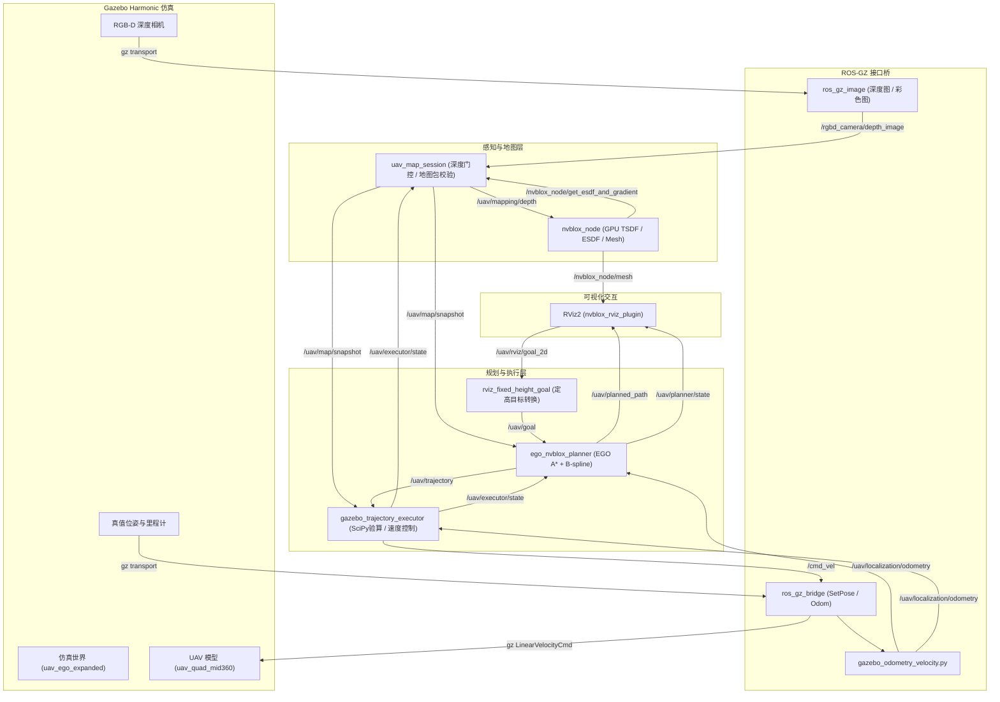
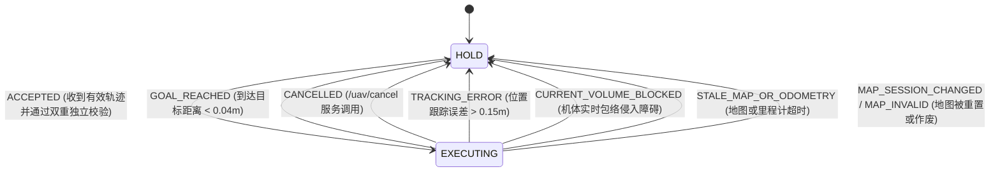

# 无人机导航仿真使用手册 (UAV Simulation User Manual)

本文档是 `uav_nav_ws` 工作区三维感知、建图、规划与执行仿真的完整操作手册。涵盖系统架构、运行准备、建图与地图包管理、定位与 RViz 交互导航、自动化验证、接口规范以及故障排除。

---

## 1. 系统概述与核心架构

### 1.1 系统定位与技术栈
本项目基于 **ROS 2 Jazzy** 与 **Gazebo Harmonic (gz-sim 8)** 构建，使用 **NVIDIA CUDA 13.2** 提供 GPU 加速，在仿真环境中实现了三维环境感知、GPU 体素建图、无碰撞轨迹规划与闭环速度跟踪控制。

- **感知与建图**：基于 `isaac_ros_nvblox`，利用 Gazebo RGB-D 深度相机图像生成 GPU 3D TSDF（截断符号距离场）和 3D ESDF（欧几里得符号距离场），并实时提取显示三维表面网格。
- **地图会话与生命周期**：`uav_nav_sim/map_session` 统一管理深度门控、ESDF 冻结快照分发、离线地图包（`static_map.nvblx` + `manifest.json`）存储与 SHA-256 兼容性校验。
- **轨迹规划**：`uav_ego_adapter`（基于 EGO-Planner 核心算法）直接基于不可变 ESDF 网格快照进行 A* 避障种子搜索与 Rebound B 样条平滑优化，并在两端施加三重重复控制点以保证静止状态平稳接管与终止。
- **仿真执行与安全监控**：`uav_nav_sim/gazebo_executor` 独立使用 SciPy 对三次 B 样条进行动力学（速度/加速度/加加速度）和连续扫掠球碰撞双重独立校验，解算机体系 FLU 速度指令直接驱动 Gazebo 模型，具备超时失联保护、跟踪偏差保护和一键急停功能。
- **可视化与人机交互**：RViz2 定制插件 `nvblox_rviz_plugin` 实现高度渐变着色与法向量着色，配套 `rviz_goal` 节点支持 2D 定高目标点交互。

### 1.2 数据流与节点拓扑



### 1.3 核心设计特性
1. **不可变地图快照（Immutable Map Snapshot）**：单次规划全过程持有冻结的 ESDF 数组与 observed 掩码，彻底规避规划中地图异步更新引发的数据竞争。
2. **三维前缀和 O(1) 障碍查询**：`planner.cpp` 维护观测掩码三维前缀和积分图，保守半径体积包络碰撞检测降至常数时间复杂度。
3. **双重独立轨迹校验**：C++ 规划器与 Python 执行器各自独立执行动力学边界与扫掠体碰撞检验，避免单点算法假阳性。
4. **安全种子回退机制（Safe Seed Fallback）**：当 Rebound B 样条因拐角穿透无法收敛时，自动降级为 A* 关键转折点三重控制点样条，停靠转折点保证绝对通行安全。

---

## 2. 环境与依赖准备

### 2.1 依赖环境要求
- **操作系统**：Ubuntu 24.04 LTS (x86_64)
- **ROS 2 版本**：ROS 2 Jazzy Jalisco
- **Gazebo 版本**：Gazebo Harmonic (8.x) 与 `ros_gz_bridge`、`ros_gz_image`
- **CUDA 版本**：CUDA 13.2（驱动支持 CUDA 13.x，默认架构 89 对应 RTX 4070）
- **Python 运行环境**：工作区本地独立虚拟环境 `.venv`（使用 `uv` 统一管理依赖）

### 2.2 核心构建脚本
在首次使用或算法代码改动后，在项目根目录下执行仿真算法专用构建：

```bash
cd /home/nuc/Program/uav_nav_ws

# 检查子模块补丁与 LFS 资源，编译算法与显示插件
./scripts/build_algorithm_sim.sh
```

该脚本会自动执行：
1. 校验第三方子模块补丁及 LFS 资产完整性。
2. 配置 EGO-Planner 算法源代码树。
3. 安装 `requirements/algorithm-sim.txt` Python 依赖。
4. 编译 `nvblox_ros`、`nvblox_rviz_plugin`、`uav_ego_adapter`、`uav_nav_sim` 和 `uav_bringup`。

### 2.3 单元测试校验
运行测试以确保执行器核心数学算法、网格解析与 B 样条校验器正常：

```bash
PYTEST_DISABLE_PLUGIN_AUTOLOAD=1 ./scripts/with_venv.sh python -m pytest -q src/uav_nav_sim/test
```
> **注意**：必须添加 `PYTEST_DISABLE_PLUGIN_AUTOLOAD=1`，以防止 ROS 系统级插件与当前测试运行器发生冲突。正常结果应显示全部测试通过（27 passed）。

---

## 3. 环境变量与多实例隔离

所有参与仿真的终端**必须**统一设置以下环境变量，防止 DDS 多播串扰以及 Gazebo 场景冲突：

```bash
export ROS_DOMAIN_ID=68
export GZ_PARTITION=uav_ego_lab
```

### 隔离原则与单实例运行约束
1. **单实例运行原则**：同一台计算机上，同一时间**只能运行一套**仿真。切换场景或模式前，必须先彻底终止上一套进程。
2. **Gazebo 实例互斥锁**：场景启动脚本会在 `/tmp` 创建仿真运行锁，正常退出时自动释放。若非正常中断导致提示 `A UAV Gazebo simulation is already running`，需先核实并清理残留进程。

---

## 4. 仿真场景矩阵与参数规范

工作区提供多个针对不同测试目的的 Gazebo 场景文件：

| 场景文件 | 物理尺寸 | 查询半宽 `map_extent` | 默认起点 | 适用任务 |
| :--- | :--- | :--- | :--- | :--- |
| **`uav_ego_expanded.sdf`** | 约 20m × 20m，高 4m | `10.5` | `(-7.5, -7.5, 1.2)` | **主推导航测试场**：中央柱、6根立柱、4个箱体、隔墙、门框 |
| **`uav_ego_lab.sdf`** | 约 10m × 10m，高 4m | `5.0` | `(-3.0, 0.0, 1.2)` | **小型基准实验室**：双房间穿门与立柱避障验证 |
| **`uav_obstacle_course.sdf`** | 约 20m × 20m，高 4m | N/A | `(0.0, -7.0, 0.11)` | **障碍穿越场地**：三组门框、平台、起终点标记（传感器检查专用） |
| **`uav_harmonic_demo.sdf`** | 演示场地 | N/A | 原点 | 基础传感器与动力学演示 |
| **`rmuc/rmul_2024/2025.sdf`** | 赛场规格 | N/A | 对应起飞区 | RoboMaster 对抗赛场静态布局 |

> [!WARNING]
> **绝对不可混用不同场景的地图！**
> 场景几何与 `map_extent` 均被哈希并写入地图包的 `scene_id`。如果场景与地图包指纹不匹配，`map_session` 会在加载时立即报错拒绝。

---

## 5. 完整操作指南：建图模式与离线巡检扫描

在仿真环境中，为了实现稳定无死角的先验三维导航，采用**深度门控巡检建图**机制。

### 5.1 启动建图模式（终端 A）
打开新终端，配置环境并启动扩展场景的建图模式：

```bash
export ROS_DOMAIN_ID=68
export GZ_PARTITION=uav_ego_lab
./scripts/with_venv.sh ros2 launch uav_bringup uav_ego_nvblox.launch.py \
  mode:=mapping gui:=true map_extent:=10.5 \
  world:="$PWD/src/uav_bringup/gazebo/worlds/uav_ego_expanded.sdf"
```

参数说明：
- `mode:=mapping`：启用深度图像接入与实时 TSDF/ESDF 积分。
- `gui:=true`：同时开启 Gazebo 图形界面与 RViz。
- `map_extent:=10.5`：设置 ESDF 空间查询范围为 X/Y: [-10.5, 10.5]，Z: [0, 4.0]。

### 5.2 执行巡检扫描（终端 B）
打开第二个终端，使用离线巡检脚本对场景进行全视角扫描覆盖：

```bash
export ROS_DOMAIN_ID=68
export GZ_PARTITION=uav_ego_lab
# 扫描输出目录必须尚不存在
./scripts/with_venv.sh python scripts/survey_gazebo_map.py \
  --layout expanded --output .cache/maps/uav_ego_expanded
```

**扫描内部机制说明**：
- 巡检脚本按 16 个水平点位（4×4 网格）、2 个高程（1.2m, 2.2m）和 4 个偏航朝向瞬移相机。
- 在瞬移前调用 `/uav/map/input_enabled` 关闭深度输入；就位稳定后再开启深度积分，杜绝因瞬移产生的拖影拉花。
- 扫描完成后，无人机自动返回停机位 `(-7.5, -7.5, 1.2)`，并通过 `/uav/map/save` 服务将三维地图导出至目标目录。

### 5.3 地图包结构与校验规范
生成的地图包目录（如 `.cache/maps/uav_ego_expanded`）包含：
- `static_map.nvblx`：nvblox 原生 GPU 压缩 TSDF/ESDF 空间体素网格。
- `manifest.json`：包含 schema 版本、map_id、scene_id（包含场景 world、model、config 及 map_extent 的联合 SHA-256）、算法构建指纹 build_id、分辨率及文件哈希。

### 5.4 手动保存地图包（可选）
如果在建图模式下手动作了探索且执行器处于 `HOLD` 状态，可通过 CLI 手动保存：

```bash
./scripts/with_venv.sh ros2 run uav_nav_sim map_bundle save .cache/maps/my_custom_map
```

---

## 6. 完整操作指南：定位与自主导航

有了扫描好的兼容地图后，每次仿真实验即可直接进入**加载定位与导航模式**。

### 6.1 启动定位与导航（终端 A）
确保建图终端已完全退出，执行启动命令：

```bash
export ROS_DOMAIN_ID=68
export GZ_PARTITION=uav_ego_lab
./scripts/with_venv.sh ros2 launch uav_bringup uav_ego_nvblox.launch.py \
  mode:=localization gui:=true map_extent:=10.5 goal_height:=1.2 \
  world:="$PWD/src/uav_bringup/gazebo/worlds/uav_ego_expanded.sdf"
```

参数重点：
- `mode:=localization`：在此模式下，系统**关闭在线深度写入**，等待外部加载静态地图包，实现零传感器漂移的高精度全局规划。
- `goal_height:=1.2`：设定 RViz 选点工具的默认目标飞行高度（单位：米）。

### 6.2 加载地图包并确认就绪（终端 B）
打开第二个终端，加载先前扫描的地图（本机已有预置地图 `.cache/maps/uav_ego_expanded_20260926`）：

```bash
export ROS_DOMAIN_ID=68
export GZ_PARTITION=uav_ego_lab
# 1. 加载地图包
./scripts/with_venv.sh ros2 run uav_nav_sim map_bundle load .cache/maps/uav_ego_expanded_20260926

# 2. 检查地图快照有效性
./scripts/with_venv.sh ros2 topic echo /uav/map/snapshot --once --field valid --qos-durability transient_local
```

当命令输出 `true`，且 RViz 中显示完整三维着色网格时，表明导航系统就绪。

### 6.3 RViz 交互式定高选点导航
1. 切换至 RViz2 窗口，确认顶部工具栏包含 **2D Goal Pose** 工具（快捷键：`G`）。
2. 在已探测出绿色/黄色的空闲空间区域，按住鼠标左键并拖拽出期望方向箭头，松开鼠标即发送目标。
3. 转换节点 `rviz_fixed_height_goal` 会截获 2D 目标并赋予当前的 `goal_height`，发布至 `/uav/goal`。
4. 规划成功后，RViz 中将绘制平滑路径（`/uav/planned_path`），无人机开始自主飞向目标。

**运行中动态调整飞行高度**：
无需重启节点，直接通过 ROS 2 参数服务修改：
```bash
./scripts/with_venv.sh ros2 param set /rviz_fixed_height_goal height 1.8
```

### 6.4 命令行直接发布 3D 目标
除 RViz 外，亦可直接通过命令行发布精确的三维坐标点：

```bash
./scripts/with_venv.sh ros2 topic pub --once /uav/goal geometry_msgs/msg/PoseStamped \
  '{header: {frame_id: map}, pose: {position: {x: 7.99, y: 4.25, z: 1.2}, orientation: {w: 1.0}}}'
```

### 6.5 任务取消与紧急悬停
在飞行过程中随时可以调用取消服务使无人机原地刹停进入 `HOLD`：

```bash
./scripts/with_venv.sh ros2 service call /uav/cancel std_srvs/srv/Trigger '{}'
```

---

## 7. RViz 可视化与地图渲染配置

默认加载配置文件 `src/uav_bringup/rviz/uav_navigation.rviz`，配置了针对无人机三维导航优化的显示项：

### 7.1 图层设置
- **3D nvblox Map**（`nvblox_rviz_plugin/NvbloxMesh`）：订阅 `/nvblox_node/mesh`。
  - **Mesh Color 选项**：
    - `Height`（默认）：按 Z 坐标进行彩虹色阶渲染（0m 蓝色 -> 4m 红色），清晰呈现空间净空高度。
    - `Normals`：按表面法向量渲染颜色，便于区分地面、顶棚与不同朝向的垂直墙面。
    - `RGB`：若启用了彩色融合，则显示相机表面纹理颜色。
- **Planned Path**（`rviz_default_plugins/Path`）：显示全局优化后的均匀 B 样条离散轨迹。
- **Navigation Goal**（`rviz_default_plugins/Pose`）：显示定高选点目标位置（橙色箭头）。
- **Cameras**：显示 `/rgbd_camera/image` 与 `/rgbd_camera/depth_image` 实时画面。

### 7.2 高度裁切（Cut Ceiling）
在室内或带顶棚场景中，如果顶棚遮挡俯视视野，可以在 `3D nvblox Map` 属性中启用：
- `Cut Ceiling`：勾选设为 `true`。
- `Ceiling Height`：设置裁切高程阈值（如 `3.8` 米）。高于该阈值的网格块将被自动隐藏。

### 7.3 独立重新打开 RViz
若在测试中误关闭了 RViz，或只希望在无 GUI 仿真基础上单独查看，使用以下命令：

```bash
./scripts/with_venv.sh rviz2 -d "$PWD/src/uav_bringup/rviz/uav_navigation.rviz" \
  --ros-args -p use_sim_time:=true
```

---

## 8. 自动化测试与回归验证

工作区提供了完整的端到端自动化测试脚本，用于量化检验轨迹安全性、到达误差与碰撞裕度。

### 8.1 扩展场景端到端导航回归
在定位模式运行、加载扩展地图且初始点位于 `(-7.5, -7.5, 1.2)` 时运行：

```bash
./scripts/with_venv.sh python scripts/check_gazebo_expanded_goal.py \
  --goal 7.99 4.25 --timeout 240 --output /tmp/expanded_navigation.json
```
**校验内容**：
- 自动发送目标，记录轨迹所有时间采样点的动力学特征。
- 利用 SDF 世界底层几何进行严格的地面与立柱间距（Ground Truth Clearance）校验。
- 确认在限时内触发 `GOAL_REACHED`，且终点误差小于 0.1m。

### 8.2 小型场景正反向往返测试
针对小场景 `uav_ego_lab.sdf` 的往返自动测试：

```bash
# 前向航行测试 (-> [3.0, 0.0, 1.2])
./scripts/with_venv.sh python scripts/check_gazebo_goal.py --goal 3 0 1.2 --output /tmp/ego_forward.json

# 反向返航测试 (-> [-3.0, 0.0, 1.2])
./scripts/with_venv.sh python scripts/check_gazebo_goal.py --goal -3 0 1.2 --output /tmp/ego_return.json
```

### 8.3 异常注入与容错边界测试
- **目标拒绝测试**：发送落在障碍物内部、地图外或未观测区域的目标，验证规划器输出 `BLOCKED_START_OR_GOAL` 或 `NO_PATH` 且拒绝生成危险轨迹。
- **地图丢失测试**：运行 `scripts/check_gazebo_map_loss.py`，验证当 ESDF 停止更新或超时时，执行器能立即在 2.0s 内触发 `STALE_MAP_OR_ODOMETRY` 并悬停。

---

## 9. 传感器验证与专用辅助场景

除了 EGO + nvblox 自主导航链路，工作区还保留了面向物理传感器验证与场地测试的独立仿真入口。

### 9.1 无人机障碍穿越场地（Obstacle Course）
该场地包含多组门框、立柱、障碍台架及地面起终点标志，用于检查传感器数据流与点云分布：

```bash
# 启动障碍场地仿真（同一时间只运行此一套）
./simulation/scripts/run_uav_obstacle_course.sh

# 可选：附带 MID360 激光雷达 ROS 桥接
./simulation/scripts/run_uav_obstacle_course.sh launch_mid360:=true
```

### 9.2 传感器话题桥接一览
在场景运行后，可查看以下标准 ROS 2 话题：
- 彩色图像：`/rgbd_camera/image` (`sensor_msgs/msg/Image`)
- 深度图像：`/rgbd_camera/depth_image` (`sensor_msgs/msg/Image`)
- 相机内参：`/rgbd_camera/camera_info` (`sensor_msgs/msg/CameraInfo`)
- 激光雷达：`/livox/lidar` (`sensor_msgs/msg/PointCloud2`，需开启 `launch_mid360`)
- 机载 IMU：`/uav/sensors/imu` (`sensor_msgs/msg/Imu`)
- 仿真里程计：`/uav/localization/odometry` (`nav_msgs/msg/Odometry`)

---

## 10. 通信接口与状态机全览

### 10.1 核心话题规范

| 话题名称 | 消息类型 | QoS 特性 | 发送方 | 接收方 | 语义描述 |
| :--- | :--- | :--- | :--- | :--- | :--- |
| `/uav/goal` | `geometry_msgs/PoseStamped` | Reliable, Depth 10 | `rviz_goal` / 手动 | `planner` | 目标位置（必须在 map 坐标系） |
| `/uav/rviz/goal_2d` | `geometry_msgs/PoseStamped` | Reliable, Depth 10 | RViz 2D Nav Goal | `rviz_goal` | 原始 2D 选点平面坐标 |
| `/uav/localization/odometry` | `nav_msgs/Odometry` | SensorData (Best Effort) | `odometry_velocity` | `planner`, `executor` | 机器人在 odom 系下的位姿与机体系 FLU 速度 |
| `/uav/map/snapshot` | `uav_nav_interfaces/MapSnapshot` | Transient Local, Depth 1 | `map_session` | `planner`, `executor` | 不可变 ESDF 网格、分辨率、尺寸及有效标志 |
| `/uav/trajectory` | `uav_nav_interfaces/TimedTrajectory` | Reliable, Depth 10 | `planner` | `executor` | 均匀三次 B 样条控制点、起始时间与动力学边界 |
| `/uav/planned_path` | `nav_msgs/Path` | Volatile, Depth 1 | `planner` | RViz | 仅供可视化的离散三维路径 |
| `/uav/planner/state` | `std_msgs/String` | Reliable, Depth 10 | `planner` | 状态监控器 | 规划器状态代码 |
| `/uav/executor/state` | `std_msgs/String` | Reliable, Depth 10 | `executor` | `map_session`, `planner` | 执行器宏观状态（`HOLD` / `EXECUTING`） |
| `/uav/executor/event` | `std_msgs/String` | Reliable, Depth 10 | `executor` | 监控器 / 自动化脚本 | 瞬时事件通知（如 `ACCEPTED`, `GOAL_REACHED`） |
| `/cmd_vel` | `geometry_msgs/Twist` | Reliable, Depth 1 | `executor` | `ros_gz_bridge` | 机体系 FLU 线速度与偏航角速度指令 |

### 10.2 核心服务规范

| 服务名称 | 服务类型 | 提供方 | 用途说明 |
| :--- | :--- | :--- | :--- |
| `/uav/cancel` | `std_srvs/srv/Trigger` | `executor` | 紧急停止当前航线规划，指令归零并回到 `HOLD` |
| `/uav/map/save` | `nvblox_msgs/srv/FilePath` | `map_session` | 将当前 TSDF/ESDF 网格导出为不可变地图包 |
| `/uav/map/load` | `nvblox_msgs/srv/FilePath` | `map_session` | 校验并加载已有的离线地图包 |
| `/uav/map/input_enabled` | `std_srvs/srv/SetBool` | `map_session` | 深度图像写入门控（巡检瞬移时设为 false） |

### 10.3 TF 坐标树结构
仿真系统中维护以下刚体与世界坐标变换：
```
map (世界大地坐标系)
 └── odom (里程计坐标系，仿真中静态对齐到 map)
      └── base_link (无人机几何中心)
           ├── oakd_camera_link (相机安装位姿: X:0.18, Z:0.16, Pitch:18°)
           │    └── oakd_camera_optical_frame (光学坐标系)
           └── mid360_link (激光雷达安装位姿)
```

### 10.4 状态机与事件代码表



- **规划器状态代码 (`/uav/planner/state`)**：
  - `WAIT_MAP_OR_ODOMETRY`：等待接收有效地图快照或最新里程计。
  - `WAIT_STOPPED`：无人机当前未处于静止状态（速度 > 0.05m/s），等待停稳后规划。
  - `BLOCKED_START_OR_GOAL`：起点或终点侵入障碍物、超出地图或位于未知盲区。
  - `NO_PATH`：A* 种子算法无法搜寻出连通路径。
  - `SAFE_SEED_FALLBACK`：Rebound 优化失败，降级采用保底 A* 转折点样条。
  - `TRAJECTORY_PUBLISHED`：轨迹规划及重定时验算成功并发布。
  - `PLAN_EXPIRED`：规划计算时间超时（超出单帧地图有效窗口）。

---

## 11. 进程管理与运维排错 (Troubleshooting)

### 11.1 规范退出流程
在启动主仿真 launch 的终端窗口，直接按下 **`Ctrl+C`**。Launch 系统的事件处理器会向 Gazebo 及各子节点传递退出信号，等待终端提示符出现。

### 11.2 异常残留排查与定点终止
若终端被强行关闭，或节点卡死未随 launch 退出，按以下步骤处理：

1. **查找当前用户属于本项目的仿真 Launch 进程**：
   ```bash
   pgrep -af '[r]os2 launch uav_bringup (uav_ego_nvblox|gazebo_harmonic_nav|rviz_navigation)\.launch\.py'
   ```
2. **确认 PID 后发送温和退出信号 (`SIGINT`)**：
   ```bash
   SIM_PID=12345  # 替换为上一步查出的 PID
   kill -INT -- "$SIM_PID"
   ```
3. **排查所有潜在残留的底层仿真组件**：
   ```bash
   ps -eo pid,ppid,stat,args | rg '[g]z sim|[g]z-sim|[r]viz2|[n]vblox_node|[e]go_nvblox_planner|[m]ap_session|[g]azebo_executor'
   ```
4. **针对无响应孤儿进程定点清理**：
   ```bash
   kill -TERM <PID>
   # 若数秒后依然存活，方可执行
   kill -KILL <PID>
   ```

### 11.3 常见故障诊断与解决对策

| 故障现象 | 潜在根本原因 | 排查手段与解决对策 |
| :--- | :--- | :--- |
| **地图加载被拒绝 (`Load rejected`)** | 场景/配置不兼容；或执行器未处于 `HOLD` | 1. 检查启动模式是否为 `mode:=localization`。<br>2. 检查当前 world 与 `map_extent` 是否与建图时完全一致。<br>3. 检查执行器状态，先调用 `/uav/cancel` 确保停在 `HOLD`。<br>4. 查看启动终端输出的精确 rejection 错误提示。 |
| **RViz 选点后无人机不响应** | 选点落在障碍物/未知区；或转换节点未启动 | 1. 监听 `/uav/planner/state`，若为 `BLOCKED_START_OR_GOAL` 则表示目标点位置无效。<br>2. 监听 `/uav/map/snapshot` 确认 `valid: true`。<br>3. 检查 `/rviz_fixed_height_goal` 节点是否存在（同一域内只能运行一个）。 |
| **RViz 重新打开后地图完全空白** | 环境变量不一致或未加载地图 | 1. 确认所有终端均设置了 `export ROS_DOMAIN_ID=68`。<br>2. 确认 Fixed Frame 设定为 `map`。<br>3. 若在定位模式下重新打开 RViz，由于没有新深度帧更新网格，重新执行一次 `map_bundle load` 触发网格发布。 |
| **提示端口冲突或仿真已在运行** | 存在未退出的 Gazebo 或锁文件占用 | 1. 使用 `pgrep -af gz` 查找残留后台进程并终止。<br>2. 锁文件位于 `/tmp/uav_gazebo_sim.lock`，检查其引用的 PID 是否真实存活。 |
| **深度画面黑屏或全零点云** | 显卡驱动渲染或 headless 模式配置错误 | 1. 确认系统具备独显驱动并支持 Vulkan/OpenGL 硬件加速。<br>2. 若在无 GUI 服务器运行，确保已安装 `libgl1-mesa-dri` 及匹配的 NVIDIA 工具包。 |
| **编译报错找不到 CUDA 或架构不匹配** | 默认编译架构与本地 GPU 不符 | 1. 打开 `scripts/build_algorithm_sim.sh`。<br>2. 将 `-DCMAKE_CUDA_ARCHITECTURES=89` 修改为您显卡对应的计算能力（如 RTX 30 系列为 86，V100 为 70）。 |

---

## 12. 实现边界与实机适配说明 (Scope & Limitations)

在将本仿真用于任何工程结论前，必须明确当前的**实现边界与仿真假设**：

1. **直接速度控制模型（LinearVelocityCmd）**：
   - 当前 Gazebo 采用直接线速度控制模型（FLU 机体系线性速度输入），不包含真实的四旋翼螺旋桨空气动力学、电机推力延迟、风扰以及重力补偿动态方程。
   - 速度与角速度直接生效，仿真中的“原地瞬时刹停”依赖物理引擎的理想速度约束，**不可等同于实机物理气动制动距离**。
2. **定位与里程计来源**：
   - 仿真当前直接使用 Gazebo 物理引擎提供的**真值全局位姿**经由 `gazebo_odometry_velocity.py` 转换输出，不存在实机相机/激光雷达 SLAM 的累积漂移、特征丢失或退化现象。
   - `localization` 模式仅复用全局静态坐标系几何，未包含基于特征的实机重定位闭环算法。
3. **飞控（PX4）闭环状态**：
   - 本套仿真链路聚焦于 **nvblox GPU 建图与 EGO-Planner 算法验证**，完全切断了与 PX4 固件、MAVLink / Micro-XRCE-DDS 串口以及外层位置环状态机的物理关联。
   - 实机自主飞行与软硬件闭环验证属于后续阶段规划，严禁在未接入 PX4 姿态/位置控制与安全围栏前直接将仿真轨迹用于真机飞行！
