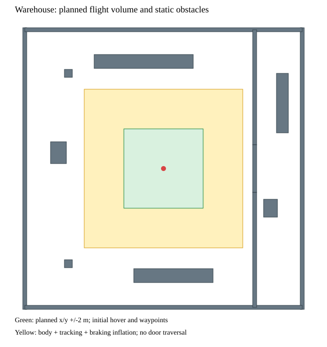

# 仓库场景与分阶段 VIO 验证

640×400 仓库 VIO 运动验证已通过，显式 0.8×／NVIDIA 无界面／图像深度 1／EKF 最大延迟 160 ms 下同机 120 秒融合连续两轮通过（READY 约 114.02 s）。默认／UI 配置仍有失败，仓库悬停和导航尚未执行。见 [长时融合报告](validation/simulation/2026-10-09-warehouse-queue-latency/REPORT.md)。

初始六轮实测的 VIO 前置检查均未通过，尚未执行仓库悬停／航点／避障。
详见 [原始结果与重放](validation/simulation/2026-10-09-warehouse-vio/REPORT.md)。

新增 `--scene warehouse` 使用 14×14 m、6 m 高的通用室内参考布局。
包含外围墙、带 2.4 m 宽/3 m 高门洞的隔墙、立柱、货架实体、箱体和纹理地面。
墙面具有固定种子的多尺度角点纹理；纹理只供实际渲染和相机观测，不产生定位数据。
配置见 [布局](../simulation/scenes/vio_warehouse.json) 与
[验收配置](../simulation/scenes/warehouse_acceptance.json)。

第一阶段预定位置范围为世界 ENU x/y ±2 m、高度至 3 m。加入机体半径 0.5 m、
跟踪余量 0.3 m、制动余量 1.2 m，以及顶部余量 0.8 m 后，生成器逐一检查与
所有实体障碍的 AABB 不相交。此检查只证明静态几何，地面是有意保留的支持面；
不证明动态制动、定位准确、传感器避障或飞行授权。门洞/货架通道在首批飞行范围外。



## 已可执行的传感器检查

```bash
# 两轮通过的无界面未解锁配置：实际双目/IMU -> cuVSLAM -> PX4 EKF
./scripts/sim.sh px4-vio-sensors --normalize --fuse-pose --scene warehouse \
  --warehouse-floor-texture --camera-pitch-deg 15 --image-resolution 640x400 \
  --quality-policy bounded_gap --real-time-factor .8 --render-device nvidia \
  --sdk-image-depth 1 --headless-rendering --ekf-delay-max-ms 160 --duration 120

# 独立载台三轴移动/转向：真值仅供误差审计，PX4 不解锁、不接收 EV
./scripts/sim.sh px4-vio-sensors --normalize --motion --scene warehouse \
  --warehouse-floor-texture --camera-pitch-deg 15 --image-resolution 640x400 \
  --quality-policy bounded_gap --duration 120 --ui

# 只读验收；传入脚本输出的缓存目录
python3 scripts/assess_vio_warehouse.py .cache/simulation/vio-sensors/<run-id> \
  --output /tmp/warehouse-assessment.json
```

`--ui` 显示本次 Gazebo/QGC，检查完成后关闭所属窗口；带 UI 的长时融合仍失败。仿真模型为理想针孔双目/
IMU参考，不是 OAK-D Pro W 实机标定。传感器检查始终要求未解锁着地；严禁与
现有 FlightServer 混开以绕过审计。SDK 新鲜度/协方差、reset 等门限保持不变。

## 验收顺序与控制交接

| 用例 | 内容 | 通过要求 |
| --- | --- | --- |
| WH-V01 | 同机未解锁实际融合 | 120 s 墙钟观察、连续 READY ≥110 s、停源失效处置，以及原传感器/融合全部检查 |
| WH-V02 | 独立载台运动 | 三轴与转向覆盖、原时间/身份/协方差检查、位置 RMSE ≤0.15 m、最大 ≤0.30 m、姿态最大 ≤10° |
| WH-F01 | BT VIO 起飞/悬停/降落 | 飞机自身 VIO，无 GNSS；真实着陆/解除武装、悬停漂移 ≤0.15 m |
| WH-F02 | BT VIO 航点/返航 | 飞行模型/场景与区域 hash 匹配、实际位移及各到点误差、根任务终态 |
| WH-F03 | VIO 停更/reset | 旧任务与参考失效、控制归属交接、真实停止或降落，不自动恢复旧任务 |
| WH-N01 | 深度建图/导航/避障 | 独立深度标定、nvblox/EGO 连接、穿门/绕柱、无路时停止，真值净空与终态 |

`assess_vio_warehouse.py` 检查生成资产摘要、纹理、几何及源用例，始终输出
`flight_authorized=false`，不以原始短时 PASS 或独立载台结果授权飞行。

预定航点配置为 [warehouse_vio_sequence.json](../simulation/missions/warehouse_vio_sequence.json)：
起飞 1.5 m→悬停 15 s→(1.25,1,1.5)→悬停 10 s→(-1.25,1,1.5)→返航→悬停 5 s→降落。
该配置目前是待验收任务，**尚未接入仓库飞行启动器**。不要把它传入原 W0 场景并称为
仓库/VIO验证。原 W0 的 hash 与独立控制链路保留。

后续需要带同机传感器模型的飞行 profile、持续 EV 写入会话及唯一 FlightServer
控制输出；VIO 在着地时仅初始化一次，飞行中继续使用原采样，失效锁存且不重发旧值。
真值只能用于审计。源前置检查未通过时不得进入飞行；导航/避障也仍为独立待实现阶段。

显式 `--sdk-debug-dump` 将 SDK 实际消费的图像／IMU及外参写入缓存 `sdk-input`，
只供诊断，退出码为 1、整体验收标记恒为 false。输入摘要可用
`python3 scripts/audit_vio_sdk_dump.py <run>/sdk-input --output /tmp/sdk-input-receipt.json` 生成；
记录负载不代表正常运行性能，尚未实现原生 SDK 的同输入回放对照。
