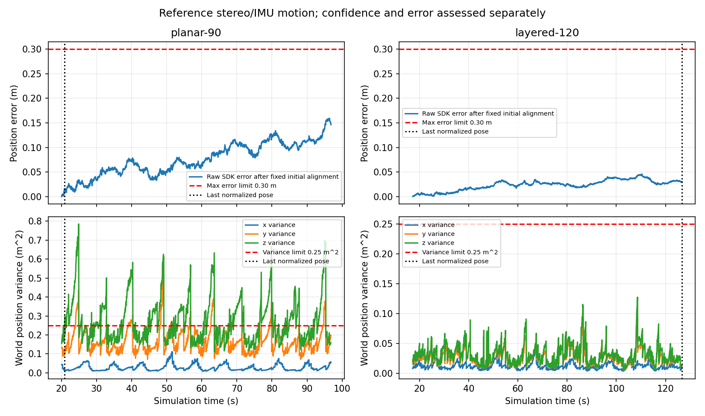

# 实际 VIO 载台运动验证与场景对照

归档日期：2026-10-09。实现提交：`163acf4`；审计修复：`9ea4008`。

新增独立物理载台，实际 Gazebo 双目/IMU → cuVSLAM → 标准 SDK 位姿，完成三轴
平移和航向运动的误差与置信度检查。多深度场景已通过 90 s 检查，平面场景仍会
因 SDK 高度方差超限停止标准输出。**这是参考载台验证，不是 PX4 VIO 飞行，S6 尚未完成。**

## 实现与配置

- 官方 PX4 1.16.2、Gazebo Harmonic、QGC 链路保留；x500/PX4 未解锁着地。
  独立模型 `vio_motion_carrier` 由 Gazebo 物理系统计算运动，没有 PX4 电机控制。
- 载台 body 质量 1 kg、惯量对角 0.02 kg·m²，固定 rig 质量 0.001 kg。
  `MotionCarrier.cc` 用 `AddWorldWrench` 施加有界力/力矩，读取自身物理状态作
  反馈控制，没有设置位姿/速度、没有读取 VIO 或发布 FMU 命令。
- 仿真 15 s 后各轴参考为 A·sin³(ωt)，A=(0.50,0.40,0.30) m，
  ω=(0.45,0.55,0.65) rad/s，z 初始 1.3 m；yaw A=0.40 rad、ω=0.40 rad/s。
  平移起始速度/加速度连续为零，航向保持水平。轨迹不是多旋翼动力学验收。
- 沿用 640×400 理想针孔双目、0.075 m 基线、25 Hz 图像、250 Hz 理想 IMU，
  FLU 安装点 (0.12,0,0.242) m，以及现有 SDK 参数/协方差契约；不是 Pro W 标定。
- `planar` 保留三面彩色网格墙；`layered` 在相同墙面基础上增加 90 个随机深度
  彩色立体特征（含碰撞）及 160 个地面纹理块。位置/颜色固定随机种子，生成资产
  按运行归档，不修改上游 world/x500/W0 安全区域。
- 先等待图像、PX4、着地消息与 QGC 就绪，再启动实际 VIO 和归一化节点。
  0.2 s 新鲜度、2 s 稳定窗口、六轴方差 >0 且 ≤0.25，以及失效锁存保持不变。
  插件构建清单绑定源码、工具、CMake 缓存及二进制，漂移时拒绝运行。

## 误差与健康判定

Gazebo `/vio/truth` 只由观察者订阅；VIO 输入仍为左右图像、CameraInfo、IMU 和
静态安装 TF。载台控制器读取物理引擎本体状态作反馈，传输真值不回灌 VIO/PX4。
每次运行记录四类 FMU 输入发布者为零、唯一真值发布者、全程未解锁和清理结果。

真值按 VIO 原始仿真时间插值，首个标准位姿确定一次固定旋转和平移；不估计尺度、
不逐段重对齐、不使用真值修正 VIO。验收要求：

- 在匹配位姿实际覆盖的真值窗口内，三轴峰峰运动至少 0.8/0.6/0.4 m，航向至少
  0.6 rad，运动覆盖至少 30 s，IMU 各平移轴与 yaw 有响应。
- 真值窗口最大采样间隔 ≤0.032 s，标准位姿最大间隔 ≤0.081 s，覆盖运行末尾
  0.2 s 内；初始化对齐前的真值间隔另行记录，不参与未使用区间的误差验收。
- 位置 RMSE ≤0.15 m、最大误差 ≤0.30 m，姿态最大误差 ≤10°；原始 SDK 误差
  单独诊断，不替代标准源的协方差和连续健康。
- 标准位姿保留原始时间/位姿，完整协方差有限、对称、半正定，各轴有效且不超限；
  标定 ID、会话和发布者一致。长时状态缓存扩大至 12000 条，避免 120 s 运行截断
  早期状态；仍以采样时间与单调接收时间分别检查。

## 运行结果

| 运行 | 原始总体判定 | 原始 SDK RMSE / 最大误差 (m) | 标准位姿数 | 标准位姿仿真时间 (s) |
| --- | --- | --- | --- | --- |
| planar-90 | FAIL | 0.082814 / 0.159413 | 21 | 20.08–20.88 |
| layered-90 | PASS | 0.023391 / 0.044426 | 1988 | 17.28–96.76 |
| layered-120 | PASS | 0.025750 / 0.045965 | 2738 | 17.20–126.68 |

最终 120 s 任务连续健康输出约 **109.49 s**（任务时长包含 VIO 初始化
和 2 s 稳定窗口），三轴峰峰位移约 1.00/0.80/0.60 m，航向约 0.80 rad。
标准位姿位置 RMSE **0.025750 m**，最大误差 **0.045965 m**，
姿态最大误差 **0.7495°**，绑定后六轴协方差无超限。
完整状态记录 5315 条，绑定后全部 valid，末尾标准位姿与真值时间差
0.052 s。四类 FMU 输入为零、全程未解锁着地、QGC 连接和所属进程清理均通过。

运行 ID：planar-90 `b5fad999-0640-43ad-a9e9-514dfd195899`；layered-90
`ec640f48-f852-485d-a2ff-16dea11f35f7`；最终 layered-120
`0e5a0688-3e35-47de-b013-7c34f56e8a6a`。

平面场景标准输出止于 20.88 s，下一 SDK 样本 20.92 s 的世界固定轴 z 方差
0.276718 m²，超过 0.25 m²，20.944 s 状态报告 `VIO_UNCERTAINTY_INVALID`，
后续旧会话持续 invalid 且没有标准输出复活。原始 SDK 继续至 96.80 s，其误差
仍达标，证明误差达标与置信度准入是独立要求。详见 `planar-90-replay.json`。




黑色竖线为最后标准输出；平面场景之后仍有原始 SDK 数据，但不能用于飞行准入。
多深度场景改变了深度、特征分布与可见地面等多个因素，当前对照支持使用该测试
场景，不能证明其中任一因素是 SDK 协方差退化的唯一原因。

## 诊断记录与审计修复

`diagnostic-startup-gap`（`9cf905fd-5e45-43a8-b0d4-6f6d0a5fdc27`）使用旧启动顺序，
源绑定后在仿真 2.724 s 观察到 tracking stamp=2.68 s、接收间隔 0.201449 s，
vo_state=1，归一化节点正确因 `VIO_TRACKING_INVALID` 撤销。后续入口等待 PX4/QGC
及传感器就绪再启动 VIO；这不证明所有运行负载下都不会再发生接收超时。

`diagnostic-truth-window`（`e8c624ab-1149-4d98-88c2-8b93aaefe241`）原始总体判定
**FAIL**，保持原结果。标准源持续覆盖 17.24–126.72 s，2738 个标准位姿，实际误差
RMSE 0.0198275 m、最大 0.0411475 m，SDK 协方差检查通过；唯一失败项是全程真值
间隔检查，将仿真 9.588–9.660 s 的 72 ms 初始化缺口计入了 17.24 s 起的匹配窗口。
修复后仅检查实际匹配窗口及插值所需的边界样本，初始化缺口保留为诊断；新增测试
明确要求窗口内同样的缺口仍失败。修复后另跑完整 120 s，不将旧失败改为通过。

开发期间一轮启动因本地测试捕获的审计变量作用域错误主动中止（缓存 run
`d33c6c01-beea-421c-b28e-db7629de4165`），所属进程已全部清理，未用于验收。

`layered-90`、`planar-90` 与上述诊断是审计修复前运行，最终指纹检查会显示审计
文件变化；传感器、场景生成、原生 SDK、归一化节点和控制后端未因此改变。
最终 `layered-120` 运行绑定修复后的全部当前输入，以其指纹与结果作当前验收证据。

## 重现与离线核对

```bash
./scripts/build_vio_motion.sh
./scripts/sim.sh px4-vio-sensors --normalize --motion --scene layered --duration 120
./scripts/sim.sh px4-vio-sensors --normalize --motion --duration 90
# 可追加 --ui；默认 QGC offscreen。两种运行都不发解锁/轨迹/外部视觉。

./scripts/with_venv.sh python docs/validation/simulation/2026-10-09-vio-motion/assess_motion.py \
  docs/validation/simulation/2026-10-09-vio-motion/layered-120
/usr/bin/python3 docs/validation/simulation/2026-10-09-vio-motion/quality_summary.py
/usr/bin/python3 docs/validation/simulation/2026-10-09-vio-motion/plot_motion.py
```

`assess_motion.py` 不依赖 ROS/运行节点，直接读取归档真值与原始 SDK 位姿，独立重算
误差并核对原始报告；它输出误差重放，不把置信度失败包装为整项通过。
图表使用系统 Python 的 numpy/matplotlib；第一方运行器不增加绘图运行依赖。

66 项相关测试通过（`pytest.xml`），包括固定初始旋转/平移、尺度错误、漂移、缺轴、
姿态错误、源停更/缺口，以及对齐前/窗口内真值缺口的相反判定。
`payload-sha256.json` 保存原始未压缩文件摘要，`SHA256SUMS` 覆盖归档文件。
PNG 由原始 RGB PPM 无损转换；未归档 ULog 或用于重建观测的图像全量包，因此本档案
支持数值误差/健康重放，不能离线重新运行 cuVSLAM。完整运行缓存仍在本机。

原 W0 后端/BT 的源码指纹仍与最近实际 full 飞行一致（`w0-source-check.json`）；
本轮没有重新执行 W0 飞行，也没有测试当前代码的暂停/取消/失联飞行。

## 下一步

实现独立、显式的 SDK 位姿融合配置、初始坐标对齐和对应 PX4 EKF 健康门控，再
验证无隐藏辅助的 BT 起飞→30 s 悬停→原生降落与退化处置。SDK 未暴露速度观测
协方差，不能伪造速度或静默降低当前四类融合门控。尚未完成 PX4 初始化对齐、
实际相机 VIO→EKF 融合、飞行闭环、遮挡/偏置测试或 Pro W 实机标定与时间映射。
