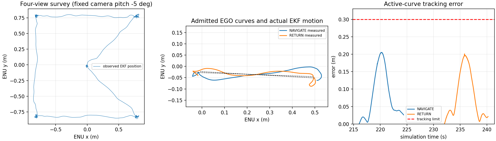

# 同机固定 5° 深度观测、安装校验与 EGO 飞行推进

2026-10-10。本轮使用官方 PX4 v1.16.2 SITL、Gazebo Harmonic、同机 RGBD、PX4 GNSS／惯性 EKF、nvblox、EGO 与唯一 FlightServer／BT。相机保持下偏 5°，无 VIO 控制输入、无真值控制输入；真值仅作独立审计。所有任务运行在隔离 domain 78／PX4 instance 7／system 8，不发送 USB 飞控控制。

已实现实际空中深度观测后放行 EGO 导航。**ego-complete-flight 已完成真实同机完整任务**：起飞→四点观察→EGO 导航→悬停→EGO 返航→悬停→原生降落锁定。BT 全部 7 步完成，根结果 SUCCEEDED、cleanup_confirmed=true；2 条实际准入曲线及独立 Gazebo 真值已归档。该轮最低观察点 1.15 m，尚未包含随后收紧的半体素观察门限；1.05 m／0.85 m 预留配置首轮仍剩 1 个未知体素，按预期 ABORTED 并降落锁定；增加有界起点补拍后，**ego-final-sweep-flight 当前控制版本也已完整成功**。两次成功之间有负向轮，不称连续稳定性通过。以下失败轮与历史 W0 航点成功不可互相替代。

## 修复与证据

- 原相机 SDF pose 默认相对 model，而合并的 base_link 自带 0.24 m 高度：实际机体相对安装 z=0.002 m，ROS optical TF 宣称 z=0.242 m。Gazebo Scene 服务直接证明 0.24 m 安装误差（`old-camera-mount.json`、压缩 Scene 原文）。生成器改用 `relative_to="base_link"`，新增解锁前物理安装审计；修复后位置／旋转符合生成的 TF。共享双目／IMU 安装也作相同修复，但本轮未重新验证 VIO 飞行，历史结果不能迁移。
- 原西侧开放天空不能提供深度自由空间证据。场景增加实际渲染及碰撞的西墙，并冻结新资产 hash。建图仍使用真实深度；没有预填自由体素或删除占用。
- 观测路线改为四个互补高度的有限全周扫描，再回起点；当前相对 home 坐标为 `(0.8,0.8,1.05)`、`(-0.8,0.8,2.4)`、`(-0.8,-0.8,1.7)`、`(0.8,-0.8,2.6)`。190 s OBSERVE、235 s 根任务期限；所有运动限值保持受冻结区域约束。
- 诊断复现轮 EGO 因种子端点 `NO_PATH` 超时；原始网格证实 0.8 m 身体／跟踪盒全已观测，而 EGO 额外半体素的 0.85 m 起终点盒含 3 个未知底层体素。观察准入已收紧到同一半体素预留，首观察点降至 1.05 m 补拍；单元测试验证该未知层阻止准入，收到新已观测网格才放行。
- EGO 生产与消费共用 profile 的速度／加速度／jerk 上限 `(0.18,0.15,0.2)`，拒绝超过区域上限的配置。未修改 0.3 m 跟踪、地图 2 s 源新鲜度、未知空间、碰撞、控制时间与身份门限。
- 每个扫描位置与返回位置导出实际 ESDF 数组及源时间、map identity、定位 session、诊断、SHA256。离线分析提供未知／占用坐标、分层图与理想相机覆盖。理想 pinhole 覆盖忽略遮挡、实际姿态与跟踪误差，仅是几何上界，不构成真实观测或避障通过。
- 新增已准入曲线及授权证据。首轮导出遇到 NumPy UUID JSON 类型错误，已修复，并将核心日志保存放在补充曲线导出之前。该失败轮缺少完整真值／曲线记录，不计导航验收。

追加新配置首轮在解锁前被深度输入新鲜度检查拒绝：image age 0.804 s，CameraInfo 更新但最新图像不匹配，arming_states 仅 [1]，未启动 FlightServer／发送飞行命令。见 `depth-startup-rejected`。此轮不是飞行失败，不放宽传感器准入门限。

收紧门限后的 `seed-reserve-observation-insufficient` 剩余 1 个未知体素，中心约 `(-0.55,-0.25,2.15)` m。追加返回起点的有界全周补拍，最多一周、原190 s观察期限不变，实图通过便立即放行。监督日志另明确区分 Validation PASS 和 Mission 根结果：预期负向验收通过不等于任务 SUCCEEDED。

## 实测序列

| 归档 | 返回位置未知／占用体素 | 已验证边界 |
| --- | ---: | --- |
| diagnostic-flight | 4930／2 | 原安装三点观测；观测不足，原生降落锁定 |
| fixed-mount-flight | 4043／0 | 实际相机安装审计通过；观测不足闭环 |
| enclosed-flight | 185／0 | 西墙与第四观察点同时引入；不能单独归因于其中一项 |
| complementary-flight | 155／0 | 四点扫描与回起点完成；仍未准入导航 |
| covered-flight | 1／0 | 剩余低层体素约 `(0.25,0.25,1.15)`；观测不足闭环 |
| ego-return-tracking-flight | 见原始地图证据 | 日志进入 NAVIGATE／HOVER／RETURN，返航跟踪超限；JSON 导出错误使独立真值证据缺失，整轮失败 |
| ego-planner-no-path-flight | 0／0（原 0.8 m 包络） | 观察放行；EGO 0.85 m 种子包络含 3 未知，`NO_PATH`→`PLANNER_TIMEOUT`；安全降落锁定 |
| ego-final-sweep-flight | 0／0（0.85 m 包络） | 当前版本全部 7 步完成，2 条曲线、独立真值、SUCCEEDED／降落锁定通过 |
| seed-reserve-observation-insufficient | 1／0（0.85 m 包络） | 任务 ABORTED／OBSERVATION_INSUFFICIENT，降落锁定；验证负向处置通过，不是完整任务成功 |
| ego-complete-flight | 0／0 | 2 条准入 EGO 曲线，完整 7 步 BT 成功，落地锁定；最低观察点 1.15 m、收紧种子门限之前 |
| ego-map-stale-flight | 以准入时地图为准 | 观察放行，实际准入 1 条曲线；导航约 3.4 s 后 `STALE_MAP_SOURCE`，降落并锁定但任务失败 |

`ego-map-stale-flight` 的失败前最后控制样本：位置约 `(0.103,0.037,2.030)` m，参考 `(0.281,0.028,2.026)` m，跟踪偏差约 0.179 m。ESDF 源与转发深度时间冻结在约 208.96 s，随后日志报告源年龄 3.112 s、转发深度年龄 3.044 s，队列仍有等待深度。该轮不能归因于跟踪超限；仅凭队列无法确认 TF 或渲染根因。下一轮新增历史 TF 错误及独立地图诊断记录复现，严格保留 exact-stamp 查询。

`route-geometry.json` 是 complementary-flight 网格上的历史候选路线计算，最低观察高度为 1.3 m，理想模型覆盖 28,577 个包络体素。它不是当前 1.15 m 配置的真实观测证明。

## 完整任务独立核验

`ego-complete-flight` run_id=`b7cf9f09-5c78-4253-a965-08e9d7699252`：导航航点真值误差 0.06747 m、返航误差 0.05462 m；两段悬停最大定位漂移分别 0.07882 m、0.10048 m。最终 landed=true、arming_state=1，控制 owner=NONE，任务 SUCCEEDED、LANDED_AND_DISARMED，BT dispatch_count=1，步骤 0..6 全部接受及完成。这是单次固定场景短距离导航成功，不代表绕障任务、长期地图新鲜度或 VIO 飞行通过。前述地图停滞未在成功轮复现，根因仍未确认。

最终 `ego-final-sweep-flight` run_id=`ba2b0bd0-b19e-4d06-9e1c-18e376d80c8f`：0.85 m 身体／跟踪／种子预留加 1.2 m 水平制动盒全部观测，无占用；导航真值误差 0.10710 m、返航 0.07448 m，两段悬停漂移 0.08162 m／0.05990 m，EGO 活动曲线最大跟踪偏差 0.20507 m；任务全部七步成功，降落锁定、控制归还。当前版本使用最低 1.05 m 观察点，返回后继续有界转向，约 8 s 补拍后准入。此前成功轮的 1.15 m 配置保留原 profile，未改写为当前版本。



`plot_flight.py <归档目录>` 可重现上图（NumPy／SciPy／Matplotlib）；图中运动为 PX4 EKF，独立真值误差由原始 `flight-truth.json(.gz)` 与任务事件核验。大 JSON 与原日志以 gzip 无损压缩，解压 hash 见 RAW_LOG_SHA256SUMS。

## 复核

`check_archive.py` 独立验证归档 hash、压缩原文 hash、资产／profile／recipe 绑定、旧安装误差、修复后实际安装、原始网格缺口计数与已准入曲线证据。它验证预期失败结果与证据一致，不把失败任务标成成功。

构建 uav_nav_sim／uav_mission／uav_bt 通过；最终核心／几何／同步／资产相关测试 **213 项通过**。新增 exact TF 错误诊断后深度同步 15 项通过，种子包络修复后定向测试 93 项通过。静态／单元结果不代替完整 SITL 飞行验收。

复核入口：

```bash
./scripts/with_venv.sh python docs/validation/simulation/2026-10-10-depth-gap-spatial/check_archive.py
./scripts/sim.sh px4-observe
```

本轮分批代码提交：`54b297b` 网格空间证据；`85b08e4` 离线几何分析；`36148f8` 实际相机安装与解锁前校验；`a95cf40` 共享双目／IMU 安装；`af63dbd` 西墙及互补观察；`e7baa7b` 低层缺口路线；`3680e61` 一致的 EGO 限值与曲线证据；`2d8ea49` 精确历史 TF 诊断；`f3c2de3` 收紧种子预留准入；`05e10cd` 完整任务证据 scope；`37a0257` 起点有界补拍；`a39199f` 监督日志根结果区分。

已逐个检查本轮归档运行的受管进程组，全部退出，见 `process-group-audit.json`。没有停止 USB 飞控相关硬件程序。
